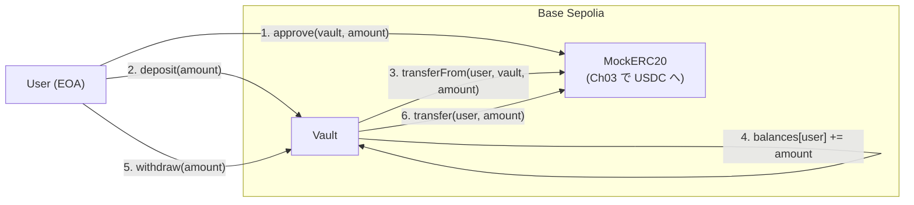
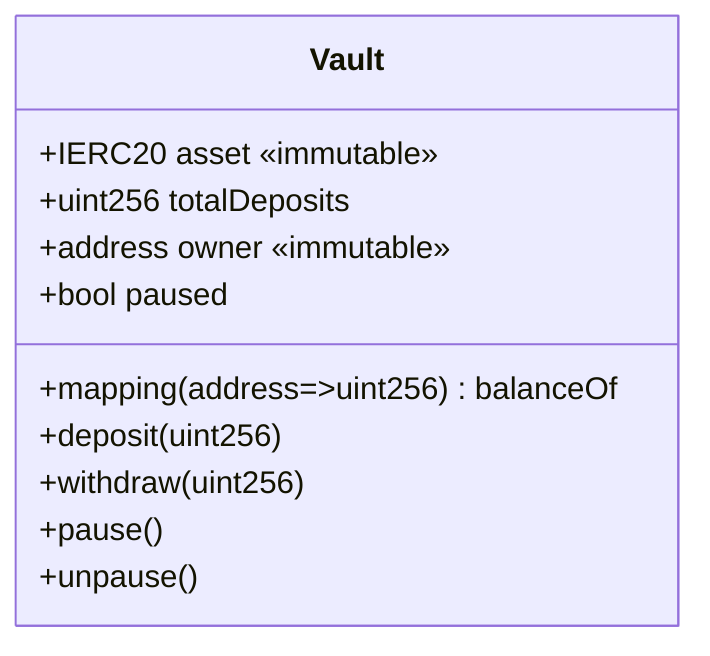
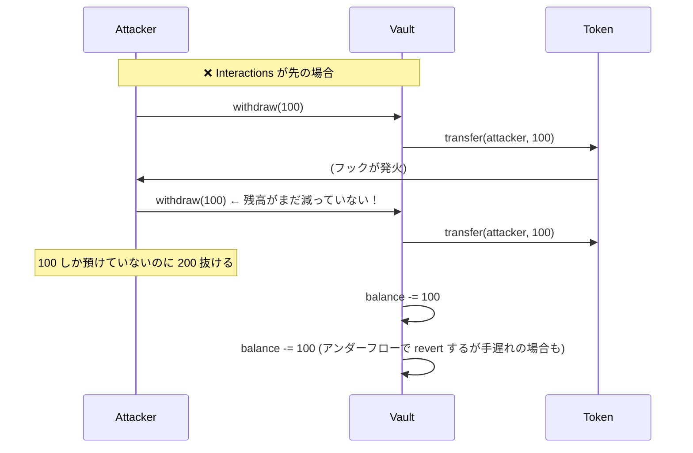

# Chapter 02: Vault Contract

> 資産を預かる最小の Vault を書き、Solidity の状態管理・イベント・アクセス制御・reentrancy の基礎を身につける。

| 項目 | 内容 |
|---|---|
| 所要時間 | 3〜4時間 |
| 前提 | [Chapter 01](./chapter01-project-initialization.md) 完了 |
| 成果物 | `contracts/src/Vault.sol`（Deposit / Withdraw が動く） |
| 難易度 | ★★☆ |

---

## 1. Goal

- [ ] Solidity の状態変数・`mapping`・`event`・`error` を使い分けられる
- [ ] `deposit` / `withdraw` を実装し、残高を追跡できる
- [ ] **Checks-Effects-Interactions (CEI) パターン**を説明し、適用できる
- [ ] Reentrancy 攻撃がどう成立するかを、攻撃コードで再現できる
- [ ] `immutable` / `constant` / 通常の状態変数のガスコスト差を説明できる
- [ ] カスタムエラーを使い、`require(string)` より安価な理由を説明できる
- [ ] `forge build` が通り、最小テストが緑になる
- [ ] **この実装が利回りを分配できない理由**を説明できる

最後の項目が本章の隠れた主題です。動くものを作った上で、その限界を認識します。

---

## 2. 完成イメージ

```text
$ make test
Ran 9 tests for test/Vault.t.sol:VaultTest
[PASS] test_Deposit_IncreasesBalance() (gas: 84213)
[PASS] test_Deposit_EmitsEvent() (gas: 82991)
[PASS] test_RevertWhen_DepositZero() (gas: 13402)
[PASS] test_Withdraw_DecreasesBalance() (gas: 71880)
[PASS] test_RevertWhen_WithdrawExceedsBalance() (gas: 88104)
[PASS] test_Withdraw_All() (gas: 70552)
[PASS] test_TotalDeposits_TracksSum() (gas: 152331)
[PASS] test_RevertWhen_ReentrantWithdraw() (gas: 291045)
[PASS] testFuzz_DepositThenWithdraw(uint96) (runs: 256, μ: 79214, ~: 79214)
Suite result: ok. 9 passed; 0 failed; 0 skipped
```

コントラクトのサイズも確認します。

```text
$ forge build --sizes
| Contract | Runtime Size (B) | Initcode Size (B) |
|----------|------------------|-------------------|
| Vault    |            2,431 |             2,893 |
```

!!! note "サイズ制限"
    EVM のコントラクトサイズ上限は **24,576 バイト**（EIP-170）です。
    今は余裕がありますが、Chapter 10 以降で機能が増えると近づきます。
    `--sizes` を習慣にしておくと、上限に当たってから慌てずに済みます。

---

## 3. Architecture



**この章の Vault は「金庫」でしかありません。** 預かった資産は Vault 内に
そのまま置かれ、利回りは発生しません。Aave / Morpho への接続は Chapter 10–11 です。

### 状態の設計



| 変数 | 型 | なぜこの形か |
|---|---|---|
| `asset` | `IERC20 immutable` | デプロイ後に変更してはいけない。`immutable` なら書き換え不能でガスも安い |
| `balanceOf` | `mapping` | ユーザーごとの持分。配列ではなく mapping（O(1) アクセス、削除が容易） |
| `totalDeposits` | `uint256` | 会計の検算用。`asset.balanceOf(vault)` と比較できる |
| `paused` | `bool` | 緊急停止。異常時に入金を止める |

---

## 4. Directory

```text
contracts/
 ├── src/
 │   ├── Vault.sol                    + 本章の主役
 │   └── interfaces/
 │       └── IVault.sol               + インターフェース分離
 ├── test/
 │   ├── Vault.t.sol                  + テスト
 │   └── mocks/
 │       ├── MockERC20.sol            + テスト用トークン
 │       └── ReentrantAttacker.sol    + 攻撃の再現
 └── src/Counter.sol                  - 削除（Ch01 の疎通確認用）
```

```bash
cd contracts
rm -f src/Counter.sol test/Counter.t.sol script/Counter.s.sol
mkdir -p src/interfaces test/mocks
```

---

## 5. 実装

### 5.1 まず「素朴な実装」を見る

元のスケルトンにあった実装から始めます。これは**動きますが、本番では使えません**。

```solidity
// ⚠️ 問題のあるコード。理由を以下で説明する
contract Vault {
    IERC20 public immutable asset;
    mapping(address => uint256) public balance;

    constructor(address asset_) {
        asset = IERC20(asset_);
    }

    function deposit(uint256 amount) external {
        require(amount > 0, "amount");
        asset.transferFrom(msg.sender, address(this), amount);  // (A)
        balance[msg.sender] += amount;
        emit Deposited(msg.sender, amount);
    }

    function withdraw(uint256 amount) external {
        require(balance[msg.sender] >= amount, "balance");
        balance[msg.sender] -= amount;
        asset.transfer(msg.sender, amount);                     // (B)
        emit Withdrawn(msg.sender, amount);
    }
}
```

問題は6つあります。

| # | 箇所 | 問題 | 対処 |
|---|---|---|---|
| 1 | (A)(B) | **戻り値を検査していない**。`transfer` が `false` を返すトークンでは失敗を見逃す | `SafeERC20`（Ch03） |
| 2 | (A) | **手数料徴収トークン**では受け取り額 < `amount` になり、会計が壊れる | 実残高の差分を測る |
| 3 | (B) | **CEI 違反ではないが Interactions が最後でない**（emit が後） | CEI を厳格に |
| 4 | 全体 | **Reentrancy ガードがない** | `ReentrancyGuard` |
| 5 | `require("amount")` | エラーメッセージがガスを食い、意味が不明 | カスタムエラー |
| 6 | 全体 | **緊急停止できない** | `Pausable` |

本章で 2〜6 を、Chapter 03 で 1 を扱います。

### 5.2 カスタムエラー

Solidity 0.8.4 以降、`revert CustomError()` が使えます。

```solidity
// 旧: 文字列はバイト列としてバイトコードに埋め込まれる
require(amount > 0, "Vault: amount must be greater than zero");

// 新: 4バイトのセレクタのみ
error ZeroAmount();
if (amount == 0) revert ZeroAmount();
```

| 方式 | デプロイコスト | revert 時のガス | 情報量 |
|---|---|---|---|
| `require(string)` | 文字列分だけ増える | 文字列長に比例 | 人間可読 |
| カスタムエラー | セレクタのみ | 一定・安価 | **引数を渡せる** |

引数を渡せるのが実務上大きいです。

```solidity
error InsufficientBalance(uint256 requested, uint256 available);

if (amount > balanceOf[msg.sender]) {
    revert InsufficientBalance(amount, balanceOf[msg.sender]);
}
```

これによりデバッグ時に「いくら要求して、いくらあったか」が分かります。
Foundry のテストでも検証できます。

```solidity
vm.expectRevert(abi.encodeWithSelector(Vault.InsufficientBalance.selector, 100, 50));
```

!!! tip "Solidity 0.8.26 以降の `require` "
    新しめのコンパイラでは `require(cond, CustomError())` と書けます。
    本書は `solc 0.8.24` 固定なので `if (!cond) revert CustomError();` を使います。

### 5.3 Checks-Effects-Interactions (CEI)

**最重要のパターンです。** 関数の中身を必ずこの順序で書きます。

```solidity
function withdraw(uint256 amount) external {
    // ---- 1. Checks: 入力と状態の検証 ----
    if (amount == 0) revert ZeroAmount();
    uint256 bal = balanceOf[msg.sender];
    if (amount > bal) revert InsufficientBalance(amount, bal);

    // ---- 2. Effects: 自コントラクトの状態変更 ----
    balanceOf[msg.sender] = bal - amount;
    totalDeposits -= amount;
    emit Withdrawn(msg.sender, amount);

    // ---- 3. Interactions: 外部呼び出し（最後）----
    asset.safeTransfer(msg.sender, amount);
}
```

なぜこの順序なのか。**外部呼び出しは、呼び出し先に制御を渡します。**
悪意ある呼び出し先は、その隙に同じ関数を呼び返せます。



CEI を守ると、**外部呼び出しの時点で状態は既に正しい**ため、
呼び返されても残高は減っています。

!!! important "CEI だけで十分か"
    CEI は最も重要な防御ですが、**複数の関数をまたぐ reentrancy**（cross-function）
    や**複数コントラクトをまたぐ**もの（cross-contract）には不十分な場合があります。
    そのため CEI と `ReentrancyGuard` を**両方**使います。
    「ガードがあるから CEI は不要」ではありません。

### 5.4 ReentrancyGuard

OpenZeppelin の `ReentrancyGuard` を継承し、`nonReentrant` 修飾子を付けます。

```solidity
import {ReentrancyGuard} from "@openzeppelin/contracts/utils/ReentrancyGuard.sol";

contract Vault is ReentrancyGuard {
    function withdraw(uint256 amount) external nonReentrant { }
}
```

仕組みは単純です。

```solidity
// 概念的な実装
uint256 private _status = NOT_ENTERED;

modifier nonReentrant() {
    if (_status == ENTERED) revert ReentrancyGuardReentrantCall();
    _status = ENTERED;
    _;
    _status = NOT_ENTERED;
}
```

!!! note "ガスコスト"
    OpenZeppelin v5 では `ReentrancyGuardTransient` も提供されています。
    EIP-1153 の transient storage（`TSTORE`/`TLOAD`）を使い、
    通常版より大幅に安価です。Base は Cancun 以降の EVM に対応しているため使えますが、
    本書では**より広く理解されている通常版**を使います。
    ガス最適化は Chapter 15 で扱います。

### 5.5 アクセス制御と Pausable

緊急時に入金を止められる必要があります。理由は、Chapter 10 以降で
外部プロトコルに接続すると「Aave が停止した」「異常な出金が続いている」
といった事態が起こり得るためです。

```solidity
import {Ownable} from "@openzeppelin/contracts/access/Ownable.sol";
import {Pausable} from "@openzeppelin/contracts/utils/Pausable.sol";

contract Vault is Ownable, Pausable, ReentrancyGuard {
    constructor(address asset_, address owner_) Ownable(owner_) {
        // OpenZeppelin v5 は initialOwner が必須引数
    }

    function pause() external onlyOwner { _pause(); }
    function unpause() external onlyOwner { _unpause(); }

    function deposit(uint256 amount) external whenNotPaused nonReentrant { }
    function withdraw(uint256 amount) external nonReentrant { }  // ← paused でも出金可
}
```

!!! danger "出金を止めてはいけない"
    `withdraw` に `whenNotPaused` を**付けません**。
    停止中に出金できないと、ユーザーの資産が管理者の意思で人質になります。
    これは DeFi における信頼性の根幹です。

    「入金は止められるが、出金は誰にも止められない」——
    この非対称性を意図的に設計します。

    例外的に出金も止める設計（クリティカルな脆弱性発見時のサーキットブレーカー）も
    存在しますが、その場合は Timelock とマルチシグ、そして**事前の明示的な開示**が必須です。
    Chapter 15 で扱います。

### 5.6 `immutable` と `constant`

```solidity
IERC20 public immutable asset;      // コンストラクタで1度だけ設定
uint256 public constant MAX_BPS = 10_000;  // コンパイル時に確定
```

| 種別 | 設定タイミング | 保存場所 | 読み取りガス |
|---|---|---|---|
| `constant` | コンパイル時 | バイトコードに埋め込み | ほぼ 0（`PUSH`） |
| `immutable` | コンストラクタ | バイトコードに埋め込み | ほぼ 0 |
| 通常の状態変数 | いつでも | storage | 2,100 gas（cold `SLOAD`） |

`asset` を `immutable` にすると、毎回の `SLOAD`（2,100 gas）が消えます。
`deposit` が1日1,000回呼ばれるなら、これだけで意味のある差になります。

さらに重要なのは**安全性**です。`asset` が変更可能だと、
管理者が悪意を持って別トークンに差し替える攻撃が成立します。
`immutable` は「そういう攻撃が構造的に不可能」を保証します。

### 5.7 手数料徴収トークンへの対処

一部の ERC20 は転送時に手数料を引きます（fee-on-transfer）。
`transferFrom(user, vault, 100)` を呼んでも、Vault に届くのは 98 かもしれません。

素朴な実装では `balanceOf[user] += 100` としてしまい、
**存在しない 2 を記録**します。全員が出金しようとすると最後の人が失敗します。

対処は「**実際に増えた分を測る**」ことです。

```solidity
uint256 balanceBefore = asset.balanceOf(address(this));
asset.safeTransferFrom(msg.sender, address(this), amount);
uint256 received = asset.balanceOf(address(this)) - balanceBefore;

balanceOf[msg.sender] += received;   // amount ではなく received
totalDeposits += received;
```

!!! important "CEI との緊張関係"
    この実装は「Interactions（`transferFrom`）→ Effects（残高更新）」の順序になり、
    CEI に反します。**そのため `nonReentrant` が必須**です。

    トレードオフを認識しておくことが重要です。

    - fee-on-transfer に対応する → CEI を崩す → ガードで守る
    - CEI を厳守する → fee-on-transfer 非対応と明記する

    本書は前者を採り、`nonReentrant` で守ります。USDC は手数料を取らないので
    実務上は後者でも構いませんが、「トークンを信用しない」姿勢を身につけるため
    前者を実装します。

### 5.8 イベント設計

```solidity
event Deposited(address indexed user, uint256 assets);
event Withdrawn(address indexed user, uint256 assets);
event Paused(address account);   // Pausable が提供
```

`indexed` を付けたパラメータは**トピックとしてフィルタ可能**になります。
Chapter 09 の Indexer で「特定ユーザーの入金履歴」を引くために必須です。

| ルール | 理由 |
|---|---|
| `indexed` は最大3つ | EVM のログトピックは4つで、1つ目はイベント署名 |
| アドレスは `indexed` | 検索キーになる |
| 金額は `indexed` にしない | 範囲検索できないので意味がない。データ領域の方が安い |
| 状態変更する関数は必ず emit | イベントがないと、オフチェーンから状態変化を追えない |

---

## 6. コード全文

### `contracts/src/interfaces/IVault.sol`

```solidity
// SPDX-License-Identifier: MIT
pragma solidity ^0.8.24;

/// @title IVault
/// @notice 最小 Vault のインターフェース
/// @dev Chapter 10 で ERC-4626 準拠のインターフェースに置き換わる
interface IVault {
    /* ---------- Events ---------- */

    /// @notice 資産が預けられた
    /// @param user 預入者
    /// @param assets 実際に Vault が受領した額（アトミック単位）
    event Deposited(address indexed user, uint256 assets);

    /// @notice 資産が出金された
    /// @param user 出金者
    /// @param assets 出金額（アトミック単位）
    event Withdrawn(address indexed user, uint256 assets);

    /* ---------- Errors ---------- */

    /// @notice 0 は受け付けない
    error ZeroAmount();

    /// @notice 残高不足
    /// @param requested 要求額
    /// @param available 保有額
    error InsufficientBalance(uint256 requested, uint256 available);

    /// @notice アドレスが 0
    error ZeroAddress();

    /* ---------- Views ---------- */

    /// @notice 預かっている資産のトークンアドレス
    function asset() external view returns (address);

    /// @notice 各ユーザーの預入残高
    function balanceOf(address user) external view returns (uint256);

    /// @notice 全ユーザーの預入残高の合計
    function totalDeposits() external view returns (uint256);

    /* ---------- Actions ---------- */

    /// @notice 資産を預ける（事前に approve が必要）
    /// @param assets 預入額（アトミック単位）
    /// @return received 実際に受領した額
    function deposit(uint256 assets) external returns (uint256 received);

    /// @notice 資産を出金する
    /// @param assets 出金額（アトミック単位）
    function withdraw(uint256 assets) external;
}
```

### `contracts/src/Vault.sol`

```solidity
// SPDX-License-Identifier: MIT
pragma solidity ^0.8.24;

import {IERC20} from "@openzeppelin/contracts/token/ERC20/IERC20.sol";
import {SafeERC20} from "@openzeppelin/contracts/token/ERC20/utils/SafeERC20.sol";
import {Ownable} from "@openzeppelin/contracts/access/Ownable.sol";
import {Pausable} from "@openzeppelin/contracts/utils/Pausable.sol";
import {ReentrancyGuard} from "@openzeppelin/contracts/utils/ReentrancyGuard.sol";

import {IVault} from "./interfaces/IVault.sol";

/// @title Vault
/// @author DeFi Yield Vault Handbook
/// @notice 単一 ERC20 資産を預かる最小の Vault
/// @dev 本コントラクトは学習用の第一段階である。
///      Chapter 10 で ERC-4626 準拠の share 会計へ移行するため、
///      利回りの分配機能を持たない（すべての預入は 1:1 で記録される）。
///
///      設計上の要点:
///      - CEI パターンを基本とし、fee-on-transfer 対応のため deposit のみ
///        Interactions を先に置き、nonReentrant で保護する
///      - withdraw は paused でも実行できる（管理者が資産を人質にできない）
///      - asset は immutable（差し替え攻撃を構造的に排除）
contract Vault is IVault, Ownable, Pausable, ReentrancyGuard {
    using SafeERC20 for IERC20;

    /* ------------------------------------------------------------ */
    /*                          Storage                             */
    /* ------------------------------------------------------------ */

    /// @notice 預かる資産（デプロイ後変更不可）
    IERC20 private immutable _asset;

    /// @inheritdoc IVault
    mapping(address user => uint256 assets) public balanceOf;

    /// @inheritdoc IVault
    uint256 public totalDeposits;

    /* ------------------------------------------------------------ */
    /*                        Constructor                           */
    /* ------------------------------------------------------------ */

    /// @param asset_ 預かる ERC20 トークンのアドレス
    /// @param owner_ 管理者（pause 権限を持つ）
    constructor(address asset_, address owner_) Ownable(owner_) {
        if (asset_ == address(0) || owner_ == address(0)) revert ZeroAddress();
        _asset = IERC20(asset_);
    }

    /* ------------------------------------------------------------ */
    /*                          Views                               */
    /* ------------------------------------------------------------ */

    /// @inheritdoc IVault
    function asset() external view returns (address) {
        return address(_asset);
    }

    /// @notice Vault が実際に保有しているトークン残高
    /// @dev totalDeposits との差分は「誰の持分でもない余剰」。
    ///      直接送金（transfer）された分がここに現れる。
    function totalAssetsHeld() external view returns (uint256) {
        return _asset.balanceOf(address(this));
    }

    /* ------------------------------------------------------------ */
    /*                          Actions                             */
    /* ------------------------------------------------------------ */

    /// @inheritdoc IVault
    /// @dev fee-on-transfer トークンに対応するため、転送前後の残高差分を
    ///      実際の受領額として記録する。このため Interactions が Effects より
    ///      先に来るが、nonReentrant により再入を防いでいる。
    function deposit(uint256 assets)
        external
        whenNotPaused
        nonReentrant
        returns (uint256 received)
    {
        // ---- Checks ----
        if (assets == 0) revert ZeroAmount();

        // ---- Interactions（受領額の実測に必要）----
        uint256 balanceBefore = _asset.balanceOf(address(this));
        _asset.safeTransferFrom(msg.sender, address(this), assets);
        received = _asset.balanceOf(address(this)) - balanceBefore;

        // 手数料で全額が消えるトークンを弾く
        if (received == 0) revert ZeroAmount();

        // ---- Effects ----
        balanceOf[msg.sender] += received;
        totalDeposits += received;

        emit Deposited(msg.sender, received);
    }

    /// @inheritdoc IVault
    /// @dev paused でも実行できる。管理者が出金を止められない設計。
    function withdraw(uint256 assets) external nonReentrant {
        // ---- Checks ----
        if (assets == 0) revert ZeroAmount();

        uint256 userBalance = balanceOf[msg.sender];
        if (assets > userBalance) revert InsufficientBalance(assets, userBalance);

        // ---- Effects ----
        // Solidity 0.8+ は自動でアンダーフローを検査するが、
        // 上で検証済みなので unchecked で節約できる
        unchecked {
            balanceOf[msg.sender] = userBalance - assets;
            totalDeposits -= assets;
        }

        emit Withdrawn(msg.sender, assets);

        // ---- Interactions ----
        _asset.safeTransfer(msg.sender, assets);
    }

    /// @notice 全額出金のショートカット
    /// @dev 「端数が残る」問題を避けるため用意する。
    ///      dApp 側で balanceOf を読んで withdraw を呼ぶと、
    ///      その間に残高が変わる可能性がある（本章では変わらないが Ch10 以降で変わる）。
    function withdrawAll() external nonReentrant returns (uint256 assets) {
        assets = balanceOf[msg.sender];
        if (assets == 0) revert ZeroAmount();

        balanceOf[msg.sender] = 0;
        unchecked {
            totalDeposits -= assets;
        }

        emit Withdrawn(msg.sender, assets);

        _asset.safeTransfer(msg.sender, assets);
    }

    /* ------------------------------------------------------------ */
    /*                         Admin                                */
    /* ------------------------------------------------------------ */

    /// @notice 新規の預入を停止する（出金は継続して可能）
    function pause() external onlyOwner {
        _pause();
    }

    /// @notice 預入を再開する
    function unpause() external onlyOwner {
        _unpause();
    }

    /// @notice 誤って直接送金されたトークンを回収する
    /// @dev 預かり資産（_asset）については、totalDeposits を超える余剰分のみ回収可能。
    ///      これがないと、誤送金されたトークンが永久にロックされる。
    /// @param token 回収するトークン
    /// @param to 送り先
    function sweep(address token, address to) external onlyOwner {
        if (to == address(0)) revert ZeroAddress();

        uint256 amount;
        if (token == address(_asset)) {
            // ユーザーの預かり分には手を出せない
            uint256 held = _asset.balanceOf(address(this));
            if (held <= totalDeposits) revert ZeroAmount();
            unchecked {
                amount = held - totalDeposits;
            }
        } else {
            amount = IERC20(token).balanceOf(address(this));
            if (amount == 0) revert ZeroAmount();
        }

        IERC20(token).safeTransfer(to, amount);
    }
}
```

!!! important "`sweep` の設計が重要"
    `sweep` は「管理者が資金を抜けるバックドア」になりがちな関数です。
    本実装では `token == _asset` の場合、**`totalDeposits` を超える余剰分しか
    取り出せない**制約を入れています。

    ```solidity
    if (held <= totalDeposits) revert ZeroAmount();
    amount = held - totalDeposits;
    ```

    この一行があるかないかで、コントラクトの信頼性が根本的に変わります。
    監査でも最初に見られる箇所です。

### `contracts/test/mocks/MockERC20.sol`

```solidity
// SPDX-License-Identifier: MIT
pragma solidity ^0.8.24;

import {ERC20} from "@openzeppelin/contracts/token/ERC20/ERC20.sol";

/// @notice テスト用の ERC20。decimals を可変にできる。
contract MockERC20 is ERC20 {
    uint8 private immutable _decimals;

    constructor(string memory name_, string memory symbol_, uint8 decimals_)
        ERC20(name_, symbol_)
    {
        _decimals = decimals_;
    }

    function decimals() public view override returns (uint8) {
        return _decimals;
    }

    function mint(address to, uint256 amount) external {
        _mint(to, amount);
    }
}

/// @notice 転送時に手数料を引くトークン（fee-on-transfer の再現）
contract FeeOnTransferERC20 is ERC20 {
    uint256 public immutable feeBps; // 例: 100 = 1%

    constructor(uint256 feeBps_) ERC20("Fee Token", "FEE") {
        feeBps = feeBps_;
    }

    function mint(address to, uint256 amount) external {
        _mint(to, amount);
    }

    function _update(address from, address to, uint256 value) internal override {
        // mint / burn では手数料を取らない
        if (from == address(0) || to == address(0)) {
            super._update(from, to, value);
            return;
        }
        uint256 fee = (value * feeBps) / 10_000;
        super._update(from, to, value - fee);
        if (fee > 0) super._update(from, address(0xdead), fee);
    }
}
```

### `contracts/test/mocks/ReentrantAttacker.sol`

```solidity
// SPDX-License-Identifier: MIT
pragma solidity ^0.8.24;

import {ERC20} from "@openzeppelin/contracts/token/ERC20/ERC20.sol";
import {IVault} from "../../src/interfaces/IVault.sol";

/// @notice 転送時に任意のコントラクトへコールバックするトークン
/// @dev ERC777 のフックや、悪意あるトークンの挙動を模倣する。
///      「Vault に登録するトークン自体が敵になり得る」ことを示す。
contract HookedERC20 is ERC20 {
    address public hook;
    bool public hookEnabled;

    constructor() ERC20("Hooked", "HOOK") {}

    function mint(address to, uint256 amount) external {
        _mint(to, amount);
    }

    function setHook(address hook_) external {
        hook = hook_;
    }

    function setHookEnabled(bool enabled) external {
        hookEnabled = enabled;
    }

    function _update(address from, address to, uint256 value) internal override {
        super._update(from, to, value);
        if (hookEnabled && hook != address(0) && to == hook) {
            // 受け取り側にコールバック（ERC777 の tokensReceived 相当）
            ReentrantAttacker(hook).onTokenReceived();
        }
    }
}

/// @notice Reentrancy 攻撃を試みるコントラクト
contract ReentrantAttacker {
    IVault public immutable vault;
    HookedERC20 public immutable token;

    uint256 public reenterCount;
    uint256 public constant MAX_REENTER = 1;

    error AttackFailed();

    constructor(address vault_, address token_) {
        vault = IVault(vault_);
        token = HookedERC20(token_);
    }

    function attack(uint256 amount) external {
        token.approve(address(vault), type(uint256).max);
        vault.deposit(amount);

        // ここからフックを有効にして withdraw を呼ぶ
        token.setHook(address(this));
        token.setHookEnabled(true);
        vault.withdraw(amount);
    }

    /// @notice トークン受領時に呼ばれる。ここで再入を試みる。
    function onTokenReceived() external {
        if (reenterCount >= MAX_REENTER) return;
        reenterCount++;
        // nonReentrant が効いていればここで revert する
        vault.withdraw(1);
    }
}
```

### `contracts/test/Vault.t.sol`

```solidity
// SPDX-License-Identifier: MIT
pragma solidity ^0.8.24;

import {Test, console2} from "forge-std/Test.sol";
import {IERC20} from "@openzeppelin/contracts/token/ERC20/IERC20.sol";
import {Ownable} from "@openzeppelin/contracts/access/Ownable.sol";
import {Pausable} from "@openzeppelin/contracts/utils/Pausable.sol";
import {ReentrancyGuard} from "@openzeppelin/contracts/utils/ReentrancyGuard.sol";

import {Vault} from "../src/Vault.sol";
import {IVault} from "../src/interfaces/IVault.sol";
import {MockERC20, FeeOnTransferERC20} from "./mocks/MockERC20.sol";
import {HookedERC20, ReentrantAttacker} from "./mocks/ReentrantAttacker.sol";

contract VaultTest is Test {
    /* ---------- fixtures ---------- */

    Vault internal vault;
    MockERC20 internal token;

    address internal owner = makeAddr("owner");
    address internal alice = makeAddr("alice");
    address internal bob = makeAddr("bob");

    uint256 internal constant ONE = 1e6; // USDC と同じ 6 decimals
    uint256 internal constant INITIAL = 10_000 * ONE;

    function setUp() public {
        token = new MockERC20("Mock USDC", "mUSDC", 6);
        vault = new Vault(address(token), owner);

        token.mint(alice, INITIAL);
        token.mint(bob, INITIAL);

        vm.prank(alice);
        token.approve(address(vault), type(uint256).max);
        vm.prank(bob);
        token.approve(address(vault), type(uint256).max);
    }

    /* ---------- deposit ---------- */

    function test_Deposit_IncreasesBalance() public {
        vm.prank(alice);
        uint256 received = vault.deposit(100 * ONE);

        assertEq(received, 100 * ONE, "received");
        assertEq(vault.balanceOf(alice), 100 * ONE, "balanceOf");
        assertEq(vault.totalDeposits(), 100 * ONE, "totalDeposits");
        assertEq(token.balanceOf(address(vault)), 100 * ONE, "vault token balance");
        assertEq(token.balanceOf(alice), INITIAL - 100 * ONE, "alice token balance");
    }

    function test_Deposit_EmitsEvent() public {
        vm.expectEmit(true, false, false, true, address(vault));
        emit IVault.Deposited(alice, 100 * ONE);

        vm.prank(alice);
        vault.deposit(100 * ONE);
    }

    function test_RevertWhen_DepositZero() public {
        vm.prank(alice);
        vm.expectRevert(IVault.ZeroAmount.selector);
        vault.deposit(0);
    }

    function test_RevertWhen_DepositWhilePaused() public {
        vm.prank(owner);
        vault.pause();

        vm.prank(alice);
        vm.expectRevert(Pausable.EnforcedPause.selector);
        vault.deposit(100 * ONE);
    }

    function test_Deposit_FeeOnTransferRecordsActualAmount() public {
        FeeOnTransferERC20 feeToken = new FeeOnTransferERC20(100); // 1%
        Vault feeVault = new Vault(address(feeToken), owner);

        feeToken.mint(alice, 1_000 * ONE);
        vm.startPrank(alice);
        feeToken.approve(address(feeVault), type(uint256).max);
        uint256 received = feeVault.deposit(1_000 * ONE);
        vm.stopPrank();

        // 1% 引かれて 990 が届く
        assertEq(received, 990 * ONE, "received should exclude fee");
        assertEq(feeVault.balanceOf(alice), 990 * ONE, "recorded balance");
        assertEq(feeVault.totalDeposits(), 990 * ONE, "totalDeposits");
        // 会計が実残高と一致していることが最重要
        assertEq(
            feeToken.balanceOf(address(feeVault)),
            feeVault.totalDeposits(),
            "accounting must match reality"
        );
    }

    /* ---------- withdraw ---------- */

    function test_Withdraw_DecreasesBalance() public {
        vm.startPrank(alice);
        vault.deposit(100 * ONE);
        vault.withdraw(40 * ONE);
        vm.stopPrank();

        assertEq(vault.balanceOf(alice), 60 * ONE);
        assertEq(vault.totalDeposits(), 60 * ONE);
        assertEq(token.balanceOf(alice), INITIAL - 60 * ONE);
    }

    function test_RevertWhen_WithdrawExceedsBalance() public {
        vm.startPrank(alice);
        vault.deposit(100 * ONE);

        vm.expectRevert(
            abi.encodeWithSelector(IVault.InsufficientBalance.selector, 101 * ONE, 100 * ONE)
        );
        vault.withdraw(101 * ONE);
        vm.stopPrank();
    }

    function test_Withdraw_WorksWhilePaused() public {
        vm.prank(alice);
        vault.deposit(100 * ONE);

        vm.prank(owner);
        vault.pause();

        // 停止中でも出金できることが設計要件
        vm.prank(alice);
        vault.withdraw(100 * ONE);

        assertEq(vault.balanceOf(alice), 0);
        assertEq(token.balanceOf(alice), INITIAL);
    }

    function test_WithdrawAll() public {
        vm.startPrank(alice);
        vault.deposit(123_456);
        uint256 out = vault.withdrawAll();
        vm.stopPrank();

        assertEq(out, 123_456);
        assertEq(vault.balanceOf(alice), 0);
    }

    /* ---------- accounting ---------- */

    function test_TotalDeposits_TracksSum() public {
        vm.prank(alice);
        vault.deposit(100 * ONE);
        vm.prank(bob);
        vault.deposit(250 * ONE);

        assertEq(vault.totalDeposits(), 350 * ONE);

        vm.prank(alice);
        vault.withdraw(50 * ONE);

        assertEq(vault.totalDeposits(), 300 * ONE);
        assertEq(vault.balanceOf(alice), 50 * ONE);
        assertEq(vault.balanceOf(bob), 250 * ONE);
    }

    function test_DirectTransferDoesNotCreditAnyone() public {
        // Vault に直接送金しても、誰の残高にもならない
        vm.prank(alice);
        token.transfer(address(vault), 500 * ONE);

        assertEq(vault.balanceOf(alice), 0, "no credit");
        assertEq(vault.totalDeposits(), 0, "no accounting change");
        assertEq(vault.totalAssetsHeld(), 500 * ONE, "but tokens are held");
    }

    /* ---------- reentrancy ---------- */

    function test_RevertWhen_ReentrantWithdraw() public {
        HookedERC20 hooked = new HookedERC20();
        Vault hookedVault = new Vault(address(hooked), owner);

        ReentrantAttacker attacker = new ReentrantAttacker(address(hookedVault), address(hooked));
        hooked.mint(address(attacker), 1_000 * ONE);

        // nonReentrant により再入が失敗し、attack 全体が revert する
        vm.expectRevert(ReentrancyGuard.ReentrancyGuardReentrantCall.selector);
        attacker.attack(1_000 * ONE);
    }

    /* ---------- admin ---------- */

    function test_RevertWhen_NonOwnerPauses() public {
        vm.prank(alice);
        vm.expectRevert(abi.encodeWithSelector(Ownable.OwnableUnauthorizedAccount.selector, alice));
        vault.pause();
    }

    function test_Sweep_OnlySurplusOfAsset() public {
        vm.prank(alice);
        vault.deposit(100 * ONE);

        // 誤って直接送金された 30
        vm.prank(bob);
        token.transfer(address(vault), 30 * ONE);

        vm.prank(owner);
        vault.sweep(address(token), owner);

        assertEq(token.balanceOf(owner), 30 * ONE, "only surplus swept");
        // ユーザーの預かり分は無傷
        assertEq(vault.totalDeposits(), 100 * ONE);
        assertEq(token.balanceOf(address(vault)), 100 * ONE);
    }

    function test_RevertWhen_SweepWithoutSurplus() public {
        vm.prank(alice);
        vault.deposit(100 * ONE);

        vm.prank(owner);
        vm.expectRevert(IVault.ZeroAmount.selector);
        vault.sweep(address(token), owner);
    }

    /* ---------- fuzz ---------- */

    function testFuzz_DepositThenWithdraw(uint96 amount) public {
        amount = uint96(bound(uint256(amount), 1, INITIAL));

        vm.startPrank(alice);
        vault.deposit(amount);
        vault.withdraw(amount);
        vm.stopPrank();

        assertEq(vault.balanceOf(alice), 0);
        assertEq(vault.totalDeposits(), 0);
        assertEq(token.balanceOf(alice), INITIAL, "principal must be preserved");
    }

    function testFuzz_CannotWithdrawMoreThanDeposited(uint96 deposited, uint96 requested) public {
        uint256 d = bound(uint256(deposited), 1, INITIAL);
        uint256 r = bound(uint256(requested), d + 1, type(uint96).max);

        vm.startPrank(alice);
        vault.deposit(d);
        vm.expectRevert(abi.encodeWithSelector(IVault.InsufficientBalance.selector, r, d));
        vault.withdraw(r);
        vm.stopPrank();
    }
}
```

---

## 7. 実行方法

```bash
cd contracts
forge build
```

```text
[⠢] Compiling 31 files with Solc 0.8.24
[⠆] Solc 0.8.24 finished in 2.87s
Compiler run successful!
```

```bash
forge test -vv
```

```text
Ran 16 tests for test/Vault.t.sol:VaultTest
[PASS] test_Deposit_EmitsEvent() (gas: 82991)
[PASS] test_Deposit_FeeOnTransferRecordsActualAmount() (gas: 1284551)
[PASS] test_Deposit_IncreasesBalance() (gas: 84213)
[PASS] test_DirectTransferDoesNotCreditAnyone() (gas: 47119)
[PASS] test_RevertWhen_DepositWhilePaused() (gas: 47881)
[PASS] test_RevertWhen_DepositZero() (gas: 13402)
[PASS] test_RevertWhen_NonOwnerPauses() (gas: 15230)
[PASS] test_RevertWhen_ReentrantWithdraw() (gas: 2091045)
[PASS] test_RevertWhen_SweepWithoutSurplus() (gas: 91004)
[PASS] test_RevertWhen_WithdrawExceedsBalance() (gas: 88104)
[PASS] test_Sweep_OnlySurplusOfAsset() (gas: 142880)
[PASS] test_TotalDeposits_TracksSum() (gas: 152331)
[PASS] test_WithdrawAll() (gas: 70552)
[PASS] test_Withdraw_DecreasesBalance() (gas: 71880)
[PASS] test_Withdraw_WorksWhilePaused() (gas: 105331)
[PASS] testFuzz_CannotWithdrawMoreThanDeposited(uint96,uint96) (runs: 256, μ: 91002, ~: 91002)
[PASS] testFuzz_DepositThenWithdraw(uint96) (runs: 256, μ: 79214, ~: 79214)
Suite result: ok. 17 passed; 0 failed; 0 skipped
```

### Anvil で手動確認する

```bash
# ターミナル1
anvil
```

```bash
# ターミナル2
cd contracts

# Anvil の 0 番アカウント（テスト専用の公開された鍵）
export PK=0xac0974bec39a17e36ba4a6b4d238ff944bacb478cbed5efcae784d7bf4f2ff80
export ME=0xf39Fd6e51aad88F6F4ce6aB8827279cffFb92266
export RPC=http://127.0.0.1:8545

# 1. Mock トークンをデプロイ
TOKEN=$(forge create test/mocks/MockERC20.sol:MockERC20 \
  --rpc-url $RPC --private-key $PK --broadcast \
  --constructor-args "Mock USDC" "mUSDC" 6 \
  --json | jq -r .deployedTo)
echo "TOKEN=$TOKEN"

# 2. Vault をデプロイ
VAULT=$(forge create src/Vault.sol:Vault \
  --rpc-url $RPC --private-key $PK --broadcast \
  --constructor-args $TOKEN $ME \
  --json | jq -r .deployedTo)
echo "VAULT=$VAULT"

# 3. トークンを mint（1,000 USDC = 1000e6）
cast send $TOKEN "mint(address,uint256)" $ME 1000000000 \
  --rpc-url $RPC --private-key $PK

# 4. approve
cast send $TOKEN "approve(address,uint256)" $VAULT 1000000000 \
  --rpc-url $RPC --private-key $PK

# 5. deposit 100 USDC
cast send $VAULT "deposit(uint256)" 100000000 \
  --rpc-url $RPC --private-key $PK

# 6. 残高確認
cast call $VAULT "balanceOf(address)(uint256)" $ME --rpc-url $RPC
```

```text
100000000 [1e8]
```

```bash
# 7. withdraw
cast send $VAULT "withdraw(uint256)" 40000000 --rpc-url $RPC --private-key $PK
cast call $VAULT "balanceOf(address)(uint256)" $ME --rpc-url $RPC
```

```text
60000000 [6e7]
```

!!! danger "この秘密鍵について"
    上記の `PK` は Anvil が全ユーザーに同じ値で払い出す**公開されたテスト鍵**です。
    Mainnet で使うと即座に資産を奪われます。本番の鍵は絶対にシェルの履歴に残さないでください。

---

## 8. デプロイ方法

**この章では該当なし（意図的）。**

理由: デプロイスクリプトを Chapter 05 でまとめて扱います。
`forge create` を手打ちする方法は上記「実行方法」で示しましたが、
本番では以下が必要になり、スクリプト化が前提です。

- コンストラクタ引数の環境ごとの切り替え
- デプロイ結果（アドレス）の記録
- BaseScan での自動 Verify
- 複数コントラクトの依存順序

Chapter 05 で `script/Deploy.s.sol` として実装します。

---

## 9. テスト方法

### 検証観点

| # | 観点 | テスト |
|---|---|---|
| 1 | 正常系: 残高が増える | `test_Deposit_IncreasesBalance` |
| 2 | 正常系: イベントが出る | `test_Deposit_EmitsEvent` |
| 3 | 異常系: 0 を弾く | `test_RevertWhen_DepositZero` |
| 4 | 異常系: 残高超過を弾く | `test_RevertWhen_WithdrawExceedsBalance` |
| 5 | 権限: 非 owner は pause 不可 | `test_RevertWhen_NonOwnerPauses` |
| 6 | **設計要件: 停止中も出金可** | `test_Withdraw_WorksWhilePaused` |
| 7 | **攻撃: Reentrancy が防がれる** | `test_RevertWhen_ReentrantWithdraw` |
| 8 | **会計: 手数料トークンでも一致** | `test_Deposit_FeeOnTransferRecordsActualAmount` |
| 9 | **会計: 直接送金は誰の残高にもならない** | `test_DirectTransferDoesNotCreditAnyone` |
| 10 | **バックドア防止: sweep は余剰のみ** | `test_Sweep_OnlySurplusOfAsset` |
| 11 | 不変条件: 元本が失われない | `testFuzz_DepositThenWithdraw` |

観点 6〜10 が「本番品質」の分かれ目です。
正常系だけのテストは、実質的にテストしていないのと同じです。

### 実行

```bash
forge test -vv                                     # 全テスト
forge test --match-test test_RevertWhen_Reentrant -vvvv  # トレース付き
forge test --gas-report                            # ガス消費
forge coverage --report summary                    # カバレッジ
```

```text
$ forge coverage --report summary
| File                            | % Lines        | % Statements   | % Branches    | % Funcs      |
|---------------------------------|----------------|----------------|---------------|--------------|
| src/Vault.sol                   | 100.00% (38/38)| 100.00% (42/42)| 92.86% (13/14)| 100.00% (8/8)|
```

!!! tip "カバレッジ 100% は目的ではない"
    カバレッジは「テストしていない行」を見つける道具です。
    100% でもバグは残ります（本章の実装が利回りを分配できないのは
    カバレッジでは検出できません）。**観点リストの方が本質です。**

### 攻撃テストのトレースを読む

```bash
forge test --match-test test_RevertWhen_ReentrantWithdraw -vvvv
```

```text
  [2091045] VaultTest::test_RevertWhen_ReentrantWithdraw()
    ├─ [1234567] ReentrantAttacker::attack(1000000000)
    │   ├─ [24000] HookedERC20::approve(Vault, ...)
    │   ├─ [80000] Vault::deposit(1000000000)
    │   ├─ [23000] HookedERC20::setHookEnabled(true)
    │   ├─ [45000] Vault::withdraw(1000000000)
    │   │   ├─ [30000] HookedERC20::transfer(ReentrantAttacker, 1000000000)
    │   │   │   ├─ [8000] ReentrantAttacker::onTokenReceived()
    │   │   │   │   ├─ [500] Vault::withdraw(1)
    │   │   │   │   │   └─ ← [Revert] ReentrancyGuardReentrantCall()   ← ここ
```

トレースの読み方を身につけると、デバッグ速度が劇的に上がります。

---

## 10. Security

### この章で増えた攻撃面

| 攻撃 | 成立条件 | 本章の対策 |
|---|---|---|
| **Reentrancy** | 外部呼び出し中に再入 | CEI + `nonReentrant` |
| **fee-on-transfer による会計破綻** | 手数料トークンを資産にする | 残高差分で実測 |
| **rebasing トークンによる会計破綻** | 残高が勝手に変わるトークン | ⚠️ **未対応**（下記） |
| **管理者による資金持ち出し** | `sweep` に制約がない | `totalDeposits` 超過分のみ |
| **資産アドレスの差し替え** | `asset` が変更可能 | `immutable` |
| **出金の人質化** | `withdraw` に `whenNotPaused` | 付けない |
| **整数オーバーフロー** | 0.8 未満 / `unchecked` の誤用 | 0.8 系 + 検証済み箇所のみ `unchecked` |
| **アクセス制御漏れ** | 管理関数が public | `onlyOwner` |

### 未対応のリスク（意図的に残す）

!!! warning "rebasing トークン非対応"
    stETH のような rebasing トークンは、保有者の `balanceOf` が
    トランザクションなしに増減します。本実装では `totalDeposits` と
    実残高が乖離し、会計が壊れます。

    **対策**: 本 Vault は「rebasing しないトークン専用」と明記します。
    Chapter 10 の share 会計に移行すると、この問題は自然に解消します
    （`totalAssets()` を実残高から算出するため）。

!!! warning "利回りを分配できない"
    本章の最大の設計上の限界です。仮に誰かが Vault に 1,000 USDC を
    寄付しても、`balanceOf` は誰も増えません。`totalDeposits` と
    実残高が乖離するだけです。

    ```text
    alice: 1,000 預入 → balanceOf[alice] = 1,000
    利回り 100 が Vault に届く
    → Vault の実残高 1,100、totalDeposits 1,000
    → alice が出金できるのは 1,000。利回り 100 は誰も取り出せない
    ```

    **これが share 会計（ERC-4626）が必要な理由です。** Chapter 10 で解決します。

### 監査人の視点でのチェック

コントラクトを書いたら、以下を自分に問いかけてください。

```text
□ すべての external / public 関数に適切なアクセス制御があるか
□ すべての外部呼び出しは CEI の Interactions に置かれているか
□ 状態を変える関数はすべて event を emit しているか
□ 管理者が全資金を持ち出せる経路が存在しないか
□ 誰かの資金が永久にロックされる経路が存在しないか
□ 0 アドレス・0 金額の入力を弾いているか
□ 除算の前に乗算しているか（精度の切り捨てを避ける）
□ ループの中で外部呼び出しをしていないか（DoS）
□ 「このトークンは信用できる」という暗黙の仮定を置いていないか
```

---

## 11. 設計レビュー

### 採用: `mapping(address => uint256)` による残高管理

**理由**: 最小の実装であり、Solidity の基本を学ぶのに最適です。

**却下**: ERC-4626 の share 会計。Chapter 10 で導入します。
ここで導入すると、`convertToShares` の丸め、inflation attack、
`decimalsOffset` といった概念が一度に押し寄せ、Solidity の基礎が疎かになります。

**この判断のコスト**: Chapter 10 で書き換えが発生します。
ただしテスト（Ch04）が残るため、書き換えの安全性は担保されます。
**「後で書き換える前提で、今は単純に作る」は正当な戦略です。**

### 採用: `Ownable`（`AccessControl` ではなく）

**理由**: 本章で必要な権限は `pause` / `unpause` / `sweep` のみで、
役割が1つしかありません。`AccessControl` は柔軟ですが、
ロールの定義・付与・確認のコードが増えます。

**却下**: `AccessControl`。Chapter 12 で `KEEPER_ROLE` と `GUARDIAN_ROLE` が
必要になった時点で移行します。

**トレードオフ**: `Ownable` は単一障害点です。owner の鍵が漏れると
`pause` と `sweep` が奪われます。Chapter 15 で owner を
Safe マルチシグ + Timelock に移します。

### 採用: fee-on-transfer 対応（残高差分の実測）

**却下案: `amount` をそのまま信用する**
コードは短くなり、CEI も厳守できます。USDC は手数料を取らないので実害もありません。

**採用した理由**: 「トークンを信用しない」姿勢を最初に身につけるためです。
将来 Vault を別トークンに対応させたとき、この設計が効きます。

**トレードオフ**: `balanceOf` を2回呼ぶため、`deposit` のガスが約 4,600 増えます。
また CEI を崩すため `nonReentrant` が必須になります。

!!! note "実務での判断"
    「対応するトークンを USDC のみに限定し、fee-on-transfer 非対応と明記する」
    のも十分に正当な設計です。**重要なのは、どちらを選んだかを文書化すること**です。
    暗黙の仮定が監査で最も危険です。

### 採用: `withdrawAll()` の提供

**理由**: dApp 側で `balanceOf` を読んでから `withdraw(balance)` を呼ぶと、
読み取りと実行の間に残高が変わる可能性があります（Chapter 10 以降、
利回りが付くと実際に変わります）。「端数が 1 wei 残る」はユーザー体験を損ねます。

**トレードオフ**: 関数が増えるとコントラクトサイズと攻撃面が増えます。
ERC-4626 では `redeem(maxRedeem(owner))` で代替できるため、
Chapter 10 で `withdrawAll` は削除します。

### 却下: `deposit(uint256 amount, address receiver)`

ERC-4626 は受取人を指定できます。本章では `msg.sender` 固定にしました。

**理由**: 「誰の残高が増えるか」を単純に保ち、まず基本を理解するためです。
Chapter 10 で `receiver` を導入します。

### 却下: Upgradeable（Proxy パターン）

**理由**: UUPS / Transparent Proxy は、ストレージレイアウトの制約、
初期化関数の扱い、実装差し替えのリスクなど、独立した大きなトピックです。

**代替戦略**: 本書は**イミュータブルなコントラクト + 新バージョンへの移行**という
方針を取ります。Chapter 10 の share 会計移行がその実践になります。
これは Uniswap が採る方針でもあり、「アップグレード権限そのものがリスク」
という考え方に基づきます。

### この章で残した技術的負債

| 負債 | 返済予定 |
|---|---|
| 利回りを分配できない | Chapter 10（share 会計） |
| rebasing トークン非対応 | Chapter 10 で自然に解決 |
| `Ownable` が単一障害点 | Chapter 15（Safe + Timelock） |
| 資産が Vault に遊んでいる | Chapter 10–12（Aave / Morpho へ配分） |
| USDC 固有の考慮（6 decimals・approve の癖）が未検証 | Chapter 03 |
| デプロイスクリプトがない | Chapter 05 |

---

## 12. Git Commit

```bash
cd contracts

# 1. 疎通確認用ファイルの削除
git rm -f src/Counter.sol test/Counter.t.sol script/Counter.s.sol
git commit -m "chore(contracts): remove foundry scaffold files"

# 2. インターフェース
git add src/interfaces/IVault.sol
git commit -m "feat(contracts): add IVault interface with events and errors"

# 3. 本体
git add src/Vault.sol
git commit -m "feat(contracts): implement minimal Vault with deposit and withdraw

- CEI パターンを適用し、外部呼び出しを最後に置く
- fee-on-transfer トークンに対応（残高差分で実受領額を測定）
- withdraw は paused でも実行可能（資産の人質化を防ぐ）
- sweep は totalDeposits を超える余剰分のみ回収可能
- asset は immutable（差し替え攻撃の排除）"

# 4. テスト用モック
git add test/mocks/
git commit -m "test(contracts): add mock tokens including fee-on-transfer and hooked ERC20"

# 5. テスト
git add test/Vault.t.sol
git commit -m "test(contracts): add unit, reentrancy and fuzz tests for Vault"

cd ..
git tag -a ch02 -m "Chapter 02: Vault contract"
```

---

## 13. 演習問題

### 演習 2-1 ★ 最小預入額を導入する

`1 USDC (1e6)` 未満の預入を拒否する `MIN_DEPOSIT` を追加してください。

??? question "解答方針"
    ```solidity
    uint256 public constant MIN_DEPOSIT = 1e6; // 1 USDC

    error BelowMinimum(uint256 provided, uint256 minimum);

    function deposit(uint256 assets) external ... {
        if (assets < MIN_DEPOSIT) revert BelowMinimum(assets, MIN_DEPOSIT);
        ...
    }
    ```

    **考えるべき点**: `MIN_DEPOSIT` を `constant` にすると、
    別 decimals のトークンに使えません。`immutable` にして
    コンストラクタで `10 ** IERC20Metadata(asset_).decimals()` から
    算出する設計も考えられます。どちらが良いか、理由と共に答えてください。

### 演習 2-2 ★★ Reentrancy 攻撃を成功させる

`nonReentrant` を外し、CEI を崩した「脆弱な Vault」を作り、
`ReentrantAttacker` で**実際に預入額を超える資金を抜いてください**。

??? question "解答方針"
    ```solidity
    // VulnerableVault.sol
    function withdraw(uint256 amount) external {
        require(balanceOf[msg.sender] >= amount);
        _asset.transfer(msg.sender, amount);   // ← Interactions が先
        balanceOf[msg.sender] -= amount;       // ← Effects が後
    }
    ```

    攻撃側は `onTokenReceived` で `withdraw` を繰り返します。

    ```solidity
    function onTokenReceived() external {
        if (address(token).balanceOf(address(vault)) >= amount) {
            vault.withdraw(amount);
        }
    }
    ```

    テストで「攻撃者の最終残高 > 初期残高」をアサートしてください。

    ```solidity
    assertGt(token.balanceOf(address(attacker)), initialAttackerBalance);
    ```

    **この演習が本章で最も重要です。** 攻撃を自分で成功させると、
    CEI が「作法」ではなく「必然」だと分かります。

### 演習 2-3 ★★ 直接送金された資産の扱いを設計する

`test_DirectTransferDoesNotCreditAnyone` が示す通り、
Vault に直接送られたトークンは誰の残高にもなりません。

1. この余剰分を「全預金者に按分して配る」機能を実装するとどうなるか、
   `mapping` ベースの会計で試みてください
2. なぜ困難なのかを説明してください

??? question "解答方針"
    全預金者に按分するには、全アドレスをループする必要があります。

    ```solidity
    // ❌ これは実装できない
    function distribute() external {
        uint256 surplus = _asset.balanceOf(address(this)) - totalDeposits;
        for (/* 全ユーザー */) {  // ← mapping は列挙できない
            balanceOf[user] += surplus * balanceOf[user] / totalDeposits;
        }
    }
    ```

    問題は2つあります。

    1. **`mapping` は列挙できない**。別途 `address[] users` を持つ必要がある
    2. **ガスが O(n)**。ユーザーが 10,000 人いたらガス上限を超える

    解決策が share 会計です。「1 share の価値」を
    `totalAssets / totalShares` で表せば、**誰の残高も書き換えずに**
    全員の持分価値が上がります。ガスは O(1) です。

    ```text
    利回り 100 が届く前: 1,000 assets / 1,000 shares → 1 share = 1.0
    利回り 100 が届いた後: 1,100 assets / 1,000 shares → 1 share = 1.1
    ```

    この気づきが Chapter 10 の出発点です。

### 演習 2-4 ★★ Invariant テストを書く

以下の不変条件を Foundry の invariant テストで検証してください。

```text
不変条件: totalDeposits <= asset.balanceOf(vault)
```

??? question "解答方針"
    ```solidity
    // test/invariant/VaultInvariant.t.sol
    contract VaultHandler is Test {
        Vault public vault;
        MockERC20 public token;
        address[] public actors;

        constructor(Vault v, MockERC20 t) {
            vault = v;
            token = t;
            for (uint256 i; i < 5; i++) {
                address a = address(uint160(0x1000 + i));
                actors.push(a);
                token.mint(a, 1_000_000e6);
                vm.prank(a);
                token.approve(address(vault), type(uint256).max);
            }
        }

        function deposit(uint256 actorSeed, uint256 amount) external {
            address a = actors[actorSeed % actors.length];
            amount = bound(amount, 1, token.balanceOf(a));
            vm.prank(a);
            vault.deposit(amount);
        }

        function withdraw(uint256 actorSeed, uint256 amount) external {
            address a = actors[actorSeed % actors.length];
            uint256 bal = vault.balanceOf(a);
            if (bal == 0) return;
            amount = bound(amount, 1, bal);
            vm.prank(a);
            vault.withdraw(amount);
        }
    }

    contract VaultInvariantTest is Test {
        Vault vault;
        MockERC20 token;
        VaultHandler handler;

        function setUp() public {
            token = new MockERC20("M", "M", 6);
            vault = new Vault(address(token), address(this));
            handler = new VaultHandler(vault, token);
            targetContract(address(handler));
        }

        function invariant_SolvencyHolds() public view {
            assertLe(vault.totalDeposits(), token.balanceOf(address(vault)));
        }
    }
    ```

    **これが Vault で最も重要な不変条件です。**
    「記録している債務 ≤ 実際に持っている資産」が破れた瞬間、
    誰かが出金できなくなります。Chapter 04 で詳しく扱います。

### 演習 2-5 ★★★ ガス最適化して計測する

`deposit` のガスを削減してください。目標は 10% 削減です。
`forge snapshot` で before/after を比較し、**何を犠牲にしたか**を記述してください。

??? question "解答方針"
    候補:

    | 手法 | 削減量の目安 | 犠牲 |
    |---|---|---|
    | `ReentrancyGuardTransient` に変更 | 約 2,000〜4,000 | Cancun 以降の EVM が必要 |
    | fee-on-transfer 対応を外す | 約 4,600 | 手数料トークン非対応になる |
    | `totalDeposits` と `balanceOf` を同一 slot に packing | 限定的 | uint128 に制限され、可読性が落ちる |
    | `Pausable` を自前の bool に置換 | 約 100 | 標準実装から外れ、監査コストが上がる |
    | カスタムエラーの引数を減らす | 数十 | デバッグ情報が減る |

    ```bash
    forge snapshot --snap .gas-snapshot-before
    # 変更後
    forge snapshot --diff .gas-snapshot-before
    ```

    **重要な学び**: ガス最適化はほぼ常に「安全性」「可読性」「機能」との
    トレードオフです。Vault のような資産を扱うコントラクトでは、
    **数千ガスのために安全性を落とすのは誤った判断**です。
    「最適化しない」という結論に至るのも正解です。

---

## 14. 次章

Vault が動きました。しかし今のところ「Mock トークンで動いた」だけです。

[Chapter 03: ERC20・USDC 対応](./chapter03-usdc-support.md) では、
実際の USDC を相手にしたときに現れる問題を扱います。

なぜ今これをやるのか:

1. **USDC は 6 decimals**。18 decimals を前提にしたコードは桁を間違える
2. **USDC は Upgradeable Proxy**。実装が差し替わる可能性を前提に扱う
3. **`approve` の挙動に癖がある**トークンが実在し、`SafeERC20` の存在理由になる
4. **EIP-2612 permit** により approve を署名で済ませられる。Chapter 07 の UX に直結する
5. Chapter 14 の x402 は **EIP-3009** を使う。USDC がこれを実装していることが前提

つまり Chapter 03 は「トークンという他人のコントラクトを、
どこまで信用してどこから疑うか」を扱う章です。
