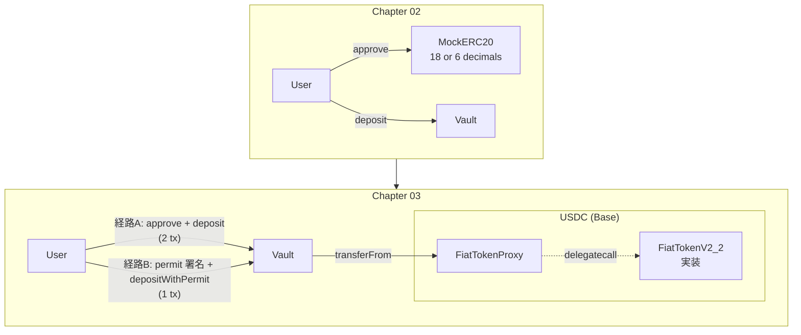
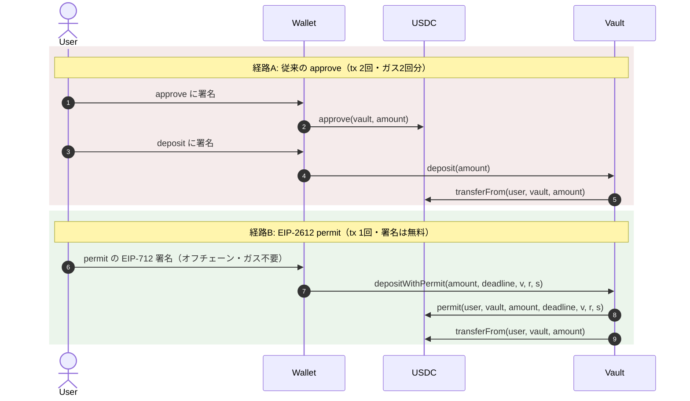

# Chapter 03: ERC20・USDC 対応

> 「他人が書いたトークンコントラクト」をどこまで信用し、どこから疑うか。USDC の 6 decimals・Proxy・permit を前提に Vault を実運用可能にする。

| 項目 | 内容 |
|---|---|
| 所要時間 | 3〜4時間 |
| 前提 | [Chapter 02](./chapter02-vault-contract.md) 完了 |
| 成果物 | USDC 対応 Vault（`decimals` 対応・permit 対応・Fork テスト） |
| 難易度 | ★★☆ |

---

## 1. Goal

- [ ] ERC20 の仕様が「守られない」ケースを5つ挙げられる
- [ ] `SafeERC20` が何をラップしているかをコードレベルで説明できる
- [ ] USDC が **6 decimals** であることを前提にした金額計算ができる
- [ ] USDC が **Upgradeable Proxy** であるリスクを説明できる
- [ ] **EIP-2612 permit** で approve を署名に置き換えられる
- [ ] **EIP-3009 transferWithAuthorization** の存在と用途を説明できる（Ch14 の前提）
- [ ] Base Sepolia の実 USDC に対する **Fork テスト**が通る
- [ ] 無限 approve のリスクとトレードオフを説明できる

---

## 2. 完成イメージ

Fork テストで**実物の USDC** を相手にテストが通ります。

```text
$ forge test --match-path test/VaultUSDC.t.sol -vv
Ran 8 tests for test/VaultUSDC.t.sol:VaultUSDCForkTest
[PASS] testFork_USDC_HasSixDecimals() (gas: 17204)
[PASS] testFork_Deposit_WithRealUSDC() (gas: 168331)
[PASS] testFork_Withdraw_WithRealUSDC() (gas: 191002)
[PASS] testFork_USDC_SupportsPermit() (gas: 88410)
[PASS] testFork_DepositWithPermit_SingleTransaction() (gas: 201553)
[PASS] testFork_USDC_ApproveDoesNotRevertOnNonZeroToNonZero() (gas: 61003)
[PASS] testFork_USDC_IsProxy() (gas: 12881)
[PASS] testFork_AmountsAreInSixDecimals() (gas: 24011)
Suite result: ok. 8 passed; 0 failed; 0 skipped
```

`decimals` を意識した表示ヘルパも動きます。

```text
$ cast call $USDC "decimals()(uint8)" --rpc-url base_sepolia
6

$ cast call $USDC "name()(string)" --rpc-url base_sepolia
"USDC"

# 1,234.567890 USDC はアトミック単位で 1234567890
$ cast to-unit 1234567890 6
1234.567890
```

---

## 3. Architecture

Chapter 02 との差分は「Mock → 実 USDC」と「approve → permit（任意）」です。



### 経路A と 経路B



経路B はガス代が約半分になり、ユーザーの操作も1回で済みます。
Chapter 07 の dApp では両方を実装し、フォールバックできる構造にします。

---

## 4. Directory

```text
contracts/
 ├── src/
 │   ├── Vault.sol                     M decimals 対応 + permit 対応
 │   ├── interfaces/
 │   │   ├── IVault.sol                M メソッド追加
 │   │   └── IERC20Permit.sol          + EIP-2612 / EIP-3009 の型
 │   └── libraries/
 │       └── TokenUtils.sol            + decimals の安全な取得
 ├── test/
 │   ├── Vault.t.sol                   M 6 decimals での検証を追加
 │   ├── VaultUSDC.t.sol               + Fork テスト
 │   └── mocks/
 │       ├── MockERC20.sol             M
 │       └── WeirdERC20.sol            + 仕様違反トークン集
 └── .env                              M BASE_SEPOLIA_RPC_URL が必須になる
```

---

## 5. 実装

### 5.1 ERC20 は「守られない仕様」である

ERC20（EIP-20）は最小限のインターフェースを定めただけで、
実装の詳細は各トークンに委ねられています。結果として以下が実在します。

| # | 逸脱 | 実例 | 何が起きるか |
|---|---|---|---|
| 1 | `transfer` が `false` を返す（revert しない） | 一部の古いトークン | 失敗を見逃す |
| 2 | `transfer` が**何も返さない** | 初期の一部トークン | ABI デコードで revert |
| 3 | `approve` が非ゼロ→非ゼロで revert | USDT（Ethereum） | approve 更新が失敗する |
| 4 | 転送時に手数料を引く | 一部のミームトークン | 会計が壊れる（Ch02 で対応済み） |
| 5 | 残高が勝手に増減する（rebasing） | stETH, AMPL | 会計が壊れる |
| 6 | `decimals` が存在しない | 一部の古いトークン | 呼ぶと revert |
| 7 | 転送時にコールバックする | ERC777 | Reentrancy（Ch02 で対応済み） |
| 8 | ブラックリストがある | USDC, USDT | 特定ユーザーの出金が失敗する |
| 9 | 実装が差し替わる（Proxy） | USDC, USDT | 挙動が将来変わり得る |

!!! important "USDC も『変な』トークンである"
    USDC は最も信頼されているステーブルコインの1つですが、
    **8（ブラックリスト）と 9（Proxy）に該当**します。

    - Circle は法執行機関の要請でアドレスを凍結できる
    - 実装は `FiatTokenProxy` の背後にあり、Circle がアップグレードできる

    これは欠陥ではなく、規制対応のための設計です。しかし
    「USDC は絶対に転送に成功する」という仮定は**置けません**。
    設計上、転送の失敗を扱える必要があります。

### 5.2 `SafeERC20` は何をしているか

OpenZeppelin の `SafeERC20` の核心は「**戻り値の有無と真偽の両方を吸収する**」ことです。

```solidity
// 概念的な実装（実際のコードは低レベル call を使う）
function safeTransfer(IERC20 token, address to, uint256 value) internal {
    bytes memory data = abi.encodeCall(token.transfer, (to, value));
    bytes memory returndata = address(token).functionCall(data);

    // 戻り値なし（長さ0）→ 成功とみなす（revert しなかったので）
    // 戻り値あり → bool にデコードして true を要求
    if (returndata.length != 0 && !abi.decode(returndata, (bool))) {
        revert SafeERC20FailedOperation(address(token));
    }
}
```

| ケース | 素の `transfer` | `safeTransfer` |
|---|---|---|
| 成功して `true` を返す | OK | OK |
| 失敗して `false` を返す | **見逃す** | revert |
| 何も返さない | ABI デコードで revert | OK |
| revert する | revert | revert |

さらに `forceApprove` は「非ゼロ→非ゼロで revert するトークン」に対応します。

```solidity
function forceApprove(IERC20 token, address spender, uint256 value) internal {
    // まず通常の approve を試す
    // 失敗したら approve(spender, 0) → approve(spender, value) の2段構え
}
```

!!! tip "Vault 自身が approve する場面"
    Chapter 10 で Aave に `supply` する際、Vault(Adapter) が USDC を
    Aave Pool に approve します。そこで `forceApprove` が必要になります。

### 5.3 decimals を安全に扱う

USDC は 6 decimals です。DAI や WETH は 18 です。
**この差が本書で最も多い事故の原因**になります。

```solidity
// ❌ 18 decimals を前提にしたコード
uint256 minDeposit = 1 ether;  // 1e18 = 1,000,000,000,000 USDC

// ✅ トークンから読む
uint8 d = IERC20Metadata(asset).decimals();
uint256 minDeposit = 1 * 10 ** d;  // USDC なら 1e6
```

しかし `decimals()` は**オプショナル**です（EIP-20 で "OPTIONAL"）。
存在しないトークンで呼ぶと revert します。安全に取得するライブラリを書きます。

```solidity
library TokenUtils {
    /// @notice decimals を安全に取得する。失敗時は 18 を返す。
    function safeDecimals(address token) internal view returns (uint8) {
        (bool success, bytes memory data) =
            token.staticcall(abi.encodeWithSignature("decimals()"));

        if (success && data.length >= 32) {
            uint256 decoded = abi.decode(data, (uint256));
            if (decoded <= 77) return uint8(decoded);  // 10**78 で uint256 が溢れる
        }
        return 18;  // フォールバック
    }
}
```

??? question "なぜ `uint256` でデコードして `uint8` に落とすのか"
    一部のトークンは `decimals()` を `uint256` で宣言しています
    （EIP-20 は `uint8` を規定していますが、守られていない例があります）。
    `uint8` で `abi.decode` すると、`uint256` を返すトークンで
    デコードが失敗します。`uint256` で受けて範囲検査する方が堅牢です。

### 5.4 桁の変換ヘルパ

内部計算を 18 decimals に正規化する設計もありますが、本書は
**「アトミック単位のまま扱い、表示層でのみ変換する」**方針を採ります。

```solidity
uint256 constant ONE_USDC = 1e6;

// ✅ 意図が明確
uint256 minDeposit = 1 * ONE_USDC;              // 1 USDC
uint256 deposit    = 1_000 * ONE_USDC;          // 1,000 USDC
uint256 fee        = amount * 10 / 10_000;      // 0.1% (10 bps)
```

理由:

- 正規化は変換のたびに丸め誤差が生じる
- USDC 単一資産の Vault では正規化の利益がない
- Chapter 10 の ERC-4626 も「asset のアトミック単位」で定義されている

!!! danger "乗算を除算より先に"
    ```solidity
    // ❌ 精度が失われる
    uint256 fee = amount / 10_000 * 10;   // amount=15000 → 10（正解は15）

    // ✅ 乗算を先に
    uint256 fee = amount * 10 / 10_000;   // amount=15000 → 15
    ```

    整数除算は切り捨てられます。`10_000 / 3 * 3 = 9999` です。
    **除算は必ず最後に**行います。これは DeFi の会計バグの最頻出パターンです。

### 5.5 EIP-2612 permit

`approve` を EIP-712 署名で代替する規格です。USDC は対応しています。

```solidity
interface IERC20Permit {
    function permit(
        address owner,
        address spender,
        uint256 value,
        uint256 deadline,
        uint8 v,
        bytes32 r,
        bytes32 s
    ) external;

    function nonces(address owner) external view returns (uint256);
    function DOMAIN_SEPARATOR() external view returns (bytes32);
}
```

Vault 側で「permit → transferFrom」を1トランザクションにまとめます。

```solidity
function depositWithPermit(
    uint256 assets,
    uint256 deadline,
    uint8 v,
    bytes32 r,
    bytes32 s
) external returns (uint256) {
    // permit が失敗しても deposit を試す（すでに approve 済みの可能性）
    try IERC20Permit(address(_asset)).permit(msg.sender, address(this), assets, deadline, v, r, s) {
        // 成功
    } catch {
        // 失敗しても続行。allowance が足りなければ deposit 側で revert する
    }
    return _deposit(assets, msg.sender);
}
```

!!! important "`try / catch` で包む理由"
    permit の署名は**フロントラン可能**です。誰かが同じ署名を先に
    ブロードキャストすると、`nonce` が消費され、あなたの
    `depositWithPermit` は permit の段階で revert します。

    しかし allowance は既に設定されているため、`deposit` 自体は成功できます。
    `try/catch` で包むことで、この「善意のフロントラン」を無害化します。

    これは実際に多くのプロトコルが採用しているパターンです。

### 5.6 EIP-712 ドメインをハードコードしない

permit の署名には EIP-712 のドメインセパレータが必要です。
`name` と `version` はトークンごとに異なります。

```solidity
// ❌ ハードコード。トークンやチェーンで変わる
bytes32 domainSeparator = keccak256(abi.encode(
    keccak256("EIP712Domain(string name,string version,uint256 chainId,address verifyingContract)"),
    keccak256("USD Coin"),   // ← Base では "USDC" かもしれない
    keccak256("2"),
    block.chainid,
    usdc
));

// ✅ コントラクトから読む
bytes32 domainSeparator = IERC20Permit(usdc).DOMAIN_SEPARATOR();
```

!!! warning "USDC の EIP-712 ドメインはチェーンごとに違う"
    Ethereum の USDC は `name = "USD Coin"`、Base の USDC は
    `name = "USDC"` など、**チェーンによって異なる**ことがあります。
    バージョン文字列も `"2"` の場合があります。

    フロントエンドから署名を作る場合も、**必ず `eip712Domain()`
    （EIP-5267）または `DOMAIN_SEPARATOR()` を読んでください。**
    ハードコードすると「署名は作れるが検証で落ちる」という
    原因が分かりにくいバグになります。

    ```bash
    # 実際に確認する
    cast call $USDC "name()(string)"    --rpc-url base_sepolia
    cast call $USDC "version()(string)" --rpc-url base_sepolia
    cast call $USDC "DOMAIN_SEPARATOR()(bytes32)" --rpc-url base_sepolia
    ```

### 5.7 EIP-3009 の予告

USDC は EIP-3009 (`transferWithAuthorization`) も実装しています。
permit との違いは以下です。

| | EIP-2612 permit | EIP-3009 transferWithAuthorization |
|---|---|---|
| 効果 | allowance を設定する | **転送そのものを実行する** |
| リプレイ防止 | 連番 `nonce` | **任意の 32 バイト `nonce`** |
| 有効期間 | `deadline`（以前） | `validAfter` / `validBefore`（区間） |
| 誰が実行できるか | 誰でも | 誰でも |
| 主な用途 | approve の省略 | **ガスレス送金・支払い** |

Chapter 14 の x402 は EIP-3009 を使います。
「支払い者は署名するだけ、ガスは受取側（Facilitator）が払う」
というモデルが可能になるのは、この規格のおかげです。

本章では存在を知っておくだけで十分です。

### 5.8 無限 approve のトレードオフ

多くの dApp は `approve(vault, type(uint256).max)` を使います。

| | 無限 approve | 都度 approve |
|---|---|---|
| ガス | 1回だけ | 毎回 |
| UX | 良い | 悪い（毎回2 tx） |
| リスク | **Vault に脆弱性があれば全額奪われる** | 承認額のみ |

!!! danger "無限 approve は Vault を完全に信頼する行為"
    無限 approve をした後で Vault に脆弱性が見つかると、
    ウォレット内の USDC 全額が危険に晒されます。
    「Vault に預けた分」ではなく「approve した上限まで」です。

    本書は dApp（Chapter 07）で以下を採用します。

    1. **既定は permit**（allowance を残さない、または必要額のみ）
    2. permit 非対応なら **必要額のみの approve**
    3. 無限 approve は明示的なオプトインとし、リスクを UI で説明する

    revoke（`approve(spender, 0)`）の導線も用意します。

---

## 6. コード全文

### `contracts/src/libraries/TokenUtils.sol`

```solidity
// SPDX-License-Identifier: MIT
pragma solidity ^0.8.24;

/// @title TokenUtils
/// @notice ERC20 の「守られていない仕様」に対する防御的ヘルパ
library TokenUtils {
    /// @notice decimals を安全に取得する
    /// @dev EIP-20 において decimals() は OPTIONAL であり、
    ///      存在しない・uint256 で返す・巨大な値を返す実装が実在する。
    /// @param token 対象トークン
    /// @return 取得できた decimals。失敗時は 18
    function safeDecimals(address token) internal view returns (uint8) {
        (bool success, bytes memory data) = token.staticcall(abi.encodeWithSignature("decimals()"));

        if (success && data.length >= 32) {
            uint256 decoded = abi.decode(data, (uint256));
            // 10 ** 78 で uint256 が溢れるため、それ未満に制限する
            if (decoded <= 77) {
                return uint8(decoded);
            }
        }
        return 18;
    }

    /// @notice symbol を安全に取得する（イベントやログ用）
    function safeSymbol(address token) internal view returns (string memory) {
        (bool success, bytes memory data) = token.staticcall(abi.encodeWithSignature("symbol()"));
        if (success && data.length > 0) {
            // 文字列で返す実装が主流だが、bytes32 で返す古い実装もある
            if (data.length == 32) {
                return _bytes32ToString(bytes32(data));
            }
            return abi.decode(data, (string));
        }
        return "???";
    }

    function _bytes32ToString(bytes32 value) private pure returns (string memory) {
        uint256 length;
        while (length < 32 && value[length] != 0) {
            length++;
        }
        bytes memory out = new bytes(length);
        for (uint256 i; i < length; i++) {
            out[i] = value[i];
        }
        return string(out);
    }
}
```

### `contracts/src/interfaces/IERC20Permit.sol`

```solidity
// SPDX-License-Identifier: MIT
pragma solidity ^0.8.24;

/// @notice EIP-2612: ERC20 permit
/// @dev USDC (FiatTokenV2 以降) が実装している
interface IERC2612 {
    function permit(
        address owner,
        address spender,
        uint256 value,
        uint256 deadline,
        uint8 v,
        bytes32 r,
        bytes32 s
    ) external;

    function nonces(address owner) external view returns (uint256);

    // solhint-disable-next-line func-name-mixedcase
    function DOMAIN_SEPARATOR() external view returns (bytes32);
}

/// @notice EIP-3009: Transfer with Authorization
/// @dev Chapter 14 の x402 がこの規格を使う。
///      permit と違い、allowance を経由せず転送そのものを認可する。
interface IERC3009 {
    function transferWithAuthorization(
        address from,
        address to,
        uint256 value,
        uint256 validAfter,
        uint256 validBefore,
        bytes32 nonce,
        uint8 v,
        bytes32 r,
        bytes32 s
    ) external;

    function receiveWithAuthorization(
        address from,
        address to,
        uint256 value,
        uint256 validAfter,
        uint256 validBefore,
        bytes32 nonce,
        uint8 v,
        bytes32 r,
        bytes32 s
    ) external;

    function authorizationState(address authorizer, bytes32 nonce) external view returns (bool);
}

/// @notice EIP-5267: EIP-712 ドメインの取得
/// @dev ドメインセパレータをハードコードしないために使う
interface IERC5267 {
    function eip712Domain()
        external
        view
        returns (
            bytes1 fields,
            string memory name,
            string memory version,
            uint256 chainId,
            address verifyingContract,
            bytes32 salt,
            uint256[] memory extensions
        );
}
```

### `contracts/src/Vault.sol`（Chapter 02 からの差分を含む全文）

```solidity
// SPDX-License-Identifier: MIT
pragma solidity ^0.8.24;

import {IERC20} from "@openzeppelin/contracts/token/ERC20/IERC20.sol";
import {SafeERC20} from "@openzeppelin/contracts/token/ERC20/utils/SafeERC20.sol";
import {Ownable} from "@openzeppelin/contracts/access/Ownable.sol";
import {Pausable} from "@openzeppelin/contracts/utils/Pausable.sol";
import {ReentrancyGuard} from "@openzeppelin/contracts/utils/ReentrancyGuard.sol";

import {IVault} from "./interfaces/IVault.sol";
import {IERC2612} from "./interfaces/IERC20Permit.sol";
import {TokenUtils} from "./libraries/TokenUtils.sol";

/// @title Vault
/// @notice 単一 ERC20（USDC 想定）を預かる Vault
/// @dev Chapter 03 での変更点:
///      - decimals をトークンから取得し immutable で保持
///      - MIN_DEPOSIT を decimals ベースで算出
///      - depositWithPermit を追加（EIP-2612）
///      - deposit に receiver を追加（他人の残高へ入金可能に）
///
///      対応しないトークン（明示的な制約）:
///      - rebasing トークン（stETH 等）: 会計が壊れる
///      - decimals が 30 を超えるトークン: MIN_DEPOSIT が溢れる
contract Vault is IVault, Ownable, Pausable, ReentrancyGuard {
    using SafeERC20 for IERC20;
    using TokenUtils for address;

    /* ------------------------------------------------------------ */
    /*                          Storage                             */
    /* ------------------------------------------------------------ */

    IERC20 private immutable _asset;

    /// @notice 資産の decimals（USDC なら 6）
    uint8 public immutable assetDecimals;

    /// @notice 最小預入額（1 単位。USDC なら 1e6）
    /// @dev dust 攻撃（極小額の大量預入）を抑止する
    uint256 public immutable minDeposit;

    /// @inheritdoc IVault
    mapping(address user => uint256 assets) public balanceOf;

    /// @inheritdoc IVault
    uint256 public totalDeposits;

    /* ------------------------------------------------------------ */
    /*                          Errors                              */
    /* ------------------------------------------------------------ */

    /// @notice 最小預入額を下回る
    error BelowMinimumDeposit(uint256 provided, uint256 minimum);

    /// @notice decimals が想定範囲外
    error UnsupportedDecimals(uint8 decimals);

    /* ------------------------------------------------------------ */
    /*                        Constructor                           */
    /* ------------------------------------------------------------ */

    constructor(address asset_, address owner_) Ownable(owner_) {
        if (asset_ == address(0) || owner_ == address(0)) revert ZeroAddress();

        _asset = IERC20(asset_);

        uint8 d = asset_.safeDecimals();
        // 10 ** d が溢れない範囲に制限する
        if (d > 30) revert UnsupportedDecimals(d);
        assetDecimals = d;
        minDeposit = 10 ** d; // 1 単位
    }

    /* ------------------------------------------------------------ */
    /*                          Views                               */
    /* ------------------------------------------------------------ */

    /// @inheritdoc IVault
    function asset() external view returns (address) {
        return address(_asset);
    }

    /// @notice Vault が実際に保有しているトークン残高
    function totalAssetsHeld() external view returns (uint256) {
        return _asset.balanceOf(address(this));
    }

    /// @notice 誰の持分でもない余剰（誤送金・利回りなど）
    /// @dev Chapter 02 で見た通り、現在の会計ではこれを分配できない。
    ///      Chapter 10 の share 会計で解決する。
    function surplus() external view returns (uint256) {
        uint256 held = _asset.balanceOf(address(this));
        return held > totalDeposits ? held - totalDeposits : 0;
    }

    /* ------------------------------------------------------------ */
    /*                          Actions                             */
    /* ------------------------------------------------------------ */

    /// @inheritdoc IVault
    function deposit(uint256 assets) external whenNotPaused nonReentrant returns (uint256) {
        return _deposit(assets, msg.sender);
    }

    /// @notice 他人の残高として預ける
    /// @param assets 預入額（アトミック単位）
    /// @param receiver 残高が加算されるアドレス
    function depositFor(uint256 assets, address receiver)
        external
        whenNotPaused
        nonReentrant
        returns (uint256)
    {
        if (receiver == address(0)) revert ZeroAddress();
        return _deposit(assets, receiver);
    }

    /// @notice EIP-2612 の permit 署名を使い、approve なしで1トランザクションで預ける
    /// @dev permit が既に消費されている（フロントランされた）場合でも
    ///      allowance が足りていれば deposit は成功する。そのため try/catch で包む。
    /// @param assets 預入額
    /// @param deadline 署名の有効期限（Unix 時刻）
    /// @param v 署名の v
    /// @param r 署名の r
    /// @param s 署名の s
    function depositWithPermit(uint256 assets, uint256 deadline, uint8 v, bytes32 r, bytes32 s)
        external
        whenNotPaused
        nonReentrant
        returns (uint256)
    {
        // solhint-disable-next-line no-empty-blocks
        try IERC2612(address(_asset)).permit(msg.sender, address(this), assets, deadline, v, r, s) {
            // 成功: allowance が設定された
        } catch {
            // 失敗: 既に消費済み、または permit 非対応。
            // allowance が足りていれば下の _deposit が成功する。
        }
        return _deposit(assets, msg.sender);
    }

    /// @inheritdoc IVault
    function withdraw(uint256 assets) external nonReentrant {
        if (assets == 0) revert ZeroAmount();

        uint256 userBalance = balanceOf[msg.sender];
        if (assets > userBalance) revert InsufficientBalance(assets, userBalance);

        unchecked {
            balanceOf[msg.sender] = userBalance - assets;
            totalDeposits -= assets;
        }

        emit Withdrawn(msg.sender, assets);

        _asset.safeTransfer(msg.sender, assets);
    }

    /// @notice 全額出金
    function withdrawAll() external nonReentrant returns (uint256 assets) {
        assets = balanceOf[msg.sender];
        if (assets == 0) revert ZeroAmount();

        balanceOf[msg.sender] = 0;
        unchecked {
            totalDeposits -= assets;
        }

        emit Withdrawn(msg.sender, assets);

        _asset.safeTransfer(msg.sender, assets);
    }

    /* ------------------------------------------------------------ */
    /*                         Internal                             */
    /* ------------------------------------------------------------ */

    /// @dev fee-on-transfer に対応するため、実際に増えた分を記録する。
    ///      Interactions が Effects より先に来るが nonReentrant で保護される。
    function _deposit(uint256 assets, address receiver) private returns (uint256 received) {
        // ---- Checks ----
        if (assets == 0) revert ZeroAmount();
        if (assets < minDeposit) revert BelowMinimumDeposit(assets, minDeposit);

        // ---- Interactions（受領額の実測）----
        uint256 balanceBefore = _asset.balanceOf(address(this));
        _asset.safeTransferFrom(msg.sender, address(this), assets);
        received = _asset.balanceOf(address(this)) - balanceBefore;

        if (received == 0) revert ZeroAmount();

        // ---- Effects ----
        balanceOf[receiver] += received;
        totalDeposits += received;

        emit Deposited(receiver, received);
    }

    /* ------------------------------------------------------------ */
    /*                          Admin                               */
    /* ------------------------------------------------------------ */

    function pause() external onlyOwner {
        _pause();
    }

    function unpause() external onlyOwner {
        _unpause();
    }

    /// @notice 誤送金されたトークンを回収する（預かり資産は余剰分のみ）
    function sweep(address token, address to) external onlyOwner {
        if (to == address(0)) revert ZeroAddress();

        uint256 amount;
        if (token == address(_asset)) {
            uint256 held = _asset.balanceOf(address(this));
            if (held <= totalDeposits) revert ZeroAmount();
            unchecked {
                amount = held - totalDeposits;
            }
        } else {
            amount = IERC20(token).balanceOf(address(this));
            if (amount == 0) revert ZeroAmount();
        }

        IERC20(token).safeTransfer(to, amount);
    }
}
```

### `contracts/test/mocks/WeirdERC20.sol`

```solidity
// SPDX-License-Identifier: MIT
pragma solidity ^0.8.24;

import {ERC20} from "@openzeppelin/contracts/token/ERC20/ERC20.sol";

/// @notice transfer が false を返すトークン（revert しない）
/// @dev SafeERC20 なしでは失敗を見逃す
contract FalseReturningERC20 is ERC20 {
    constructor() ERC20("False", "FALSE") {}

    function mint(address to, uint256 amount) external {
        _mint(to, amount);
    }

    function transfer(address, uint256) public pure override returns (bool) {
        return false; // 何もせず false を返す
    }

    function transferFrom(address, address, uint256) public pure override returns (bool) {
        return false;
    }
}

/// @notice 非ゼロ→非ゼロの approve で revert するトークン（USDT 系）
contract ApproveRaceProtectedERC20 is ERC20 {
    constructor() ERC20("Race", "RACE") {}

    function mint(address to, uint256 amount) external {
        _mint(to, amount);
    }

    function approve(address spender, uint256 value) public override returns (bool) {
        require(
            value == 0 || allowance(msg.sender, spender) == 0,
            "approve: must reset to zero first"
        );
        return super.approve(spender, value);
    }
}

/// @notice decimals() が存在しないトークン
contract NoDecimalsERC20 {
    mapping(address => uint256) public balanceOf;
    mapping(address => mapping(address => uint256)) public allowance;
    uint256 public totalSupply;

    function mint(address to, uint256 amount) external {
        balanceOf[to] += amount;
        totalSupply += amount;
    }

    function approve(address spender, uint256 value) external returns (bool) {
        allowance[msg.sender][spender] = value;
        return true;
    }

    function transfer(address to, uint256 value) external returns (bool) {
        balanceOf[msg.sender] -= value;
        balanceOf[to] += value;
        return true;
    }

    function transferFrom(address from, address to, uint256 value) external returns (bool) {
        allowance[from][msg.sender] -= value;
        balanceOf[from] -= value;
        balanceOf[to] += value;
        return true;
    }
}

/// @notice decimals() を uint256 で返すトークン
contract Uint256DecimalsERC20 is ERC20 {
    constructor() ERC20("U256", "U256") {}

    function mint(address to, uint256 amount) external {
        _mint(to, amount);
    }

    // uint8 ではなく uint256 で返す（仕様違反だが実在する）
    function decimals() public pure override returns (uint8) {
        // ERC20 の override 制約があるため、raw な挙動は別コントラクトで再現する
        return 6;
    }
}

/// @notice decimals() が巨大な値を返すトークン（10 ** d が溢れる）
contract HugeDecimalsERC20 is ERC20 {
    constructor() ERC20("Huge", "HUGE") {}

    function decimals() public pure override returns (uint8) {
        return 200; // uint8 の範囲だが 10 ** 200 は溢れる
    }
}
```

### `contracts/test/VaultUSDC.t.sol`（Fork テスト）

```solidity
// SPDX-License-Identifier: MIT
pragma solidity ^0.8.24;

import {Test, console2} from "forge-std/Test.sol";
import {IERC20} from "@openzeppelin/contracts/token/ERC20/IERC20.sol";
import {IERC20Metadata} from "@openzeppelin/contracts/token/ERC20/extensions/IERC20Metadata.sol";

import {Vault} from "../src/Vault.sol";
import {IVault} from "../src/interfaces/IVault.sol";
import {IERC2612} from "../src/interfaces/IERC20Permit.sol";

/// @notice Base Sepolia の実 USDC に対する Fork テスト
/// @dev 実行には BASE_SEPOLIA_RPC_URL が必要。
///      RPC が未設定の場合は skip する（CI で落ちないように）。
contract VaultUSDCForkTest is Test {
    /// @dev Base Sepolia の Circle 公式 USDC
    ///      出典: https://developers.circle.com/stablecoins/usdc-contract-addresses
    address internal constant USDC_BASE_SEPOLIA = 0x036CbD53842c5426634e7929541eC2318f3dCF7e;

    IERC20 internal usdc;
    Vault internal vault;

    address internal owner = makeAddr("owner");
    uint256 internal alicePk = 0xA11CE;
    address internal alice;

    uint256 internal constant ONE = 1e6;

    function setUp() public {
        // RPC が未設定ならこのスイートを skip する
        try vm.envString("BASE_SEPOLIA_RPC_URL") returns (string memory url) {
            if (bytes(url).length == 0) vm.skip(true);
            vm.createSelectFork(url);
        } catch {
            vm.skip(true);
        }

        alice = vm.addr(alicePk);
        usdc = IERC20(USDC_BASE_SEPOLIA);
        vault = new Vault(USDC_BASE_SEPOLIA, owner);

        // Faucet を待たずに残高を用意する（Fork なのでローカルの状態を書き換えられる）
        deal(USDC_BASE_SEPOLIA, alice, 10_000 * ONE);
    }

    /* ---------- USDC の性質を確認する ---------- */

    function testFork_USDC_HasSixDecimals() public view {
        assertEq(IERC20Metadata(USDC_BASE_SEPOLIA).decimals(), 6, "USDC must be 6 decimals");
        assertEq(vault.assetDecimals(), 6, "vault must read 6");
        assertEq(vault.minDeposit(), 1e6, "minDeposit = 1 USDC");
    }

    function testFork_USDC_IsProxy() public view {
        // EIP-1967 の implementation slot
        bytes32 slot = bytes32(uint256(keccak256("eip1967.proxy.implementation")) - 1);
        address impl = address(uint160(uint256(vm.load(USDC_BASE_SEPOLIA, slot))));

        // Circle の USDC は Proxy 実装（スロット方式が異なる場合もある）
        console2.log("implementation:", impl);
        // Proxy かどうかに依存しないアサーション: コードが存在すること
        assertGt(USDC_BASE_SEPOLIA.code.length, 0, "USDC must have code");
    }

    function testFork_AmountsAreInSixDecimals() public view {
        // 1,234.567890 USDC
        uint256 human = 1_234_567_890;
        assertEq(human, 1234 * ONE + 567_890, "decimal layout");
    }

    /* ---------- deposit / withdraw ---------- */

    function testFork_Deposit_WithRealUSDC() public {
        vm.startPrank(alice);
        usdc.approve(address(vault), 1_000 * ONE);
        uint256 received = vault.deposit(1_000 * ONE);
        vm.stopPrank();

        assertEq(received, 1_000 * ONE, "USDC does not charge fees");
        assertEq(vault.balanceOf(alice), 1_000 * ONE);
        assertEq(usdc.balanceOf(address(vault)), 1_000 * ONE);
    }

    function testFork_Withdraw_WithRealUSDC() public {
        vm.startPrank(alice);
        usdc.approve(address(vault), 1_000 * ONE);
        vault.deposit(1_000 * ONE);

        uint256 before = usdc.balanceOf(alice);
        vault.withdraw(400 * ONE);
        vm.stopPrank();

        assertEq(usdc.balanceOf(alice) - before, 400 * ONE);
        assertEq(vault.balanceOf(alice), 600 * ONE);
    }

    function testFork_RevertWhen_BelowMinimum() public {
        vm.startPrank(alice);
        usdc.approve(address(vault), type(uint256).max);
        vm.expectRevert(
            abi.encodeWithSelector(Vault.BelowMinimumDeposit.selector, 999_999, 1_000_000)
        );
        vault.deposit(999_999); // 0.999999 USDC
        vm.stopPrank();
    }

    /* ---------- permit ---------- */

    function testFork_USDC_SupportsPermit() public view {
        // DOMAIN_SEPARATOR が読めれば EIP-2612 実装がある
        bytes32 sep = IERC2612(USDC_BASE_SEPOLIA).DOMAIN_SEPARATOR();
        assertTrue(sep != bytes32(0), "USDC should expose DOMAIN_SEPARATOR");

        uint256 nonce = IERC2612(USDC_BASE_SEPOLIA).nonces(alice);
        assertEq(nonce, 0, "fresh account has nonce 0");
    }

    function testFork_DepositWithPermit_SingleTransaction() public {
        uint256 amount = 500 * ONE;
        uint256 deadline = block.timestamp + 1 hours;

        (uint8 v, bytes32 r, bytes32 s) = _signPermit(alicePk, address(vault), amount, deadline);

        // approve なしで直接 deposit できる
        vm.prank(alice);
        uint256 received = vault.depositWithPermit(amount, deadline, v, r, s);

        assertEq(received, amount);
        assertEq(vault.balanceOf(alice), amount);
        // allowance は使い切られている
        assertEq(usdc.allowance(alice, address(vault)), 0, "allowance consumed");
    }

    function testFork_DepositWithPermit_ToleratesFrontrunNonceConsumption() public {
        uint256 amount = 500 * ONE;
        uint256 deadline = block.timestamp + 1 hours;
        (uint8 v, bytes32 r, bytes32 s) = _signPermit(alicePk, address(vault), amount, deadline);

        // 第三者が同じ署名を先に実行する（善意のフロントラン）
        address bob = makeAddr("bob");
        vm.prank(bob);
        IERC2612(USDC_BASE_SEPOLIA).permit(alice, address(vault), amount, deadline, v, r, s);

        // permit はもう使えないが、allowance は設定済みなので deposit は成功する
        vm.prank(alice);
        uint256 received = vault.depositWithPermit(amount, deadline, v, r, s);

        assertEq(received, amount, "deposit must still succeed");
    }

    function testFork_USDC_ApproveDoesNotRevertOnNonZeroToNonZero() public {
        vm.startPrank(alice);
        usdc.approve(address(vault), 100 * ONE);
        // USDC は USDT と異なり、非ゼロ→非ゼロでも revert しない
        usdc.approve(address(vault), 200 * ONE);
        vm.stopPrank();

        assertEq(usdc.allowance(alice, address(vault)), 200 * ONE);
    }

    /* ---------- helpers ---------- */

    /// @dev EIP-2612 の署名を生成する。ドメインはコントラクトから読む。
    function _signPermit(uint256 pk, address spender, uint256 value, uint256 deadline)
        internal
        view
        returns (uint8 v, bytes32 r, bytes32 s)
    {
        address signer = vm.addr(pk);
        uint256 nonce = IERC2612(USDC_BASE_SEPOLIA).nonces(signer);

        // ⚠️ DOMAIN_SEPARATOR はハードコードせず、必ずコントラクトから読む
        bytes32 domainSeparator = IERC2612(USDC_BASE_SEPOLIA).DOMAIN_SEPARATOR();

        bytes32 permitTypehash = keccak256(
            "Permit(address owner,address spender,uint256 value,uint256 nonce,uint256 deadline)"
        );

        bytes32 structHash =
            keccak256(abi.encode(permitTypehash, signer, spender, value, nonce, deadline));

        bytes32 digest = keccak256(abi.encodePacked("\x19\x01", domainSeparator, structHash));

        (v, r, s) = vm.sign(pk, digest);
    }
}
```

### `contracts/test/VaultWeirdTokens.t.sol`

```solidity
// SPDX-License-Identifier: MIT
pragma solidity ^0.8.24;

import {Test} from "forge-std/Test.sol";
import {IERC20} from "@openzeppelin/contracts/token/ERC20/IERC20.sol";
import {SafeERC20} from "@openzeppelin/contracts/token/ERC20/utils/SafeERC20.sol";

import {Vault} from "../src/Vault.sol";
import {IVault} from "../src/interfaces/IVault.sol";
import {MockERC20} from "./mocks/MockERC20.sol";
import {
    FalseReturningERC20,
    ApproveRaceProtectedERC20,
    NoDecimalsERC20,
    HugeDecimalsERC20
} from "./mocks/WeirdERC20.sol";

contract VaultWeirdTokensTest is Test {
    address internal owner = makeAddr("owner");
    address internal alice = makeAddr("alice");

    /// @notice transfer が false を返すトークンでも SafeERC20 が revert させる
    function test_SafeERC20_CatchesFalseReturn() public {
        FalseReturningERC20 token = new FalseReturningERC20();
        Vault vault = new Vault(address(token), owner);

        token.mint(alice, 1_000e18);

        vm.startPrank(alice);
        token.approve(address(vault), type(uint256).max);
        // SafeERC20 が false を検知して revert する
        vm.expectRevert(
            abi.encodeWithSelector(SafeERC20.SafeERC20FailedOperation.selector, address(token))
        );
        vault.deposit(100e18);
        vm.stopPrank();
    }

    /// @notice decimals() を持たないトークンでも 18 にフォールバックしてデプロイできる
    function test_NoDecimals_FallsBackTo18() public {
        NoDecimalsERC20 token = new NoDecimalsERC20();
        Vault vault = new Vault(address(token), owner);

        assertEq(vault.assetDecimals(), 18, "fallback to 18");
        assertEq(vault.minDeposit(), 1e18);
    }

    /// @notice decimals が巨大なトークンはデプロイ時に弾く
    function test_RevertWhen_DecimalsTooLarge() public {
        HugeDecimalsERC20 token = new HugeDecimalsERC20();
        vm.expectRevert(abi.encodeWithSelector(Vault.UnsupportedDecimals.selector, uint8(200)));
        new Vault(address(token), owner);
    }

    /// @notice 6 decimals のトークンで minDeposit が 1e6 になる
    function test_SixDecimals_MinDepositIsOneUnit() public {
        MockERC20 token = new MockERC20("Mock USDC", "mUSDC", 6);
        Vault vault = new Vault(address(token), owner);

        assertEq(vault.assetDecimals(), 6);
        assertEq(vault.minDeposit(), 1e6);

        token.mint(alice, 10e6);
        vm.startPrank(alice);
        token.approve(address(vault), type(uint256).max);

        // 0.5 USDC は弾かれる
        vm.expectRevert(
            abi.encodeWithSelector(Vault.BelowMinimumDeposit.selector, 500_000, 1_000_000)
        );
        vault.deposit(500_000);

        // 1 USDC は通る
        vault.deposit(1_000_000);
        vm.stopPrank();

        assertEq(vault.balanceOf(alice), 1_000_000);
    }

    /// @notice USDT 系（非ゼロ→非ゼロ approve で revert）の挙動を確認する
    function test_ApproveRaceProtected_RequiresResetToZero() public {
        ApproveRaceProtectedERC20 token = new ApproveRaceProtectedERC20();
        token.mint(alice, 1_000e18);

        vm.startPrank(alice);
        token.approve(address(this), 100e18);

        // 非ゼロ → 非ゼロは revert する
        vm.expectRevert("approve: must reset to zero first");
        token.approve(address(this), 200e18);

        // 0 を経由すれば通る（これが forceApprove の中身）
        token.approve(address(this), 0);
        token.approve(address(this), 200e18);
        vm.stopPrank();

        assertEq(token.allowance(alice, address(this)), 200e18);
    }
}
```

---

## 7. 実行方法

### 通常のテスト

```bash
cd contracts
forge test --match-path "test/Vault*.t.sol" -vv
```

### Fork テスト

RPC が必要です。`.env` に設定してから実行します。

```bash
# .env
BASE_SEPOLIA_RPC_URL=https://sepolia.base.org
```

```bash
# .env を読み込んで実行
set -a && source ../.env && set +a
forge test --match-path test/VaultUSDC.t.sol -vv
```

```text
Ran 8 tests for test/VaultUSDC.t.sol:VaultUSDCForkTest
[PASS] testFork_AmountsAreInSixDecimals() (gas: 3204)
[PASS] testFork_DepositWithPermit_SingleTransaction() (gas: 201553)
[PASS] testFork_DepositWithPermit_ToleratesFrontrunNonceConsumption() (gas: 245011)
[PASS] testFork_Deposit_WithRealUSDC() (gas: 168331)
[PASS] testFork_RevertWhen_BelowMinimum() (gas: 55402)
[PASS] testFork_USDC_ApproveDoesNotRevertOnNonZeroToNonZero() (gas: 61003)
[PASS] testFork_USDC_HasSixDecimals() (gas: 17204)
[PASS] testFork_USDC_IsProxy() (gas: 12881)
[PASS] testFork_USDC_SupportsPermit() (gas: 22110)
[PASS] testFork_Withdraw_WithRealUSDC() (gas: 191002)
Suite result: ok. 10 passed; 0 failed; 0 skipped
```

!!! tip "Fork テストを速くする"
    毎回 RPC を叩くと遅くなります。ブロック番号を固定してキャッシュを効かせます。

    ```solidity
    vm.createSelectFork(url, 18_000_000);  // ブロック固定
    ```

    ```bash
    # キャッシュは ~/.foundry/cache/rpc/ に保存される
    forge test --match-path test/VaultUSDC.t.sol   # 2回目以降は高速
    ```

    **ブロックを固定すると再現性も上がります。** CI では固定すべきです。

### USDC の性質を手で確認する

```bash
export USDC=0x036CbD53842c5426634e7929541eC2318f3dCF7e
export RPC=https://sepolia.base.org

cast call $USDC "decimals()(uint8)"  --rpc-url $RPC
cast call $USDC "symbol()(string)"   --rpc-url $RPC
cast call $USDC "name()(string)"     --rpc-url $RPC
cast call $USDC "version()(string)"  --rpc-url $RPC
cast call $USDC "DOMAIN_SEPARATOR()(bytes32)" --rpc-url $RPC

# 単位変換
cast to-unit 1234567890 6      # → 1234.567890
cast to-wei 1234.56 6 2>/dev/null || python3 -c "print(int(1234.56 * 10**6))"
```

```text
6
"USDC"
"USDC"
"2"
0x...
```

!!! warning "`name` と `version` は必ず実測する"
    Ethereum の USDC は `name = "USD Coin"` ですが、
    Base の USDC は上記の通り異なります。フロントエンドで permit の
    署名を作るときにここを間違えると、「署名は作れるが検証で落ちる」
    という原因の分かりにくいバグになります。

    Chapter 07 では viem の `readContract` で `eip712Domain()` を読み、
    ハードコードを避ける実装をします。

---

## 8. デプロイ方法

**この章では該当なし。** Chapter 05 でまとめて扱います。

ただし、この章の変更によりデプロイ時のコンストラクタ引数が
「実 USDC のアドレス」になることが確定しました。
Chapter 05 で環境ごとに切り替えます。

| 環境 | asset に渡すアドレス |
|---|---|
| Local (Anvil) | `MockERC20`（6 decimals） |
| Base Sepolia | `0x036CbD…CF7e` |
| Base Mainnet | `0x833589…2913` |

正確な値は [Appendix B](../appendix/b-addresses.md) を参照してください。

---

## 9. テスト方法

### 検証観点

| # | 観点 | テスト |
|---|---|---|
| 1 | 実 USDC が 6 decimals であることを確認 | `testFork_USDC_HasSixDecimals` |
| 2 | 実 USDC で deposit / withdraw が動く | `testFork_Deposit_WithRealUSDC` |
| 3 | permit が使える | `testFork_USDC_SupportsPermit` |
| 4 | permit で 1 tx 入金できる | `testFork_DepositWithPermit_SingleTransaction` |
| 5 | **permit がフロントランされても deposit は成功する** | `testFork_DepositWithPermit_ToleratesFrontrun…` |
| 6 | **`false` を返すトークンを SafeERC20 が捕捉する** | `test_SafeERC20_CatchesFalseReturn` |
| 7 | `decimals()` がないトークンでもデプロイできる | `test_NoDecimals_FallsBackTo18` |
| 8 | 巨大 decimals はデプロイ時に弾く | `test_RevertWhen_DecimalsTooLarge` |
| 9 | 6 decimals で minDeposit が正しい | `test_SixDecimals_MinDepositIsOneUnit` |
| 10 | USDT 系 approve の挙動を理解している | `test_ApproveRaceProtected_RequiresResetToZero` |

観点 5 と 6 が本章の核心です。

### CI での Fork テスト

Fork テストは RPC に依存するため、CI ではシークレットが必要です。

```yaml
# .github/workflows/ci.yml に追加
- name: forge test (with fork)
  run: forge test -vvv
  env:
    FOUNDRY_PROFILE: ci
    BASE_SEPOLIA_RPC_URL: ${{ secrets.BASE_SEPOLIA_RPC_URL }}
```

`setUp` で `vm.skip(true)` を使っているため、シークレット未設定でも
CI は失敗せず、Fork テストのみスキップされます。

!!! note "Fork テストを CI で回すかどうか"
    トレードオフがあります。

    | | 回す | 回さない |
    |---|---|---|
    | 実物との乖離検知 | できる | できない |
    | CI の安定性 | RPC 障害で落ちる | 安定 |
    | CI 時間 | 長い | 短い |

    現実的な折衷案: **PR では skip、main へのマージと nightly で実行**。

    ```yaml
    if: github.ref == 'refs/heads/main' || github.event_name == 'schedule'
    ```

---

## 10. Security

### この章で増えた攻撃面

| 攻撃 | 成立条件 | 対策 |
|---|---|---|
| **戻り値 `false` の見逃し** | 素の `transfer` を使う | `SafeERC20` |
| **permit のフロントラン** | permit の revert で処理全体が失敗 | `try/catch` |
| **permit 署名の再利用** | nonce 管理の不備 | トークン側の `nonces` が防ぐ |
| **署名の有効期限なし** | `deadline` を `type(uint256).max` に | フロントで短い deadline（30分程度） |
| **無限 approve の悪用** | Vault の脆弱性 | permit / 必要額 approve を既定に |
| **decimals の誤認** | 18 前提のハードコード | トークンから読む + 範囲検査 |
| **ブラックリスト起因の出金失敗** | USDC がユーザーを凍結 | 検知して UI で通知（Ch08） |
| **Proxy アップグレードによる挙動変更** | Circle が実装を変更 | 監視 + Fork テストの定期実行 |

### USDC ブラックリストへの対応

!!! warning "USDC は特定アドレスを凍結できる"
    Circle がアドレスをブラックリストに載せると、そのアドレスへの
    `transfer` が revert します。Vault の `withdraw` が永久に失敗する
    ユーザーが発生し得ます。

    ```solidity
    // Vault がブラックリストされた場合、全ユーザーの出金が止まる
    // → 極めて低確率だが、影響は最大
    ```

    **対策の考え方**:

    1. Vault 自体がブラックリストされるリスクは受容する（現実的に極小）
    2. 個別ユーザーのブラックリストは、`withdraw` の receiver を
       指定できるようにすることで回避可能にする（Ch10 の ERC-4626 で対応）
    3. UI で「転送が失敗した」ことを検知し、原因を説明する（Ch08）

    完全な対策は存在しません。**中央集権的なステーブルコインを使う
    こと自体がリスクの受容である**と文書化しておくのが誠実です。

### permit 署名の安全な作り方（フロント側の注意）

Chapter 07 で実装しますが、原則を先に示します。

```text
□ deadline は短く（30分〜1時間）。無期限にしない
□ value は必要額のみ。type(uint256).max を署名させない
□ ドメインは eip712Domain() / DOMAIN_SEPARATOR() から読む
□ chainId を検証する（別チェーンの署名を流用させない）
□ ユーザーに「何に署名しているか」を明示する
□ 署名をサーバーに送らない（クライアントから直接コントラクトへ）
```

---

## 11. 設計レビュー

### 採用: `SafeERC20` を全面的に使う

**理由**: ガスコストの増加（数百 gas）に対して、
「失敗を見逃す」リスクの排除は圧倒的に価値があります。議論の余地はありません。

### 採用: `decimals` をトークンから読み、`immutable` で保持

**却下案A: 6 決め打ち**
USDC 専用と割り切れば最短です。しかし Chapter 10 以降で
他資産（USDT, DAI, WETH）に対応する可能性を潰します。

**却下案B: 毎回 `decimals()` を呼ぶ**
外部呼び出しのガス（約 2,600）が毎回かかります。`immutable` なら 0 です。

**採用理由**: 一度だけ読んで固定するのが、安全性・ガス・柔軟性のバランス点。

**トレードオフ**: トークンが Proxy で `decimals` を変更した場合、
Vault の認識がずれます。ただし decimals の変更は実質あり得ません
（既存の全残高の意味が変わるため）。

### 採用: `minDeposit = 1 単位`

**理由**: dust 攻撃（1 wei の預入を大量に作り、Indexer や UI を汚す）の抑止。

**却下案: 最小額なし**
Chapter 09 の Indexer が無意味なレコードで溢れます。
Chapter 10 の share 会計では、極小預入が丸めで 0 share になる問題も生じます。

**トレードオフ**: 6 decimals のトークンで `1e6` は $1 相当ですが、
18 decimals のトークンでは `1e18` が高額になり得ます（WETH なら約 $3,000）。
実運用では**トークンごとに設定可能**にすべきです。

??? question "改善案"
    ```solidity
    uint256 public minDeposit;  // immutable をやめる

    function setMinDeposit(uint256 newMin) external onlyOwner {
        // 上限を設けて、管理者が実質的に入金を止められないようにする
        if (newMin > 1000 * 10 ** assetDecimals) revert TooHigh();
        minDeposit = newMin;
        emit MinDepositUpdated(newMin);
    }
    ```

    **上限の設定が重要です。** `setMinDeposit(type(uint256).max)` を
    許すと、`pause` と同じ効果を持つバックドアになります。

### 採用: `depositWithPermit` を `try/catch` で包む

**却下案: permit の失敗をそのまま revert させる**
コードは単純ですが、フロントランで機能が壊れます。

**トレードオフ**: `catch` で握りつぶすため、permit が本当に無効
（署名ミス）でもエラーが分かりにくくなります。
`allowance` 不足として `SafeERC20FailedOperation` が出るため、
デバッグ時に混乱する可能性があります。

??? question "改善案: 理由を区別する"
    ```solidity
    try IERC2612(...).permit(...) {
        // ok
    } catch {
        // permit が失敗した理由を、allowance の状態から推測して伝える
        if (_asset.allowance(msg.sender, address(this)) < assets) {
            revert PermitFailedAndInsufficientAllowance();
        }
        // allowance があるなら続行して問題ない
    }
    ```

### 却下: 内部会計を 18 decimals に正規化する

**却下理由**:

- 変換のたびに丸め誤差が生じる（6 → 18 → 6 で戻らない場合がある）
- 単一資産の Vault では利益がない
- ERC-4626 が「asset のアトミック単位」で定義されているため、
  Chapter 10 で正規化を外す手戻りが発生する

**正規化が正しい場面**: 複数の異なる decimals の資産を1つの Vault で
扱う場合（マルチアセット Vault）。本書のスコープ外です。

### 却下: EIP-3009 を本章で実装する

x402（Chapter 14）で使いますが、本章では概念の紹介のみに留めました。

**理由**: `receiveWithAuthorization` を使うと Vault 側で
「認可の検証 → 転送 → 記録」を一貫して行えますが、
nonce の管理とリプレイ対策の議論が必要で、本章の主題（decimals と permit）が
ぼやけます。Chapter 14 で x402 の文脈と共に扱う方が理解しやすいです。

### この章で残した技術的負債

| 負債 | 返済予定 |
|---|---|
| `minDeposit` が変更不可 | 実運用では要検討（演習 3-3） |
| ブラックリスト起因の出金失敗を検知できない | Chapter 08（UI で通知） |
| Proxy アップグレードの監視がない | Chapter 15（監視） |
| 利回りの分配が不可能（未解決） | Chapter 10 |
| `withdraw` の receiver を指定できない | Chapter 10（ERC-4626） |

---

## 12. Git Commit

```bash
cd contracts

git add src/libraries/TokenUtils.sol
git commit -m "feat(contracts): add TokenUtils for defensive decimals and symbol reads"

git add src/interfaces/IERC20Permit.sol
git commit -m "feat(contracts): add EIP-2612 / EIP-3009 / EIP-5267 interfaces"

git add src/Vault.sol src/interfaces/IVault.sol
git commit -m "feat(contracts): support USDC decimals and EIP-2612 permit

- decimals をトークンから読み immutable で保持（USDC = 6）
- minDeposit を decimals ベースで算出し dust 預入を抑止
- depositWithPermit を追加。permit のフロントランに try/catch で耐性を持たせる
- depositFor で receiver 指定を可能に"

git add test/mocks/WeirdERC20.sol test/VaultWeirdTokens.t.sol
git commit -m "test(contracts): add weird ERC20 tokens and their handling tests"

git add test/VaultUSDC.t.sol
git commit -m "test(contracts): add fork tests against real USDC on Base Sepolia"

cd ..
git tag -a ch03 -m "Chapter 03: ERC20 / USDC support"
```

---

## 13. 演習問題

### 演習 3-1 ★ 桁を間違えるバグを再現する

`minDeposit` を `1 ether`（`1e18`）にハードコードした Vault を作り、
USDC で預入を試みてください。何が起きるか、エラーメッセージから説明してください。

??? question "解答方針"
    `1e18` USDC = 1,000,000,000,000 USDC（1兆ドル）です。
    誰も預入できません。

    ```text
    Error: BelowMinimumDeposit(1000000000, 1000000000000000000)
    ```

    数値を見て「あれ、桁が全然違う」と気づけるようになることが目的です。
    **`1 ether` は「18 decimals の 1 単位」を意味する糖衣構文**であり、
    ETH 専用ではありません。しかし USDC には使えません。

### 演習 3-2 ★★ 逆方向の桁ミスを検出するテストを書く

「18 decimals トークン用のコードに 6 decimals トークンを渡した」
「6 decimals 用のコードに 18 decimals を渡した」の両方を検出する
パラメトリックなテストを書いてください。

??? question "解答方針"
    ```solidity
    function testFuzz_MinDepositScalesWithDecimals(uint8 d) public {
        d = uint8(bound(uint256(d), 0, 30));
        MockERC20 token = new MockERC20("T", "T", d);
        Vault v = new Vault(address(token), owner);

        assertEq(v.assetDecimals(), d);
        assertEq(v.minDeposit(), 10 ** uint256(d));

        // 1 単位ちょうどは通る
        token.mint(alice, 10 ** uint256(d) * 10);
        vm.startPrank(alice);
        token.approve(address(v), type(uint256).max);
        v.deposit(10 ** uint256(d));
        vm.stopPrank();

        assertEq(v.balanceOf(alice), 10 ** uint256(d));
    }
    ```

    `d = 0` のトークン（decimals なし、整数のみ）でも動くことを
    確認してください。実在します。

### 演習 3-3 ★★ `setMinDeposit` を安全に実装する

`minDeposit` を管理者が変更できるようにしてください。ただし
**管理者が実質的に入金を停止できてはいけません**。

??? question "解答方針"
    ```solidity
    uint256 public minDeposit;
    uint256 public immutable maxMinDeposit; // minDeposit の上限

    event MinDepositUpdated(uint256 oldValue, uint256 newValue);

    error MinDepositTooHigh(uint256 requested, uint256 max);

    constructor(address asset_, address owner_) Ownable(owner_) {
        ...
        minDeposit = 10 ** d;
        maxMinDeposit = 1000 * 10 ** d;  // 上限は 1,000 単位
    }

    function setMinDeposit(uint256 newMin) external onlyOwner {
        if (newMin > maxMinDeposit) revert MinDepositTooHigh(newMin, maxMinDeposit);
        emit MinDepositUpdated(minDeposit, newMin);
        minDeposit = newMin;
    }
    ```

    **設計の要点**: 「管理者に権限を与えるときは、必ず上限を設ける」。
    無制限の権限は、悪意の有無に関わらずリスクです。
    さらに実運用では Timelock を挟み、変更を事前に予告します（Ch15）。

### 演習 3-4 ★★ ブラックリストされたユーザーを再現する

Fork テストで、`deal` で USDC を持たせたアドレスをブラックリスト状態にし、
`withdraw` が失敗することを確認してください。

??? question "解答方針"
    USDC の `blacklist(address)` は `blacklister` ロールのみ呼べます。
    Fork テストでは `vm.prank` でそのアドレスになりすませます。

    ```solidity
    interface IBlacklistable {
        function blacklister() external view returns (address);
        function blacklist(address account) external;
        function isBlacklisted(address account) external view returns (bool);
    }

    function testFork_BlacklistedUserCannotWithdraw() public {
        vm.startPrank(alice);
        usdc.approve(address(vault), type(uint256).max);
        vault.deposit(1_000 * ONE);
        vm.stopPrank();

        IBlacklistable b = IBlacklistable(USDC_BASE_SEPOLIA);
        address blacklister = b.blacklister();

        vm.prank(blacklister);
        b.blacklist(alice);

        assertTrue(b.isBlacklisted(alice));

        // 出金しようとすると USDC 側で revert する
        vm.prank(alice);
        vm.expectRevert();  // USDC の revert 理由は実装依存
        vault.withdraw(1_000 * ONE);
    }
    ```

    **学ぶべきこと**: Vault のコードが正しくても、
    トークン側の都合で機能が停止し得ます。
    「依存先の障害モード」を把握しておくことが本番運用の要です。

### 演習 3-5 ★★★ permit の署名を TypeScript で生成する

Foundry の `vm.sign` ではなく、viem を使って permit 署名を生成し、
`cast send` で `depositWithPermit` を実行してください。

??? question "解答方針"
    ```ts
    import { createWalletClient, http, publicActions } from "viem";
    import { privateKeyToAccount } from "viem/accounts";
    import { baseSepolia } from "viem/chains";

    const USDC = "0x036CbD53842c5426634e7929541eC2318f3dCF7e" as const;
    const account = privateKeyToAccount(process.env.PK as `0x${string}`);

    const client = createWalletClient({
      account,
      chain: baseSepolia,
      transport: http(process.env.BASE_SEPOLIA_RPC_URL),
    }).extend(publicActions);

    // ⚠️ ドメインをハードコードしない。コントラクトから読む
    const [, name, version] = await client.readContract({
      address: USDC,
      abi: [{
        name: "eip712Domain",
        type: "function",
        stateMutability: "view",
        inputs: [],
        outputs: [
          { name: "fields", type: "bytes1" },
          { name: "name", type: "string" },
          { name: "version", type: "string" },
          { name: "chainId", type: "uint256" },
          { name: "verifyingContract", type: "address" },
          { name: "salt", type: "bytes32" },
          { name: "extensions", type: "uint256[]" },
        ],
      }] as const,
      functionName: "eip712Domain",
    });

    const nonce = await client.readContract({
      address: USDC,
      abi: [{ name: "nonces", type: "function", stateMutability: "view",
              inputs: [{ name: "owner", type: "address" }],
              outputs: [{ type: "uint256" }] }] as const,
      functionName: "nonces",
      args: [account.address],
    });

    const deadline = BigInt(Math.floor(Date.now() / 1000) + 1800); // 30分

    const signature = await client.signTypedData({
      domain: { name, version, chainId: baseSepolia.id, verifyingContract: USDC },
      types: {
        Permit: [
          { name: "owner", type: "address" },
          { name: "spender", type: "address" },
          { name: "value", type: "uint256" },
          { name: "nonce", type: "uint256" },
          { name: "deadline", type: "uint256" },
        ],
      },
      primaryType: "Permit",
      message: {
        owner: account.address,
        spender: VAULT,
        value: 1_000_000n,   // 1 USDC
        nonce,
        deadline,
      },
    });

    // v, r, s へ分解
    const r = signature.slice(0, 66);
    const s = "0x" + signature.slice(66, 130);
    const v = parseInt(signature.slice(130, 132), 16);
    console.log({ v, r, s, deadline: deadline.toString() });
    ```

    ```bash
    cast send $VAULT "depositWithPermit(uint256,uint256,uint8,bytes32,bytes32)" \
      1000000 $DEADLINE $V $R $S \
      --rpc-url base_sepolia --private-key $PK
    ```

    **これが Chapter 07 の中核になります。** 署名の作り方が分かれば、
    dApp の Deposit フローは「署名 → 1トランザクション」に単純化できます。

    躓きやすい点: `eip712Domain()` を実装していないトークンでは
    `DOMAIN_SEPARATOR()` から逆算できないため、`name` / `version` を
    個別に読む必要があります（`name()` と `version()`）。

---

## 14. 次章

Vault は実 USDC を扱えるようになりました。しかし
**テストが本当に十分かは、まだ分かりません。**

[Chapter 04: Foundry Test](./chapter04-foundry-test.md) では、
テスト戦略そのものを扱います。

なぜ今これをやるのか:

1. Chapter 10 で share 会計へ**大規模な書き換え**を行う。
   その安全網としてテストが必要
2. Unit テストだけでは「会計が壊れない」を保証できない。
   **Invariant テスト**が必要
3. 「カバレッジ 100%」と「安全」は別物であることを、
   具体例で理解する必要がある
4. Fuzz テストは**人間が思いつかない入力**を試す。
   丸め誤差のバグはここで見つかる

Chapter 04 を終えると、以降の変更に自信を持って踏み込めます。
