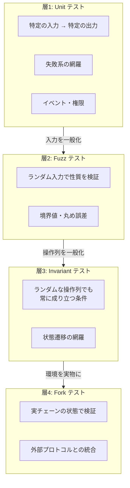
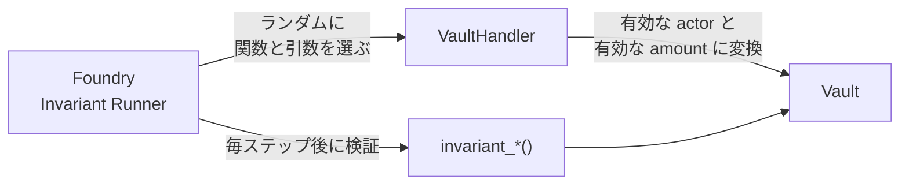
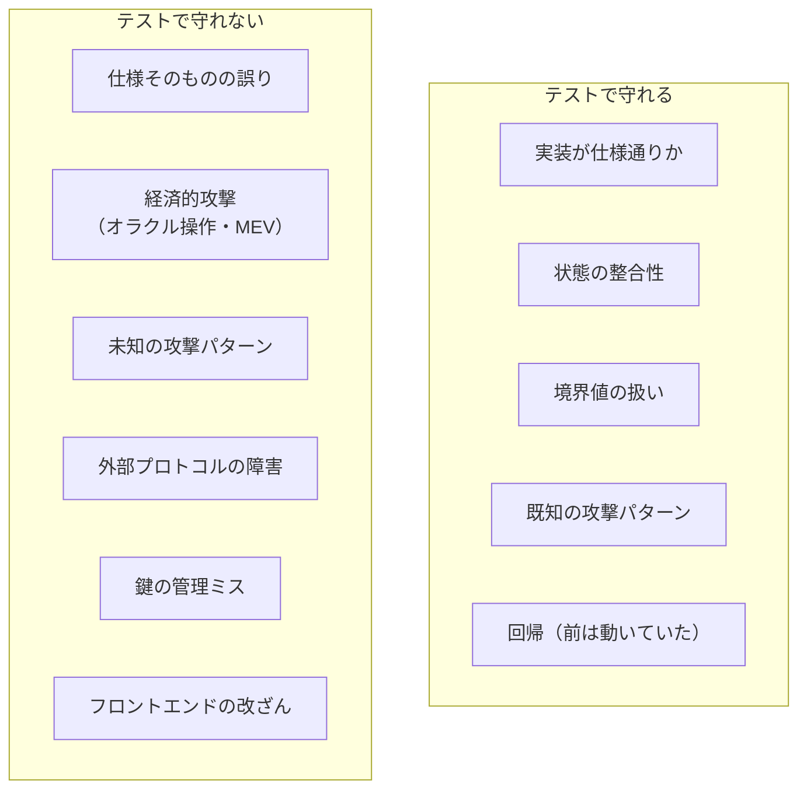

# Chapter 04: Foundry Test

> Unit / Fuzz / Invariant / Fork の4層でテストを組み、Chapter 10 の大規模な書き換えに耐える安全網を作る。

| 項目 | 内容 |
|---|---|
| 所要時間 | 4〜5時間 |
| 前提 | [Chapter 03](./chapter03-usdc-support.md) 完了 |
| 成果物 | `test/` 配下のテストスイート（Unit / Fuzz / Invariant / Fork） |
| 難易度 | ★★★ |

---

## 1. Goal

- [ ] テストの4層（Unit / Fuzz / Invariant / Fork）を使い分けられる
- [ ] **Invariant テスト**を Handler パターンで書ける
- [ ] Vault における最重要の不変条件を言語化できる
- [ ] Fuzz テストで `bound` を正しく使える（`vm.assume` との違いを説明できる）
- [ ] `vm.prank` / `startPrank` / `deal` / `warp` / `expectRevert` / `expectEmit` を使える
- [ ] `forge coverage` の限界を説明できる
- [ ] ガススナップショット（`forge snapshot`）で回帰を検出できる
- [ ] **カバレッジ 100% でも見逃されるバグ**を1つ実演できる

---

## 2. 完成イメージ

```text
$ make test
Ran 6 tests for test/invariant/VaultInvariant.t.sol:VaultInvariantTest
[PASS] invariant_SolvencyHolds() (runs: 64, calls: 2048, reverts: 331)
[PASS] invariant_SumOfBalancesEqualsTotalDeposits() (runs: 64, calls: 2048, reverts: 318)
[PASS] invariant_NoUserCanExceedTotalDeposits() (runs: 64, calls: 2048, reverts: 342)
[PASS] invariant_TotalDepositsNeverExceedsHeldAssets() (runs: 64, calls: 2048, reverts: 329)
[PASS] invariant_PausedNeverBlocksWithdraw() (runs: 64, calls: 2048, reverts: 351)
[PASS] invariant_CallSummary() (runs: 64, calls: 2048, reverts: 337)

Ran 17 tests for test/Vault.t.sol:VaultTest
...
Ran 6 tests for test/VaultWeirdTokens.t.sol:VaultWeirdTokensTest
...
Ran 10 tests for test/VaultUSDC.t.sol:VaultUSDCForkTest
...

Ran 4 test suites: 39 tests passed, 0 failed, 0 skipped (39 total tests)
```

Invariant テストの呼び出しサマリ:

```text
  Call summary:
    deposit           : 612
    depositFor        : 284
    withdraw          : 578
    withdrawAll       : 191
    pause             : 96
    unpause           : 88
    donate            : 199
```

ガススナップショットの差分検出:

```text
$ forge snapshot --diff
Vault:deposit                (gas: 84213 -> 84891) (+0.80%)
Vault:withdraw               (gas: 71880 -> 71880) (0.00%)
Overall gas change: +678 (+0.34%)
```

---

## 3. Architecture

テストは目的の違う4層で構成します。**どれか1つでは不十分**です。



| 層 | 何を守るか | 見つけられないもの |
|---|---|---|
| Unit | 仕様通りに動くこと | 想定外の入力・操作順序 |
| Fuzz | 入力空間全体での性質 | 複数トランザクションにまたがるバグ |
| Invariant | **状態の整合性** | 外部プロトコルの実挙動 |
| Fork | 実環境との乖離 | 実行が遅く網羅性が低い |

!!! important "Invariant テストが Vault の生命線"
    Vault の本質は「**預かった資産と記録した債務が一致していること**」です。
    これは特定の入力ではなく、**あらゆる操作の後で成り立つべき条件**です。

    Unit テストでは「deposit → withdraw」しか試せません。
    Invariant テストは「deposit → pause → deposit(失敗) → withdraw →
    donate → withdrawAll → unpause → …」といった
    **数千通りのランダムな操作列**を自動生成します。

---

## 4. Directory

```text
contracts/test/
 ├── Vault.t.sol                        M Unit テストを整理
 ├── VaultUSDC.t.sol                    （Ch03 で作成済み）
 ├── VaultWeirdTokens.t.sol             （Ch03 で作成済み）
 ├── base/
 │   └── VaultTestBase.sol              + 共通のセットアップ
 ├── fuzz/
 │   └── VaultFuzz.t.sol                + Fuzz テスト
 ├── invariant/
 │   ├── VaultInvariant.t.sol           + Invariant テスト
 │   └── handlers/
 │       └── VaultHandler.sol           + Handler（操作の定義）
 ├── mocks/
 │   ├── MockERC20.sol                  （既存）
 │   ├── WeirdERC20.sol                 （既存）
 │   └── ReentrantAttacker.sol          （既存）
 └── utils/
     └── Assertions.sol                 + カスタムアサーション

contracts/
 ├── .gas-snapshot                      + ガススナップショット
 └── foundry.toml                       M invariant / fuzz 設定を調整
```

```bash
cd contracts
mkdir -p test/base test/fuzz test/invariant/handlers test/utils
```

---

## 5. 実装

### 5.1 テストの共通基盤を切り出す

`setUp` の重複を避け、テストの意図を読みやすくします。

```solidity
// test/base/VaultTestBase.sol
abstract contract VaultTestBase is Test {
    Vault internal vault;
    MockERC20 internal token;

    address internal owner = makeAddr("owner");
    address internal alice = makeAddr("alice");
    address internal bob = makeAddr("bob");
    address internal carol = makeAddr("carol");

    uint256 internal constant ONE = 1e6;
    uint256 internal constant INITIAL = 1_000_000 * ONE;

    function setUp() public virtual {
        token = new MockERC20("Mock USDC", "mUSDC", 6);
        vault = new Vault(address(token), owner);
        _fund(alice);
        _fund(bob);
        _fund(carol);
    }

    function _fund(address who) internal {
        token.mint(who, INITIAL);
        vm.prank(who);
        token.approve(address(vault), type(uint256).max);
    }

    /// @dev テストの意図を明確にするヘルパ
    function _deposit(address who, uint256 amount) internal returns (uint256) {
        vm.prank(who);
        return vault.deposit(amount);
    }

    function _withdraw(address who, uint256 amount) internal {
        vm.prank(who);
        vault.withdraw(amount);
    }
}
```

`setUp` を `virtual` にすることで、派生クラスが拡張できます。

```solidity
contract SomeTest is VaultTestBase {
    function setUp() public override {
        super.setUp();
        // 追加のセットアップ
    }
}
```

### 5.2 Foundry のチートコード

テストで使う主要なチートコードを整理します。

| チートコード | 用途 | 注意 |
|---|---|---|
| `vm.prank(addr)` | **次の1回**の呼び出しを `addr` として実行 | 1回だけ |
| `vm.startPrank(addr)` | `stopPrank` まで `addr` として実行 | 忘れると後続が壊れる |
| `vm.prank(addr, origin)` | `msg.sender` と `tx.origin` の両方を設定 | フィッシング検査のテスト用 |
| `deal(token, to, amount)` | ERC20 残高を直接書き換える | Fork テストで便利 |
| `vm.deal(addr, amount)` | ETH 残高を設定 | ERC20 版と名前が紛らわしい |
| `vm.warp(ts)` | `block.timestamp` を設定 | 利回り計算のテストで必須 |
| `vm.roll(n)` | `block.number` を設定 | Aave の利息計算はブロック依存 |
| `vm.expectRevert(sel)` | 次の呼び出しが revert することを検証 | **直前に置く** |
| `vm.expectEmit(...)` | イベントの発火を検証 | `emit` 文を直後に書く |
| `vm.mockCall(...)` | 外部呼び出しの戻り値を差し替える | 外部依存の分離 |
| `vm.snapshotState()` / `vm.revertToState(id)` | 状態の保存と復元 | 分岐のテスト |
| `vm.skip(true)` | テストをスキップ | 環境依存のテスト |
| `vm.label(addr, name)` | トレースに名前を出す | デバッグ効率が上がる |

!!! warning "`vm.expectRevert` の落とし穴"
    `expectRevert` は**次の外部呼び出し1回**に適用されます。
    間にヘルパ関数を挟むと、そのヘルパの内部呼び出しに適用されてしまいます。

    ```solidity
    // ❌ _deposit の内部で最初に起きる呼び出しに適用される
    vm.expectRevert(IVault.ZeroAmount.selector);
    _deposit(alice, 0);   // ヘルパ内の vm.prank が先に来る

    // ✅ 直接呼ぶ
    vm.prank(alice);
    vm.expectRevert(IVault.ZeroAmount.selector);
    vault.deposit(0);
    ```

    これは初学者が最も詰まる箇所です。テストが「なぜか通らない」ときは
    まずここを疑ってください。

### 5.3 Fuzz テスト: `bound` と `vm.assume`

Fuzz テストはランダムな入力で関数を呼びます。範囲の絞り方が2種類あります。

```solidity
// ❌ vm.assume: 条件を満たさない入力を「捨てる」
function testFuzz_Bad(uint256 amount) public {
    vm.assume(amount > 0 && amount <= INITIAL);
    // amount は uint256 全域からランダム。
    // 条件を満たす確率が極小なので、ほぼ全て捨てられる
    // → 実質的にテストされない（"too many rejects" で失敗する）
}

// ✅ bound: 入力を範囲に「写像する」
function testFuzz_Good(uint256 amount) public {
    amount = bound(amount, 1, INITIAL);
    // すべての入力が有効な範囲に変換される。捨てない
}
```

| | `vm.assume` | `bound` |
|---|---|---|
| 動作 | 条件を満たさない実行を破棄 | 値を範囲内へ写像 |
| 効率 | 破棄率が高いと無意味 | 常に100%活用 |
| 使う場面 | 「特定の値を除外」（例: `assume(addr != address(0))`） | 「範囲を指定」 |

**原則: 範囲指定は `bound`、少数の例外除外は `vm.assume`。**

```solidity
function testFuzz_DepositFor(uint96 amount, address receiver) public {
    // 範囲は bound
    uint256 a = bound(uint256(amount), vault.minDeposit(), INITIAL);
    // 例外の除外は assume
    vm.assume(receiver != address(0));
    vm.assume(receiver != address(vault));   // Vault 自身は除外

    vm.prank(alice);
    vault.depositFor(a, receiver);

    assertEq(vault.balanceOf(receiver), a);
}
```

!!! tip "`uint96` を引数に使う理由"
    `uint256` の全域をランダムに振ると、ほとんどが天文学的な数値になり
    `bound` で潰されます。`uint96`（最大約 7.9e28）にしておくと、
    現実的な範囲に自然に収まり、`bound` の効きも良くなります。

    USDC の総供給量は約 6e16（600億 × 1e6）なので、`uint96` で十分です。

### 5.4 Invariant テスト: Handler パターン

Invariant テストは Foundry が**ランダムな順序で関数を呼び続け**、
毎回 `invariant_*` 関数をチェックします。

素朴に Vault を直接ターゲットにすると、ほぼ全ての呼び出しが revert します。

```solidity
// ❌ 非効率: ランダムな address / amount ではほぼ revert する
targetContract(address(vault));
```

そこで **Handler** を挟みます。Handler は「意味のある呼び出し」だけを生成します。



Handler の責務:

1. **actor の管理** — 固定の数人を用意し、その中から選ぶ
2. **引数の正規化** — `bound` で有効範囲に写像する
3. **失敗する呼び出しの回避** — 残高0で `withdraw` を呼ばない
4. **統計の記録** — どの関数が何回呼ばれたかを記録する（網羅性の確認）
5. **ゴースト変数の維持** — 期待値を独立に計算し、実装と比較する

### 5.5 Vault の不変条件を言語化する

これが本章で最も重要な作業です。**コードを書く前に、日本語で書きます。**

| # | 不変条件 | なぜ重要か |
|---|---|---|
| **I1** | `totalDeposits <= asset.balanceOf(vault)` | 破れた瞬間、誰かが出金できない（**支払不能**） |
| **I2** | `Σ balanceOf[user] == totalDeposits` | 個別残高の合計と総額が一致（**会計の整合**） |
| **I3** | `balanceOf[user] <= totalDeposits` | 1人が全体を超えることはない |
| **I4** | `paused` でも `withdraw` は成功する | **資産の人質化を防ぐ設計要件** |
| **I5** | 誰も自分が預けた以上を引き出せない | 資金の不正取得の防止 |
| **I6** | `sweep` はユーザーの預かり分に触れない | バックドアの防止 |

!!! important "I1 と I2 の違い"
    - **I1** は「実物 ≥ 帳簿」（外部との整合）
    - **I2** は「明細の合計 = 合計欄」（内部の整合）

    I2 が破れると、`totalDeposits` を使う計算（Chapter 10 の share 計算）が
    全て狂います。I1 が破れると即座に出金が止まります。**両方必要です。**

I2 を検証するには「全ユーザーの残高を合計する」必要があります。
`mapping` は列挙できないため、**Handler が actor リストを持つ**ことで解決します。

### 5.6 ゴースト変数

Handler 内で「実装とは独立に期待値を計算」します。
実装のバグを、実装のロジックを使わずに検出するためです。

```solidity
contract VaultHandler is Test {
    // ゴースト変数: Handler が独自に追跡する期待値
    uint256 public ghost_totalDeposited;   // 累計預入額
    uint256 public ghost_totalWithdrawn;   // 累計出金額
    uint256 public ghost_totalDonated;     // 直接送金された額

    function deposit(uint256 actorSeed, uint256 amount) external {
        // ... 実行 ...
        ghost_totalDeposited += received;
    }
}

// テスト側
function invariant_NetFlowMatchesTotalDeposits() public view {
    assertEq(
        handler.ghost_totalDeposited() - handler.ghost_totalWithdrawn(),
        vault.totalDeposits()
    );
}
```

**これが強力な理由**: `vault.totalDeposits()` の計算にバグがあっても、
ゴースト変数は独立に計算しているため差分として現れます。

### 5.7 カバレッジの限界を実演する

Chapter 02 の「利回りを分配できない」問題は、
**カバレッジ 100% でも検出されません**。実演します。

```solidity
function test_CoverageIsNotSafety() public {
    // alice が 1,000 預ける
    _deposit(alice, 1_000 * ONE);

    // 誰かが 100 を寄付（Aave の利回りが届いた状況を模倣）
    vm.prank(bob);
    token.transfer(address(vault), 100 * ONE);

    // 実残高は 1,100 だが、alice が引き出せるのは 1,000
    assertEq(vault.totalAssetsHeld(), 1_100 * ONE);
    assertEq(vault.balanceOf(alice), 1_000 * ONE);

    vm.prank(alice);
    vault.withdrawAll();

    // 100 USDC が Vault に取り残された。誰も取り出せない
    assertEq(vault.totalAssetsHeld(), 100 * ONE, "orphaned yield");
    assertEq(vault.totalDeposits(), 0);

    // owner だけが sweep で回収できる = 利回りを owner が独占する構造
    vm.prank(owner);
    vault.sweep(address(token), owner);
    assertEq(token.balanceOf(owner), 100 * ONE, "yield goes to owner, not depositors");
}
```

!!! danger "これが Chapter 10 の動機"
    この振る舞いはコードとして「正しく動いています」。
    全行がテストで実行され、すべてのアサーションが通ります。

    しかし**プロダクトとして間違っています**。利回りは預金者に分配されるべきで、
    owner が独占するべきではありません。

    **カバレッジは「テストしていない行」を教えてくれますが、
    「間違った仕様」は教えてくれません。**
    仕様の正しさは、不変条件を人間が言語化することでしか検証できません。

### 5.8 ガススナップショット

ガスの回帰（無自覚な悪化）を検出します。

```bash
forge snapshot                    # .gas-snapshot を生成
# コードを変更
forge snapshot --diff             # 差分を表示
forge snapshot --check            # 差分があれば失敗（CI 用）
```

```text
$ forge snapshot --diff
VaultTest:test_Deposit_IncreasesBalance() (gas: 84213 -> 88914) (+5.58%)
```

`.gas-snapshot` をコミットしておくと、PR のレビューで
「この変更でガスが 5% 増えた」が可視化されます。

!!! tip "CI では `--check` を使わない方が良い場合がある"
    テストを追加するだけでスナップショットが変わるため、
    `--check` を必須にすると開発が煩わしくなります。

    実務的な運用: **`--diff` の結果を PR にコメントする**
    （`foundry-gas-diff` などの Action を使う）。
    失敗させず、可視化だけする方が回ります。

---

## 6. コード全文

### `contracts/test/base/VaultTestBase.sol`

```solidity
// SPDX-License-Identifier: MIT
pragma solidity ^0.8.24;

import {Test} from "forge-std/Test.sol";

import {Vault} from "../../src/Vault.sol";
import {MockERC20} from "../mocks/MockERC20.sol";

/// @notice Vault のテストで共通するセットアップ
/// @dev setUp を virtual にし、派生クラスが拡張できるようにする
abstract contract VaultTestBase is Test {
    Vault internal vault;
    MockERC20 internal token;

    address internal owner = makeAddr("owner");
    address internal alice = makeAddr("alice");
    address internal bob = makeAddr("bob");
    address internal carol = makeAddr("carol");

    /// @dev USDC と同じ 6 decimals
    uint256 internal constant ONE = 1e6;
    uint256 internal constant INITIAL = 1_000_000 * ONE;

    function setUp() public virtual {
        token = new MockERC20("Mock USDC", "mUSDC", 6);
        vault = new Vault(address(token), owner);

        vm.label(address(vault), "Vault");
        vm.label(address(token), "mUSDC");

        _fund(alice);
        _fund(bob);
        _fund(carol);
    }

    function _fund(address who) internal {
        token.mint(who, INITIAL);
        vm.prank(who);
        token.approve(address(vault), type(uint256).max);
    }

    function _deposit(address who, uint256 amount) internal returns (uint256) {
        vm.prank(who);
        return vault.deposit(amount);
    }

    function _withdraw(address who, uint256 amount) internal {
        vm.prank(who);
        vault.withdraw(amount);
    }

    /// @dev 外部から Vault へ直接送金する（利回り到着の模倣）
    function _donate(address from, uint256 amount) internal {
        vm.prank(from);
        token.transfer(address(vault), amount);
    }
}
```

### `contracts/test/utils/Assertions.sol`

```solidity
// SPDX-License-Identifier: MIT
pragma solidity ^0.8.24;

import {Test} from "forge-std/Test.sol";

/// @notice Vault 固有のアサーション
/// @dev 不変条件をアサーションとして再利用可能にする。
///      Unit / Fuzz / Invariant のどの層からも呼べる。
abstract contract VaultAssertions is Test {
    /// @notice 支払能力（実物 >= 帳簿）
    function assertSolvent(uint256 totalDeposits, uint256 heldAssets) internal pure {
        assertLe(totalDeposits, heldAssets, "INSOLVENT: totalDeposits > heldAssets");
    }

    /// @notice 誤差を許容した比較（丸め誤差の検証に使う）
    function assertApproxEq(uint256 a, uint256 b, uint256 maxDelta, string memory err)
        internal
        pure
    {
        uint256 delta = a > b ? a - b : b - a;
        assertLe(delta, maxDelta, err);
    }

    /// @notice 丸めが常にプロトコル有利（ユーザー不利）であることを検証する
    /// @dev DeFi の鉄則: 丸め誤差はプロトコル側に有利に倒す。
    ///      逆にするとプロトコルが徐々に資産を失う。
    function assertRoundsInFavorOfProtocol(uint256 userReceives, uint256 theoreticalAmount)
        internal
        pure
    {
        assertLe(userReceives, theoreticalAmount, "rounding must not favor the user");
    }
}
```

### `contracts/test/invariant/handlers/VaultHandler.sol`

```solidity
// SPDX-License-Identifier: MIT
pragma solidity ^0.8.24;

import {CommonBase} from "forge-std/Base.sol";
import {StdCheats} from "forge-std/StdCheats.sol";
import {StdUtils} from "forge-std/StdUtils.sol";
import {console2} from "forge-std/console2.sol";

import {Vault} from "../../../src/Vault.sol";
import {MockERC20} from "../../mocks/MockERC20.sol";

/// @notice Invariant テスト用の Handler
/// @dev Foundry がこのコントラクトの external 関数をランダムな順序・引数で呼ぶ。
///
///      Handler の責務:
///        1. 有効な actor の集合を管理する
///        2. 引数を有効範囲に写像する（bound）
///        3. 確実に revert する呼び出しを避ける（無駄な試行を減らす）
///        4. 呼び出し統計を記録する（網羅性の確認）
///        5. ゴースト変数で期待値を独立に計算する
contract VaultHandler is CommonBase, StdCheats, StdUtils {
    Vault public immutable vault;
    MockERC20 public immutable token;
    address public immutable owner;

    /// @dev 残高の合計を計算するため、actor を列挙可能に保持する
    address[] public actors;

    /* ---------- ゴースト変数（実装から独立した期待値）---------- */

    uint256 public ghost_totalDeposited;
    uint256 public ghost_totalWithdrawn;
    uint256 public ghost_totalDonated;

    /* ---------- 呼び出し統計 ---------- */

    mapping(bytes32 => uint256) public calls;

    modifier countCall(bytes32 key) {
        calls[key]++;
        _;
    }

    constructor(Vault vault_, MockERC20 token_, address owner_) {
        vault = vault_;
        token = token_;
        owner = owner_;

        // 5人の actor を用意する。
        // 人数を固定するのは、同じ actor が繰り返し選ばれて
        // 状態が深く進むようにするため（1回だけの操作では状態遷移が浅い）。
        for (uint256 i; i < 5; i++) {
            address actor = address(uint160(uint256(keccak256(abi.encode("actor", i)))));
            actors.push(actor);
            token.mint(actor, 1_000_000e6);
            vm.prank(actor);
            token.approve(address(vault), type(uint256).max);
        }
    }

    function actorCount() external view returns (uint256) {
        return actors.length;
    }

    function _actor(uint256 seed) internal view returns (address) {
        return actors[seed % actors.length];
    }

    /* ------------------------------------------------------------ */
    /*                      Target functions                        */
    /* ------------------------------------------------------------ */

    function deposit(uint256 actorSeed, uint256 amount) external countCall("deposit") {
        address actor = _actor(actorSeed);

        uint256 balance = token.balanceOf(actor);
        if (balance < vault.minDeposit()) return;

        amount = bound(amount, vault.minDeposit(), balance);

        // paused 中は deposit が revert する。呼ばずに戻る。
        if (vault.paused()) return;

        vm.prank(actor);
        uint256 received = vault.deposit(amount);

        ghost_totalDeposited += received;
    }

    function depositFor(uint256 actorSeed, uint256 receiverSeed, uint256 amount)
        external
        countCall("depositFor")
    {
        address actor = _actor(actorSeed);
        address receiver = _actor(receiverSeed);

        uint256 balance = token.balanceOf(actor);
        if (balance < vault.minDeposit()) return;
        if (vault.paused()) return;

        amount = bound(amount, vault.minDeposit(), balance);

        vm.prank(actor);
        uint256 received = vault.depositFor(amount, receiver);

        ghost_totalDeposited += received;
    }

    function withdraw(uint256 actorSeed, uint256 amount) external countCall("withdraw") {
        address actor = _actor(actorSeed);

        uint256 balance = vault.balanceOf(actor);
        if (balance == 0) return;

        amount = bound(amount, 1, balance);

        vm.prank(actor);
        vault.withdraw(amount);

        ghost_totalWithdrawn += amount;
    }

    function withdrawAll(uint256 actorSeed) external countCall("withdrawAll") {
        address actor = _actor(actorSeed);

        uint256 balance = vault.balanceOf(actor);
        if (balance == 0) return;

        vm.prank(actor);
        uint256 out = vault.withdrawAll();

        ghost_totalWithdrawn += out;
    }

    /// @notice 外部から Vault へ直接送金する（利回り到着・誤送金の模倣）
    /// @dev これが会計を壊さないことを検証するために必要
    function donate(uint256 actorSeed, uint256 amount) external countCall("donate") {
        address actor = _actor(actorSeed);

        uint256 balance = token.balanceOf(actor);
        if (balance == 0) return;

        amount = bound(amount, 1, balance);

        vm.prank(actor);
        token.transfer(address(vault), amount);

        ghost_totalDonated += amount;
    }

    function pause() external countCall("pause") {
        if (vault.paused()) return;
        vm.prank(owner);
        vault.pause();
    }

    function unpause() external countCall("unpause") {
        if (!vault.paused()) return;
        vm.prank(owner);
        vault.unpause();
    }

    function sweep() external countCall("sweep") {
        if (vault.surplus() == 0) return;
        vm.prank(owner);
        vault.sweep(address(token), owner);
    }

    /// @notice 時間を進める（Chapter 10 以降の利回り計算で意味を持つ）
    function warp(uint256 seconds_) external countCall("warp") {
        seconds_ = bound(seconds_, 1, 30 days);
        vm.warp(block.timestamp + seconds_);
    }

    /* ------------------------------------------------------------ */
    /*                        Helpers                               */
    /* ------------------------------------------------------------ */

    /// @notice 全 actor の Vault 残高の合計
    /// @dev mapping は列挙できないため、Handler が actor を保持することで実現する
    function sumOfBalances() external view returns (uint256 total) {
        uint256 len = actors.length;
        for (uint256 i; i < len; i++) {
            total += vault.balanceOf(actors[i]);
        }
    }

    /// @notice 呼び出し統計を出力する
    function callSummary() external view {
        console2.log("--- Call summary ---");
        console2.log("deposit     :", calls["deposit"]);
        console2.log("depositFor  :", calls["depositFor"]);
        console2.log("withdraw    :", calls["withdraw"]);
        console2.log("withdrawAll :", calls["withdrawAll"]);
        console2.log("donate      :", calls["donate"]);
        console2.log("pause       :", calls["pause"]);
        console2.log("unpause     :", calls["unpause"]);
        console2.log("sweep       :", calls["sweep"]);
        console2.log("warp        :", calls["warp"]);
        console2.log("--- Ghost variables ---");
        console2.log("totalDeposited:", ghost_totalDeposited);
        console2.log("totalWithdrawn:", ghost_totalWithdrawn);
        console2.log("totalDonated  :", ghost_totalDonated);
    }
}
```

!!! important "`if (...) return;` で早期リターンする理由"
    revert させると、そのステップは「無効な呼び出し」として
    カウントされます（`fail_on_revert = false` なら無視される）。
    しかし**revert したステップでは状態が進みません**。

    `return` で戻れば呼び出し自体は成功扱いになり、次のステップへ進みます。
    結果として**より深い状態遷移**を探索できます。

    ただし早期リターンが多すぎると、実質的にテストされない関数が生まれます。
    そのため `callSummary` で「どの関数が何回**実際に**実行されたか」を
    確認することが重要です。

### `contracts/test/invariant/VaultInvariant.t.sol`

```solidity
// SPDX-License-Identifier: MIT
pragma solidity ^0.8.24;

import {Test} from "forge-std/Test.sol";

import {Vault} from "../../src/Vault.sol";
import {MockERC20} from "../mocks/MockERC20.sol";
import {VaultAssertions} from "../utils/Assertions.sol";
import {VaultHandler} from "./handlers/VaultHandler.sol";

/// @notice Vault の不変条件テスト
/// @dev Foundry が Handler の関数をランダムな順序で呼び、
///      毎ステップ後に invariant_* を検証する。
contract VaultInvariantTest is Test, VaultAssertions {
    Vault internal vault;
    MockERC20 internal token;
    VaultHandler internal handler;

    address internal owner = makeAddr("owner");

    function setUp() public {
        token = new MockERC20("Mock USDC", "mUSDC", 6);
        vault = new Vault(address(token), owner);
        handler = new VaultHandler(vault, token, owner);

        // Handler のみをターゲットにする（Vault を直接叩かせない）
        targetContract(address(handler));

        // Handler の view / helper 関数は呼ばせない
        bytes4[] memory selectors = new bytes4[](9);
        selectors[0] = handler.deposit.selector;
        selectors[1] = handler.depositFor.selector;
        selectors[2] = handler.withdraw.selector;
        selectors[3] = handler.withdrawAll.selector;
        selectors[4] = handler.donate.selector;
        selectors[5] = handler.pause.selector;
        selectors[6] = handler.unpause.selector;
        selectors[7] = handler.sweep.selector;
        selectors[8] = handler.warp.selector;

        targetSelector(FuzzSelector({addr: address(handler), selectors: selectors}));

        // Handler 自身を送信者から除外する（意図しない prank の混入を防ぐ）
        excludeSender(address(vault));
        excludeSender(address(token));
    }

    /* ------------------------------------------------------------ */
    /*                        Invariants                            */
    /* ------------------------------------------------------------ */

    /// @notice I1: 支払能力。帳簿上の債務は実際の保有資産を超えない
    /// @dev これが破れた瞬間、誰かが出金できなくなる。最重要の不変条件。
    function invariant_SolvencyHolds() public view {
        assertSolvent(vault.totalDeposits(), token.balanceOf(address(vault)));
    }

    /// @notice I2: 会計の整合。個別残高の合計は totalDeposits と一致する
    function invariant_SumOfBalancesEqualsTotalDeposits() public view {
        assertEq(
            handler.sumOfBalances(),
            vault.totalDeposits(),
            "sum of balances must equal totalDeposits"
        );
    }

    /// @notice I3: 1人のユーザーが総額を超えることはない
    function invariant_NoUserCanExceedTotalDeposits() public view {
        uint256 total = vault.totalDeposits();
        uint256 count = handler.actorCount();
        for (uint256 i; i < count; i++) {
            assertLe(vault.balanceOf(handler.actors(i)), total, "user balance exceeds total");
        }
    }

    /// @notice I4: ゴースト変数との一致（実装から独立した検算）
    /// @dev 累計預入 - 累計出金 == 現在の totalDeposits
    function invariant_NetFlowMatchesTotalDeposits() public view {
        uint256 expected = handler.ghost_totalDeposited() - handler.ghost_totalWithdrawn();
        assertEq(expected, vault.totalDeposits(), "net flow mismatch");
    }

    /// @notice I5: 停止中でも出金できる（設計要件）
    /// @dev paused 状態で残高のあるユーザーが出金できることを実際に試す
    function invariant_PausedNeverBlocksWithdraw() public {
        if (!vault.paused()) return;

        uint256 count = handler.actorCount();
        for (uint256 i; i < count; i++) {
            address actor = handler.actors(i);
            uint256 balance = vault.balanceOf(actor);
            if (balance == 0) continue;

            // 状態を壊さないようスナップショットを取って試す
            uint256 snap = vm.snapshotState();
            vm.prank(actor);
            vault.withdraw(balance); // revert すればこの invariant は失敗する
            vm.revertToState(snap);

            break; // 1人確認できれば十分
        }
    }

    /// @notice 呼び出し統計を出力する（テストとしては常に成功する）
    /// @dev -vv で実行すると、各関数が実際に何回呼ばれたかが見える。
    ///      「deposit: 0」のような結果が出たら Handler の early return を疑う。
    function invariant_CallSummary() public view {
        handler.callSummary();
    }
}
```

### `contracts/test/fuzz/VaultFuzz.t.sol`

```solidity
// SPDX-License-Identifier: MIT
pragma solidity ^0.8.24;

import {VaultTestBase} from "../base/VaultTestBase.sol";
import {VaultAssertions} from "../utils/Assertions.sol";
import {IVault} from "../../src/interfaces/IVault.sol";
import {Vault} from "../../src/Vault.sol";
import {MockERC20} from "../mocks/MockERC20.sol";

contract VaultFuzzTest is VaultTestBase, VaultAssertions {
    /// @notice 預けて全額引き出せば元本は完全に戻る
    function testFuzz_DepositWithdraw_PreservesPrincipal(uint96 amount) public {
        uint256 a = bound(uint256(amount), vault.minDeposit(), INITIAL);

        uint256 before = token.balanceOf(alice);

        _deposit(alice, a);
        vm.prank(alice);
        vault.withdrawAll();

        assertEq(token.balanceOf(alice), before, "principal must be preserved exactly");
        assertEq(vault.balanceOf(alice), 0);
        assertEq(vault.totalDeposits(), 0);
    }

    /// @notice 部分出金を繰り返しても合計は一致する
    function testFuzz_PartialWithdrawals(uint96 depositAmount, uint8 parts) public {
        uint256 a = bound(uint256(depositAmount), vault.minDeposit(), INITIAL);
        uint256 n = bound(uint256(parts), 1, 20);

        _deposit(alice, a);

        uint256 each = a / n;
        if (each == 0) return; // 分割できない場合

        uint256 withdrawn;
        for (uint256 i; i < n; i++) {
            _withdraw(alice, each);
            withdrawn += each;
        }

        assertEq(vault.balanceOf(alice), a - withdrawn, "remaining balance");
        assertEq(vault.totalDeposits(), a - withdrawn);
    }

    /// @notice 複数ユーザーの残高が互いに干渉しない
    function testFuzz_MultipleUsersAreIsolated(uint96 aliceAmount, uint96 bobAmount) public {
        uint256 a = bound(uint256(aliceAmount), vault.minDeposit(), INITIAL);
        uint256 b = bound(uint256(bobAmount), vault.minDeposit(), INITIAL);

        _deposit(alice, a);
        _deposit(bob, b);

        assertEq(vault.balanceOf(alice), a);
        assertEq(vault.balanceOf(bob), b);
        assertEq(vault.totalDeposits(), a + b);

        // alice が全額出金しても bob には影響しない
        vm.prank(alice);
        vault.withdrawAll();

        assertEq(vault.balanceOf(bob), b, "bob must be unaffected");
        assertEq(vault.totalDeposits(), b);
    }

    /// @notice 預入額を超えた出金は必ず失敗する
    function testFuzz_CannotOverWithdraw(uint96 depositAmount, uint96 extra) public {
        uint256 a = bound(uint256(depositAmount), vault.minDeposit(), INITIAL);
        uint256 e = bound(uint256(extra), 1, type(uint96).max);

        _deposit(alice, a);

        vm.prank(alice);
        vm.expectRevert(
            abi.encodeWithSelector(IVault.InsufficientBalance.selector, a + e, a)
        );
        vault.withdraw(a + e);
    }

    /// @notice 直接送金は誰の残高も増やさない（支払能力は保たれる）
    function testFuzz_DonationNeverBreaksSolvency(uint96 depositAmount, uint96 donation) public {
        uint256 a = bound(uint256(depositAmount), vault.minDeposit(), INITIAL / 2);
        uint256 d = bound(uint256(donation), 1, INITIAL / 2);

        _deposit(alice, a);
        _donate(bob, d);

        assertEq(vault.balanceOf(alice), a, "donation must not credit anyone");
        assertSolvent(vault.totalDeposits(), token.balanceOf(address(vault)));

        // alice は自分の元本を必ず全額回収できる
        uint256 before = token.balanceOf(alice);
        vm.prank(alice);
        vault.withdrawAll();
        assertEq(token.balanceOf(alice) - before, a);
    }

    /// @notice 任意の decimals で minDeposit が正しくスケールする
    function testFuzz_MinDepositScalesWithDecimals(uint8 decimals_) public {
        uint8 d = uint8(bound(uint256(decimals_), 0, 30));

        MockERC20 t = new MockERC20("T", "T", d);
        Vault v = new Vault(address(t), owner);

        assertEq(v.assetDecimals(), d);
        assertEq(v.minDeposit(), 10 ** uint256(d));

        uint256 unit = 10 ** uint256(d);
        t.mint(alice, unit * 10);

        vm.startPrank(alice);
        t.approve(address(v), type(uint256).max);
        v.deposit(unit);
        vm.stopPrank();

        assertEq(v.balanceOf(alice), unit);
    }

    /// @notice receiver を指定した預入で、送信者ではなく受取人の残高が増える
    function testFuzz_DepositForCreditsReceiver(uint96 amount, uint256 receiverSeed) public {
        uint256 a = bound(uint256(amount), vault.minDeposit(), INITIAL);
        address receiver = address(uint160(bound(receiverSeed, 1, type(uint160).max)));

        vm.assume(receiver != alice);
        vm.assume(receiver != address(vault));

        vm.prank(alice);
        vault.depositFor(a, receiver);

        assertEq(vault.balanceOf(receiver), a, "receiver credited");
        assertEq(vault.balanceOf(alice), 0, "sender not credited");
    }
}
```

### `contracts/test/Vault.t.sol` に追加するテスト

```solidity
    /* ---------- カバレッジの限界の実演 ---------- */

    /// @notice カバレッジ 100% でも「仕様の誤り」は検出できないことを示す
    /// @dev このテストは「現在の実装が正しく動くこと」を確認するが、
    ///      同時に「プロダクトとして間違っていること」を記録している。
    ///      Chapter 10 でこの振る舞いは変わる。
    function test_CoverageIsNotSafety_YieldIsOrphaned() public {
        _deposit(alice, 1_000 * ONE);

        // Aave からの利回り 100 USDC が Vault に届いた状況を模倣
        _donate(bob, 100 * ONE);

        assertEq(vault.totalAssetsHeld(), 1_100 * ONE, "vault holds 1100");
        assertEq(vault.balanceOf(alice), 1_000 * ONE, "but alice can only claim 1000");
        assertEq(vault.surplus(), 100 * ONE, "100 is orphaned");

        vm.prank(alice);
        vault.withdrawAll();

        // 利回りは Vault に取り残される
        assertEq(vault.totalAssetsHeld(), 100 * ONE);
        assertEq(vault.totalDeposits(), 0);

        // owner が sweep すると利回りを独占できてしまう
        vm.prank(owner);
        vault.sweep(address(token), owner);
        assertEq(
            token.balanceOf(owner),
            100 * ONE,
            "DESIGN FLAW: yield goes to owner, not to depositors"
        );
    }

    /// @notice 2人が同額を預けている状態で利回りが来ても、按分されない
    function test_YieldCannotBeSplitBetweenDepositors() public {
        _deposit(alice, 1_000 * ONE);
        _deposit(bob, 1_000 * ONE);

        _donate(carol, 200 * ONE); // 利回り 200

        // 本来なら alice / bob それぞれ +100 になるべき
        assertEq(vault.balanceOf(alice), 1_000 * ONE, "alice gets nothing");
        assertEq(vault.balanceOf(bob), 1_000 * ONE, "bob gets nothing");

        // これを解決するのが share 会計（Chapter 10）
    }
```

### `contracts/foundry.toml`（invariant 設定の調整）

```toml
[profile.default.invariant]
runs = 64            # ランダムな操作列を何本生成するか
depth = 32           # 1本の操作列で何回関数を呼ぶか
fail_on_revert = false
call_override = false
shrink_run_limit = 5000

[profile.ci.invariant]
runs = 256           # CI ではより深く探索する
depth = 64
fail_on_revert = false

[profile.deep.invariant]
runs = 2000          # nightly でさらに深く
depth = 128
fail_on_revert = false

[profile.deep.fuzz]
runs = 50_000
```

| パラメータ | 意味 | 増やすと |
|---|---|---|
| `runs` | 操作列の本数 | 多様な操作順序を試せる |
| `depth` | 1本あたりの呼び出し回数 | より深い状態に到達できる |
| `fail_on_revert` | revert で失敗させるか | `true` にすると Handler の不備が可視化される |
| `shrink_run_limit` | 失敗時の最小反例探索の上限 | デバッグしやすい反例が得られる |

!!! tip "`fail_on_revert = true` で Handler をデバッグする"
    Handler を書いたら、一度 `fail_on_revert = true` で走らせてください。
    revert する呼び出しが見つかれば、Handler の `bound` や
    早期リターンの条件に漏れがあります。

    修正後に `false` に戻すと、探索効率が上がった状態でテストできます。

---

## 7. 実行方法

### 全テスト

```bash
cd contracts
forge test
```

### 層ごとに実行

```bash
# Unit
forge test --match-path "test/Vault.t.sol" -vv

# Fuzz（詳細な統計付き）
forge test --match-path "test/fuzz/*" -vv

# Invariant（呼び出しサマリを見る）
forge test --match-path "test/invariant/*" -vv

# Fork（RPC が必要）
set -a && source ../.env && set +a
forge test --match-path "test/VaultUSDC.t.sol" -vv
```

### Invariant の呼び出し統計を確認する

```bash
forge test --match-test invariant_CallSummary -vv
```

```text
[PASS] invariant_CallSummary() (runs: 64, calls: 2048, reverts: 337)
Logs:
  --- Call summary ---
  deposit     : 289
  depositFor  : 271
  withdraw    : 265
  withdrawAll : 248
  donate      : 259
  pause       : 122
  unpause     : 118
  sweep       : 231
  warp        : 245
  --- Ghost variables ---
  totalDeposited: 41928374651
  totalWithdrawn: 38102947281
  totalDonated  : 8271094523
```

!!! warning "統計を必ず確認する"
    もし `deposit: 0` のような結果が出たら、Handler の早期リターン条件が
    厳しすぎて**その関数が一度も実行されていない**ことを意味します。

    テストは「PASS」と表示されますが、実質的に何も検証していません。
    **Invariant テストで最も多い失敗パターンがこれです。**

### 深いテストを走らせる

```bash
FOUNDRY_PROFILE=deep forge test --match-path "test/invariant/*"
```

数分かかります。CI の nightly ジョブで実行する想定です。

### カバレッジ

```bash
forge coverage --report summary
```

```text
| File                          | % Lines         | % Statements    | % Branches     | % Funcs       |
|-------------------------------|-----------------|-----------------|----------------|---------------|
| src/Vault.sol                 | 100.00% (52/52) | 100.00% (58/58) | 95.00% (19/20) | 100.00% (12/12)|
| src/libraries/TokenUtils.sol  |  85.71% (12/14) |  86.67% (13/15) | 75.00% (3/4)   | 66.67% (2/3)  |
| Total                         |  96.97% (64/66) |  97.26% (71/73) | 91.67% (22/24) | 93.33% (14/15)|
```

詳細な HTML レポート:

```bash
forge coverage --report lcov
genhtml lcov.info -o coverage-html --branch-coverage
open coverage-html/index.html
```

!!! note "`TokenUtils` のカバレッジが低い理由"
    `safeSymbol` の `bytes32` 分岐など、実在するが再現しにくいケースがあります。
    **カバレッジを上げるために無意味なテストを書くのは逆効果**です。
    「なぜカバーされていないか」を説明できれば十分です。

### ガススナップショット

```bash
forge snapshot
git add .gas-snapshot
git commit -m "test(contracts): add gas snapshot baseline"

# 変更後
forge snapshot --diff
```

---

## 8. デプロイ方法

**この章では該当なし。**

理由: テストコードはデプロイ対象ではありません。
ただし CI にテストを組み込むことで、「デプロイ前の関門」として機能させます。

### CI の更新

```yaml
# .github/workflows/ci.yml の contracts ジョブを更新
  contracts:
    runs-on: ubuntu-latest
    defaults:
      run:
        working-directory: contracts
    steps:
      - uses: actions/checkout@v4
        with:
          submodules: recursive
      - uses: foundry-rs/foundry-toolchain@v1

      - name: forge fmt --check
        run: forge fmt --check

      - name: forge build
        run: forge build --sizes

      - name: unit & fuzz & invariant
        run: forge test --no-match-path "test/VaultUSDC.t.sol" -vvv
        env:
          FOUNDRY_PROFILE: ci

      # Fork テストは main とスケジュール実行のみ（RPC 障害で PR を止めない）
      - name: fork tests
        if: github.ref == 'refs/heads/main' || github.event_name == 'schedule'
        run: forge test --match-path "test/VaultUSDC.t.sol" -vvv
        env:
          FOUNDRY_PROFILE: ci
          BASE_SEPOLIA_RPC_URL: ${{ secrets.BASE_SEPOLIA_RPC_URL }}

      - name: coverage
        run: forge coverage --report summary

      - name: gas snapshot diff
        run: forge snapshot --diff || true
```

nightly の深いテスト:

```yaml
# .github/workflows/nightly.yml
name: nightly
on:
  schedule:
    - cron: "0 18 * * *"   # 毎日 03:00 JST
  workflow_dispatch:

jobs:
  deep-fuzz:
    runs-on: ubuntu-latest
    defaults:
      run:
        working-directory: contracts
    steps:
      - uses: actions/checkout@v4
        with:
          submodules: recursive
      - uses: foundry-rs/foundry-toolchain@v1
      - name: deep fuzz and invariant
        run: forge test -vvv
        env:
          FOUNDRY_PROFILE: deep
          BASE_SEPOLIA_RPC_URL: ${{ secrets.BASE_SEPOLIA_RPC_URL }}
```

---

## 9. テスト方法

「テストのテスト」です。テストが本当に機能しているかを検証します。

### 手法1: 意図的にバグを入れる（ミューテーションテスト）

**テストが本当にバグを捕まえるか**は、バグを入れて確認するしかありません。

| # | 入れるバグ | 捕まえるべきテスト |
|---|---|---|
| 1 | `totalDeposits += received` を削除 | `invariant_SumOfBalancesEqualsTotalDeposits` |
| 2 | `balanceOf[receiver] += received` を `= received` に | `testFuzz_PartialWithdrawals` |
| 3 | `withdraw` の残高チェックを削除 | `testFuzz_CannotOverWithdraw` |
| 4 | `nonReentrant` を削除 | `test_RevertWhen_ReentrantWithdraw` |
| 5 | `sweep` の余剰チェックを削除 | `invariant_SolvencyHolds` |
| 6 | `withdraw` に `whenNotPaused` を追加 | `invariant_PausedNeverBlocksWithdraw` |
| 7 | `deposit` で `assets` を記録（`received` でなく） | `test_Deposit_FeeOnTransferRecordsActualAmount` |

やってみます。

```bash
# バグ5: sweep の余剰チェックを削除
```

```solidity
    function sweep(address token, address to) external onlyOwner {
        if (to == address(0)) revert ZeroAddress();
        uint256 amount = IERC20(token).balanceOf(address(this));  // ← 全額
        IERC20(token).safeTransfer(to, amount);
    }
```

```bash
forge test --match-path "test/invariant/*"
```

```text
[FAIL: INSOLVENT: totalDeposits > heldAssets: 41928374651 > 0]
        invariant_SolvencyHolds() (runs: 3, calls: 41, reverts: 6)

Failing sequence:
  sender=0x... addr=[VaultHandler]::deposit(1, 5000000)
  sender=0x... addr=[VaultHandler]::sweep()
```

**Invariant テストが数十ステップで支払不能を検出しました。**
Unit テストの `test_Sweep_OnlySurplusOfAsset` でも捕まりますが、
Invariant は「どんな操作順序でも」を保証します。

!!! important "この作業を必ず一度やってください"
    「テストが緑だから安全」ではありません。
    **バグを入れてテストが赤くなることを確認して初めて、
    そのテストが機能していると言えます。**

    この作業なしに書かれたテストは、しばしば何も検証していません。

### 手法2: 反例の最小化を確認する

Foundry は失敗時に反例を最小化（shrink）します。

```text
[FAIL: assertion failed] testFuzz_PartialWithdrawals(uint96,uint8)
  Args: [1000000 [1e6], 3]
```

`Args` が読みやすい値になっていれば shrink が機能しています。
巨大な値のままなら `shrink_run_limit` を増やしてください。

### 手法3: 検証観点の網羅表

| 観点 | Unit | Fuzz | Invariant | Fork |
|---|---|---|---|---|
| 正常系の入出金 | ✅ | ✅ | ✅ | ✅ |
| 失敗系（0・残高超過） | ✅ | ✅ | — | ✅ |
| アクセス制御 | ✅ | — | — | — |
| イベント | ✅ | — | — | — |
| Reentrancy | ✅ | — | — | — |
| 支払能力（I1） | ✅ | ✅ | ✅ | — |
| 会計の整合（I2） | ✅ | — | ✅ | — |
| 停止中の出金（I4） | ✅ | — | ✅ | — |
| 任意の decimals | — | ✅ | — | ✅ |
| fee-on-transfer | ✅ | — | — | — |
| 実 USDC の挙動 | — | — | — | ✅ |
| permit | — | — | — | ✅ |
| **利回りの分配** | ❌ | ❌ | ❌ | ❌ |

最下行が空欄なのは**機能自体が存在しない**ためです。
Chapter 10 でこの行が埋まります。

---

## 10. Security

### テストが守れるもの・守れないもの



| 守れないもの | 代替の防御 |
|---|---|
| 仕様の誤り | 不変条件の言語化・設計レビュー・第三者監査 |
| 経済的攻撃 | 経済モデルのシミュレーション・配分上限（Ch12） |
| 未知の攻撃 | Bug Bounty・段階的な TVL 上限（Ch15） |
| 外部プロトコル障害 | Circuit Breaker・分散配分（Ch12） |
| 鍵の管理 | マルチシグ・Timelock・HW ウォレット（Ch15） |
| フロント改ざん | IPFS 固定・CSP・SRI（Ch15） |

### テストコード自体のセキュリティ

!!! danger "テストコードに本番の鍵を書かない"
    ```solidity
    // ❌ 絶対にやらない
    uint256 pk = 0x実際の秘密鍵;

    // ✅ テスト用の値を使う
    uint256 pk = 0xA11CE;
    address alice = vm.addr(pk);
    ```

    テストファイルは公開されます。GitHub の検索で秘密鍵を探すボットが
    常時稼働しており、**push から数秒で資産が抜かれます**。

!!! warning "`deal` は Fork テストでのみ使う"
    `deal(token, addr, amount)` はストレージを直接書き換えます。
    Mainnet では当然できません。**テストで動くコードが本番で動く保証にはならない**
    典型例です。Fork テストで `deal` を使ったら、
    実際のフローでも動くか（Faucet → approve → deposit）を別途確認してください。

### Fork テストのブロック固定

```solidity
// ❌ 最新ブロック: 実行時期でテスト結果が変わる
vm.createSelectFork(url);

// ✅ ブロック固定: 再現性がある
vm.createSelectFork(url, 18_000_000);
```

固定しないと「昨日は通ったが今日は落ちる」が起こり、
原因の切り分けに時間を取られます。ただし**固定しすぎると
外部プロトコルの変更に気づけない**ため、nightly では最新ブロックで走らせます。

---

## 11. 設計レビュー

### 採用: Handler パターンによる Invariant テスト

**却下案A: Vault を直接 `targetContract` にする**

```solidity
targetContract(address(vault));
```

ランダムな `address` と `uint256` が渡されるため、
ほぼ全ての呼び出しが「残高不足」で revert します。
`reverts: 2040 / calls: 2048` のような結果になり、実質的に何も探索できません。

**却下案B: Handler なしで actor を固定する**
`excludeSender` と `targetSender` で送信者を絞る方法もありますが、
引数の正規化ができないため効率が上がりません。

**採用理由**: Handler は「有効な操作の集合」を定義する層です。
これがあることで探索効率が10倍以上変わります。

**トレードオフ**: Handler 自体にバグがあると、テストが機能しません。
そのため `callSummary` による統計確認が必須です。

### 採用: ゴースト変数による独立検算

**理由**: 実装のロジックを使わずに期待値を計算するため、
実装のバグを検出できます。

**却下案: `vault.totalDeposits()` だけを信じる**
実装が `totalDeposits` の更新を忘れていても、
「`totalDeposits == totalDeposits`」は常に真です。検証になりません。

**トレードオフ**: ゴースト変数の計算ロジックが実装と同じ考え方に
なっていると、同じバグを共有します（**相関する誤り**）。
「なるべく違う方法で計算する」意識が必要です。

### 採用: `bound` を既定にする

**却下**: `vm.assume` による範囲指定。破棄率が高く、実質的にテストされません。

`vm.assume` を使うべき場面は「候補が十分に多く、除外がわずか」なケースです。

```solidity
vm.assume(receiver != address(0));         // ✅ 除外は 2^160 のうち 1
vm.assume(amount > 1e6 && amount < 1e12);  // ❌ 有効なのは 2^256 のうち極小
```

### 採用: Fork テストを PR では skip する

**却下案: 常に実行する**
RPC の障害・レートリミットで PR がブロックされます。
「自分の変更と無関係な理由で CI が落ちる」は開発体験を著しく損ねます。

**トレードオフ**: main にマージされるまで、実 USDC との乖離に気づけません。
ローカルで実行する習慣（`make test-fork`）で補います。

### 却下: 100% カバレッジの強制

**理由**: カバレッジは手段であり目的ではありません。
100% を強制すると、以下の副作用が生じます。

- 到達困難な分岐のために不自然なモックを大量に書く
- 「カバレッジのためのテスト」が増え、意図が読めなくなる
- **カバレッジが 100% だから安全という誤った安心感**

**代替**: 「観点リストの網羅」を指標にします。
`9. テスト方法` の網羅表を PR のレビュー項目にします。

### 却下: Echidna / Medusa の併用

property-based testing の専用ツールで、Foundry の invariant より
強力な探索（coverage-guided fuzzing）が可能です。

**却下理由**: ツールが増えると学習コストが上がります。
Foundry の invariant で本書の目的（会計の整合性の検証）は達成できます。

**参照**: 実運用のプロトコルでは併用が推奨されます。
Chapter 15 の「監査前の準備」で言及します。

### 却下: Formal Verification（Certora / halmos / Kontrol）

数学的に不変条件を証明する手法で、Fuzz では見つからないバグを発見できます。

**却下理由**: 学習コストが本書のスコープを超えます。
ただし `halmos` は Foundry のテストをそのまま記号実行できるため、
興味があれば試す価値があります。

```bash
# 参考: halmos は forge のテストを symbolic に実行する
pip install halmos
halmos --function testFuzz_DepositWithdraw_PreservesPrincipal
```

### この章で残した技術的負債

| 負債 | 返済予定 |
|---|---|
| Invariant に「利回り分配」の観点がない | Chapter 10（機能追加と同時） |
| 外部プロトコル（Aave/Morpho）のモックがない | Chapter 10–11 |
| 時間経過（`warp`）を使う意味がまだない | Chapter 10（利息が発生する） |
| ミューテーションテストが手動 | 演習 4-5 |
| Formal verification 未導入 | スコープ外（Ch15 で言及） |

---

## 12. Git Commit

```bash
cd contracts

git add test/base/VaultTestBase.sol test/utils/Assertions.sol
git commit -m "test(contracts): extract shared test base and custom assertions"

git add test/fuzz/
git commit -m "test(contracts): add fuzz tests for principal preservation and isolation"

git add test/invariant/
git commit -m "test(contracts): add invariant tests with handler pattern

不変条件:
  I1 支払能力: totalDeposits <= asset.balanceOf(vault)
  I2 会計整合: Σ balanceOf == totalDeposits
  I3 個別上限: balanceOf[user] <= totalDeposits
  I4 独立検算: ghost の純流入 == totalDeposits
  I5 設計要件: paused でも withdraw が成功する

Handler で actor と引数を正規化し、探索効率を確保している。
callSummary で各関数の実行回数を可視化する。"

git add test/Vault.t.sol
git commit -m "test(contracts): document that yield is orphaned in current accounting

カバレッジ 100% でも仕様の誤りは検出できないことを、
実行可能なテストとして記録する。Chapter 10 で解消する。"

git add foundry.toml
git commit -m "chore(contracts): add ci and deep fuzz profiles"

git add .gas-snapshot
git commit -m "test(contracts): add gas snapshot baseline"

cd ..
git add .github/workflows/
git commit -m "chore(ci): split fork tests and add nightly deep fuzz job"

git tag -a ch04 -m "Chapter 04: Foundry test suite"
```

---

## 13. 演習問題

### 演習 4-1 ★ `expectRevert` の落とし穴を再現する

ヘルパ関数を経由した `vm.expectRevert` が意図通り動かないケースを作り、
エラーメッセージから原因を説明してください。

??? question "解答方針"
    ```solidity
    function _depositAs(address who, uint256 amount) internal returns (uint256) {
        vm.prank(who);                    // ← これが「次の呼び出し」を消費する
        return vault.deposit(amount);
    }

    function test_Wrong() public {
        vm.expectRevert(IVault.ZeroAmount.selector);
        _depositAs(alice, 0);
    }
    ```

    `vm.prank` はチートコード呼び出しですが、Foundry のバージョンにより
    「次の呼び出し」の解釈が変わり得ます。安全なのは**チートコードを挟まず、
    検証対象の呼び出しの直前に `expectRevert` を置く**ことです。

    ```solidity
    // ✅
    vm.prank(alice);
    vm.expectRevert(IVault.ZeroAmount.selector);
    vault.deposit(0);
    ```

    **教訓**: `expectRevert` の直後は、検証したい呼び出しだけを書く。

### 演習 4-2 ★★ 不変条件を1つ追加する

以下の不変条件を実装してください。

```text
I7: sweep を何回呼んでも、全 actor は自分の balanceOf 全額を出金できる
```

??? question "解答方針"
    ```solidity
    function invariant_AllActorsCanFullyWithdraw() public {
        uint256 count = handler.actorCount();
        uint256 snap = vm.snapshotState();

        for (uint256 i; i < count; i++) {
            address actor = handler.actors(i);
            uint256 balance = vault.balanceOf(actor);
            if (balance == 0) continue;

            vm.prank(actor);
            vault.withdrawAll();   // revert すれば失敗

            assertEq(vault.balanceOf(actor), 0);
        }

        vm.revertToState(snap);
    }
    ```

    **重要な点**: `snapshotState` / `revertToState` で状態を戻さないと、
    次のステップの探索が「全員が出金済み」の状態から始まり、
    探索の多様性が失われます。

    **さらに考えるべき点**: 全 actor が順番に出金できることは、
    「最後の1人も出金できる」を意味します。これは支払能力（I1）より
    強い条件です。なぜでしょうか。

    → I1 は合計の話ですが、この条件は「実行順序に依存しない」ことも
    含みます。丸め誤差が累積する実装（Chapter 10 の share 会計）では、
    **最後の1人が 1 wei 足りずに失敗する**ことが実際に起こります。

### 演習 4-3 ★★ Handler の穴を見つける

`fail_on_revert = true` にして Invariant テストを走らせ、
revert する呼び出しを1つ以上見つけ、Handler を修正してください。

??? question "解答方針"
    ```bash
    # foundry.toml
    [profile.default.invariant]
    fail_on_revert = true
    ```

    ```bash
    forge test --match-path "test/invariant/*" -vvv
    ```

    見つかりやすい穴:

    1. `donate` で `amount` が 0 になる場合（`bound(amount, 1, balance)` だが
       `balance == 0` のとき `bound(x, 1, 0)` が異常な値を返す）
    2. `depositFor` で `receiver` が `address(0)` になる場合
    3. `sweep` の直後に `surplus` が変わり、条件判定と実行の間で不整合

    修正例:

    ```solidity
    function donate(uint256 actorSeed, uint256 amount) external countCall("donate") {
        address actor = _actor(actorSeed);
        uint256 balance = token.balanceOf(actor);
        if (balance == 0) return;         // ← 先に弾く
        amount = bound(amount, 1, balance);
        ...
    }
    ```

    **`bound(x, 1, 0)` は下限 > 上限の不正な呼び出し**です。
    `bound` は内部で `min <= max` を要求するため revert します。
    このパターンは Handler のバグとして頻出します。

### 演習 4-4 ★★ 丸め誤差の方向をテストする

Chapter 10 の予習です。以下の性質を検証するテストを書いてください。

```text
性質: どんな入出金の順序でも、ユーザーが得る額は理論値以下である
      （丸め誤差はプロトコル有利に倒れる）
```

現在の実装（1:1 の会計）では丸めが発生しないため、
`assertEq` で通ります。Chapter 10 で `assertLe` が必要になります。

??? question "解答方針"
    ```solidity
    function testFuzz_RoundingFavorsProtocol(uint96 amount) public {
        uint256 a = bound(uint256(amount), vault.minDeposit(), INITIAL);

        uint256 before = token.balanceOf(alice);
        _deposit(alice, a);
        vm.prank(alice);
        vault.withdrawAll();
        uint256 received = token.balanceOf(alice) - (before - a);

        // 現在は誤差 0。Chapter 10 では received <= a になる
        assertRoundsInFavorOfProtocol(received, a);
    }
    ```

    **なぜプロトコル有利に倒すのか**: ユーザー有利に倒すと、
    「1 wei ずつ得をする操作」を大量に繰り返す攻撃
    （grinding attack）でプロトコルの資産が流出します。

    ERC-4626 の実装では、`deposit` は share を切り捨て（ユーザー不利）、
    `withdraw` は share を切り上げ（ユーザー不利）にします。
    OpenZeppelin の `ERC4626` は `Math.Rounding` でこれを制御しています。

### 演習 4-5 ★★★ ミューテーションテストを自動化する

ソースコードに機械的にバグを注入し、テストが検出するかを自動判定する
スクリプトを書いてください。

??? question "解答方針"
    ```bash
    #!/usr/bin/env bash
    # scripts/mutate.sh
    set -uo pipefail

    SRC="src/Vault.sol"
    BACKUP="$(mktemp)"
    cp "$SRC" "$BACKUP"
    trap 'cp "$BACKUP" "$SRC"; rm -f "$BACKUP"' EXIT

    # ミューテーション: 演算子・比較子の置換
    declare -a MUTATIONS=(
      's/totalDeposits += received/totalDeposits += 0/'
      's/balanceOf\[receiver\] += received/balanceOf[receiver] = received/'
      's/if (assets > userBalance)/if (assets > type(uint256).max)/'
      's/nonReentrant//'
      's/if (held <= totalDeposits) revert ZeroAmount();//'
    )

    survived=0
    killed=0

    for m in "${MUTATIONS[@]}"; do
      cp "$BACKUP" "$SRC"
      sed -i.bak "$m" "$SRC" && rm -f "$SRC.bak"

      echo "=== mutation: $m"
      if forge test --no-match-path "test/VaultUSDC.t.sol" >/dev/null 2>&1; then
        echo "  ❌ SURVIVED (テストが検出できなかった)"
        survived=$((survived + 1))
      else
        echo "  ✅ KILLED"
        killed=$((killed + 1))
      fi
    done

    echo ""
    echo "killed=$killed survived=$survived"
    echo "mutation score: $(( killed * 100 / (killed + survived) ))%"

    [ "$survived" -eq 0 ]
    ```

    **目標は mutation score 100%** です。生き残ったミューテーションは
    「テストが検出できないバグ」を意味します。

    実務では [`gambit`](https://github.com/Certora/gambit)（Certora 製）などの
    専用ツールを使います。手書きスクリプトでも、主要な変異を
    5〜10個カバーすれば十分な効果があります。

    **注意**: `nonReentrant` を削除するミューテーションでコンパイルが
    通らない場合、それは「KILLED」ではなく「無効なミューテーション」です。
    コンパイル失敗と テスト失敗を区別してください。

### 演習 4-6 ★★★ 探索の深さを評価する

Invariant テストの `depth` を 8 / 32 / 128 に変えて実行し、
以下を計測・考察してください。

1. `callSummary` の各関数の実行回数
2. 実行時間
3. 「pause 中に deposit を試みる」ような複合状態への到達率

??? question "解答方針"
    到達率を測るには、Handler にカウンタを追加します。

    ```solidity
    uint256 public ghost_depositWhilePausedAttempts;

    function deposit(uint256 actorSeed, uint256 amount) external countCall("deposit") {
        if (vault.paused()) {
            ghost_depositWhilePausedAttempts++;
            return;
        }
        ...
    }
    ```

    典型的な結果:

    | depth | 実行時間 | pause 中 deposit 試行 |
    |---|---|---|
    | 8 | 2s | 12 |
    | 32 | 8s | 187 |
    | 128 | 35s | 891 |

    **考察のポイント**: `depth` を増やすと深い状態に到達しますが、
    実行時間は線形に増えます。`runs` を増やすと多様な順序を試せますが、
    各系列は浅いままです。

    **どちらを優先すべきか**は検証対象で変わります。

    - 状態が単純（本章）→ `runs` を増やす方が効率的
    - 状態が複雑（Chapter 12 のリバランス）→ `depth` が重要

---

## 14. 次章

テストの安全網ができました。次は**外の世界に出します**。

[Chapter 05: Base Sepolia Deploy](./chapter05-base-sepolia-deploy.md) では、
コントラクトを実際のチェーンにデプロイし、BaseScan で検証します。

なぜ今これをやるのか:

1. **ローカルで動くことと、チェーン上で動くことは別**です。
   ガス上限、nonce、RPC の挙動、Verify の失敗など、
   デプロイ固有の問題が存在します
2. Chapter 06 以降の dApp は「**実在するコントラクトアドレス**」を必要とします
3. デプロイスクリプトを早めに整備すると、Chapter 10 の
   大規模な書き換え後の再デプロイが楽になります
4. **Verify されたコントラクト**があると、BaseScan の Read/Write タブから
   手動で操作できます。フロント実装前のデバッグに極めて有用です

!!! note "テストを書いた後にデプロイする順序"
    「動いたからデプロイ、後でテスト」という順序を取ると、
    デプロイ済みコントラクトのバグを発見したときに
    移行が必要になります。イミュータブルな設計では
    **デプロイは取り消せません**。テストを先に完成させる順序は必然です。
