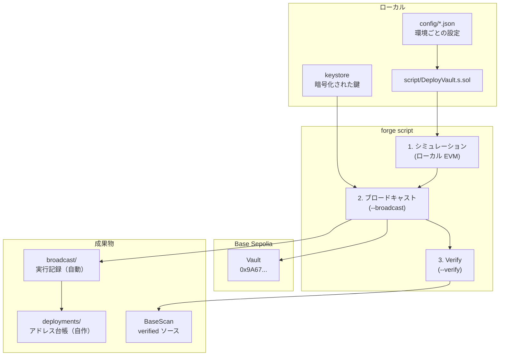
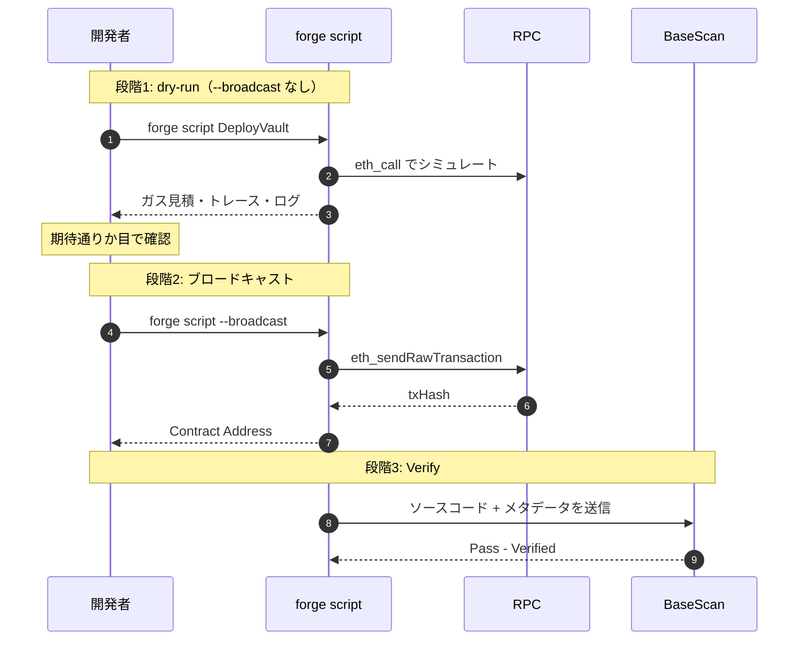
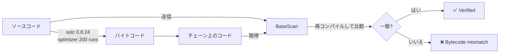
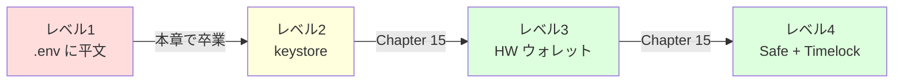
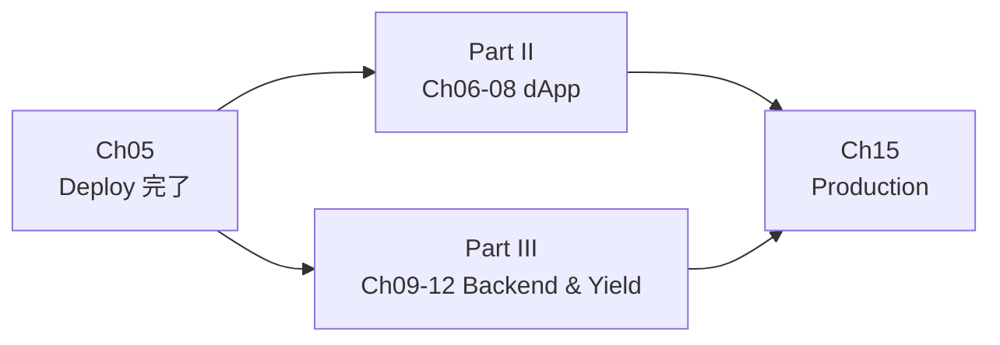

# Chapter 05: Base Sepolia Deploy

> ローカルで動くコントラクトを実チェーンへ出す。環境ごとの設定管理、Verify、デプロイ記録、そして「取り消せない操作」との向き合い方を身につける。

| 項目 | 内容 |
|---|---|
| 所要時間 | 3〜4時間 |
| 前提 | [Chapter 04](./chapter04-foundry-test.md) 完了、Base Sepolia ETH（Faucet） |
| 成果物 | Base Sepolia 上の verified な Vault + `deployments/` の記録 |
| 難易度 | ★★☆ |

---

## 1. Goal

- [ ] `forge script` でデプロイスクリプトを書ける
- [ ] `--broadcast` の有無（dry-run と本実行）を使い分けられる
- [ ] 環境ごと（Local / Sepolia / Mainnet）の設定を安全に切り替えられる
- [ ] BaseScan で **verified 表示**を達成できる
- [ ] デプロイ結果を JSON として記録し、Git で追跡できる
- [ ] **keystore** を使い、秘密鍵を平文で扱わない方法を実践できる
- [ ] デプロイ後の検証（smoke test）を自動化できる
- [ ] `CREATE2` による決定的アドレスの利点を説明できる
- [ ] **デプロイは取り消せない**ことを前提にした手順を組める

---

## 2. 完成イメージ

### dry-run（シミュレーション）

```text
$ make deploy-sepolia-dry
[⠢] Compiling...
Traces:
  [1284551] DeployVault::run()
    ├─ [0] VM::envAddress("USDC_ADDRESS") [staticcall]
    │   └─ ← [Return] 0x036CbD53842c5426634e7929541eC2318f3dCF7e
    ├─ [1102334] → new Vault@0x5FbDB2315678afecb367f032d93F642f64180aa3
    │   └─ ← [Return] 2431 bytes of code
    └─ ← [Stop]

Script ran successfully.

== Logs ==
  === Deployment Plan ===
  chainId      : 84532
  network      : base-sepolia
  deployer     : 0x1234...5678
  asset (USDC) : 0x036CbD53842c5426634e7929541eC2318f3dCF7e
  owner        : 0x1234...5678
  --- verification ---
  asset()      : 0x036CbD53842c5426634e7929541eC2318f3dCF7e
  decimals     : 6
  minDeposit   : 1000000
  owner()      : 0x1234...5678

Estimated gas price: 0.001000254 gwei
Estimated total gas used for script: 1435291
Estimated amount required: 0.00000143 ETH
```

### 本実行

```text
$ make deploy-sepolia
...
##### base-sepolia
✅  [Success] Hash: 0x8f2a...c103
Contract Address: 0x9A676e781A523b5d0C0e43731313A708CB607508
Block: 12459301
Paid: 0.000001435 ETH (1435291 gas * 0.001 gwei)

## Setting up 1 EVM.
==========================
Simulated On-chain Traces:
...
Submitting verification for [src/Vault.sol:Vault] 0x9A676e781A523b5d0C0e43731313A708CB607508.
Submitted contract for verification:
        Response: `OK`
        GUID: `abc123...`
        URL: https://sepolia.basescan.org/address/0x9a676e781a523b5d0c0e43731313a708cb607508
Contract verification status:
Response: `NOTOK`
Details: `Pending in queue`
Contract verification status:
Response: `OK`
Details: `Pass - Verified`
Contract successfully verified
```

### デプロイ記録

```text
$ cat contracts/deployments/84532.json
{
  "chainId": 84532,
  "network": "base-sepolia",
  "contracts": {
    "Vault": {
      "address": "0x9A676e781A523b5d0C0e43731313A708CB607508",
      "deployedAt": "2026-07-29T04:12:33Z",
      "blockNumber": 12459301,
      "txHash": "0x8f2a...c103",
      "deployer": "0x1234...5678",
      "constructorArgs": {
        "asset": "0x036CbD53842c5426634e7929541eC2318f3dCF7e",
        "owner": "0x1234...5678"
      },
      "commit": "a3f8c21",
      "compiler": "0.8.24",
      "optimizerRuns": 200
    }
  }
}
```

### smoke test

```text
$ make smoke-sepolia
>>> checking Vault at 0x9A676e...
  asset()        = 0x036CbD53842c5426634e7929541eC2318f3dCF7e  ✅ matches USDC
  assetDecimals()= 6                                            ✅
  minDeposit()   = 1000000                                      ✅
  owner()        = 0x1234...5678                                ✅ matches deployer
  paused()       = false                                        ✅
  totalDeposits()= 0                                            ✅
✅ all checks passed
```

---

## 3. Architecture



### デプロイの3段階



!!! important "dry-run を飛ばさない"
    `--broadcast` を付けない実行は無料で、何度でもやり直せます。
    **必ず先に dry-run し、ログとトレースを目で確認してください。**

    特に確認すべき点:

    - `chainId` が意図した値か（84532 = Sepolia、8453 = Mainnet）
    - コンストラクタ引数が正しいか（特に USDC アドレス）
    - `owner` が意図したアドレスか
    - ガス見積が異常に大きくないか

---

## 4. Directory

```text
contracts/
 ├── script/
 │   ├── DeployVault.s.sol           + デプロイ本体
 │   ├── base/
 │   │   └── ScriptBase.sol          + 環境設定・記録の共通処理
 │   ├── SmokeTest.s.sol             + デプロイ後の検証
 │   └── DeployMockUSDC.s.sol        + ローカル/Sepolia 用のモック
 ├── config/
 │   ├── 31337.json                  + Anvil
 │   ├── 84532.json                  + Base Sepolia
 │   └── 8453.json                   + Base Mainnet（Ch15 で使用）
 ├── deployments/
 │   ├── 31337.json                  + デプロイ記録（自動生成）
 │   └── 84532.json                  +
 ├── broadcast/                        （forge が自動生成。dry-run は gitignore）
 └── foundry.toml                    M etherscan 設定を確認
```

```bash
cd contracts
mkdir -p script/base config deployments
```

---

## 5. 実装

### 5.1 環境ごとの設定を JSON で持つ

コンストラクタ引数を環境変数に散らすと、
「Sepolia のつもりで Mainnet の USDC を渡す」事故が起きます。
**チェーン ID をキーにした JSON** で管理します。

```json
// config/84532.json
{
  "chainId": 84532,
  "network": "base-sepolia",
  "asset": "0x036CbD53842c5426634e7929541eC2318f3dCF7e",
  "assetSymbol": "USDC",
  "assetDecimals": 6,
  "useMockAsset": false,
  "explorerBaseUrl": "https://sepolia.basescan.org"
}
```

Foundry は `vm.readFile` + `vm.parseJson` で JSON を読めます。

```solidity
string memory path = string.concat("config/", vm.toString(block.chainid), ".json");
string memory json = vm.readFile(path);
address asset = vm.parseJsonAddress(json, ".asset");
```

!!! important "この設計の利点"
    `block.chainid` から設定ファイルを選ぶため、
    **RPC を間違えると設定ファイルが見つからず失敗**します。

    ```text
    Error: failed to read file: config/1.json
    ```

    「Ethereum Mainnet に繋がっていた」ことに、デプロイ前に気づけます。
    環境変数だけの管理では、この安全弁が働きません。

### 5.2 `ScriptBase` で共通処理をまとめる

すべてのスクリプトが必要とする処理を基底クラスに置きます。

| 責務 | 理由 |
|---|---|
| 設定ファイルの読み込み | 全スクリプト共通 |
| チェーン ID の検証 | 想定外のチェーンで実行しない |
| デプロイ記録の書き出し | 手作業だと必ず忘れる |
| 環境変数の安全な取得 | 未設定を早期に検出 |
| ログの統一フォーマット | dry-run の確認が容易になる |

```solidity
abstract contract ScriptBase is Script {
    struct NetworkConfig {
        uint256 chainId;
        string network;
        address asset;
        uint8 assetDecimals;
        bool useMockAsset;
    }

    function _loadConfig() internal view returns (NetworkConfig memory cfg) {
        string memory path = string.concat("config/", vm.toString(block.chainid), ".json");
        string memory json = vm.readFile(path);

        cfg.chainId = vm.parseJsonUint(json, ".chainId");
        cfg.network = vm.parseJsonString(json, ".network");
        cfg.asset = vm.parseJsonAddress(json, ".asset");
        cfg.assetDecimals = uint8(vm.parseJsonUint(json, ".assetDecimals"));
        cfg.useMockAsset = vm.parseJsonBool(json, ".useMockAsset");

        // JSON の chainId と実際のチェーンが一致することを確認
        require(cfg.chainId == block.chainid, "config chainId mismatch");
    }
}
```

### 5.3 デプロイスクリプトの構造

```solidity
contract DeployVault is ScriptBase {
    function run() external returns (Vault vault) {
        NetworkConfig memory cfg = _loadConfig();
        address deployer = msg.sender;   // --account / --private-key で決まる
        address owner = _ownerFor(deployer);

        _logPlan(cfg, deployer, owner);   // dry-run で目視確認する情報

        vm.startBroadcast();
        vault = new Vault(cfg.asset, owner);
        vm.stopBroadcast();

        _verifyDeployment(vault, cfg, owner);   // デプロイ直後の自己検証
        _record("Vault", address(vault), cfg);  // 台帳へ記録
    }
}
```

#### `vm.startBroadcast()` の意味

```solidity
// この範囲の状態変更トランザクションが実際に送信される
vm.startBroadcast();
vault = new Vault(asset, owner);
vm.stopBroadcast();

// この外側の読み取りはローカルのシミュレーションのみ（トランザクション不要）
uint8 d = vault.assetDecimals();
```

!!! warning "`startBroadcast` の中に読み取りを入れない"
    `view` 関数の呼び出しを `startBroadcast` の中に置くと、
    Foundry がトランザクションとして送ろうとする場合があります。
    **状態を変える操作だけを囲む**のが原則です。

### 5.4 デプロイ直後の自己検証

デプロイしただけでは「正しくデプロイされた」とは言えません。
スクリプト内で即座に検証します。

```solidity
function _verifyDeployment(Vault vault, NetworkConfig memory cfg, address owner) internal view {
    require(vault.asset() == cfg.asset, "asset mismatch");
    require(vault.assetDecimals() == cfg.assetDecimals, "decimals mismatch");
    require(vault.minDeposit() == 10 ** cfg.assetDecimals, "minDeposit mismatch");
    require(vault.owner() == owner, "owner mismatch");
    require(!vault.paused(), "should not be paused");
    require(vault.totalDeposits() == 0, "should start empty");
}
```

これがあると、**設定ミスがデプロイ直後の revert として現れます**。
デプロイは成功したが引数が間違っていた、という最悪のケースを防げます。

!!! important "なぜ `assetDecimals` を config に書いて検証するのか"
    `Vault` はトークンから `decimals()` を読みます。
    config に期待値を書いて照合することで、
    「間違ったトークンアドレスを渡した」ことを検出できます。

    ```text
    config: assetDecimals = 6（USDC のはず）
    実際: 18 が返ってきた
    → USDC ではないトークンを渡している！
    ```

### 5.5 デプロイ記録を残す

`broadcast/` には Foundry が自動で実行記録を残しますが、
**ファイル構造が深く、人間が読みにくい**です。

```text
broadcast/DeployVault.s.sol/84532/run-latest.json   ← 巨大な JSON
```

アドレス台帳を別途作ります。

```solidity
function _record(string memory name, address addr, NetworkConfig memory cfg) internal {
    string memory path = string.concat("deployments/", vm.toString(block.chainid), ".json");

    string memory obj = "deployment";
    vm.serializeUint(obj, "chainId", cfg.chainId);
    vm.serializeString(obj, "network", cfg.network);
    vm.serializeAddress(obj, "address", addr);
    vm.serializeUint(obj, "blockNumber", block.number);
    string memory out = vm.serializeString(obj, "contract", name);

    vm.writeJson(out, path);
}
```

!!! note "`deployments/` を Git にコミットする"
    アドレスは**チーム全員が知る必要がある公開情報**です。
    コミットすることで、以下が可能になります。

    - フロントエンド（Ch06）が台帳からアドレスを読める
    - バックエンド（Ch09）が同じ台帳を参照できる
    - 「いつ、どのコミットからデプロイしたか」が追跡できる
    - Mainnet デプロイ時に過去の記録と比較できる

    一方 `broadcast/**/dry-run/` は `.gitignore` します（ノイズ）。

### 5.6 秘密鍵を平文で扱わない

Chapter 01 では `.env` に `PRIVATE_KEY` を置きました。
**Sepolia でもこれは避けるべき**です。理由は習慣化のためです。

#### keystore 方式

```bash
# 鍵を暗号化して保存する（パスフレーズを要求される）
cast wallet import deployer-sepolia --interactive
```

```text
Enter private key:
Enter password:
`deployer-sepolia` keystore was saved successfully.
Address: 0x1234567890abcdef1234567890abcdef12345678
```

保存先は `~/.foundry/keystores/deployer-sepolia` です。

```bash
# 使うときはアカウント名で指定する
forge script script/DeployVault.s.sol \
  --rpc-url base_sepolia \
  --account deployer-sepolia \
  --broadcast
```

実行時にパスフレーズを聞かれます。**平文の鍵はどこにも存在しません。**

```bash
# アドレスの確認
cast wallet address --account deployer-sepolia
```

| 方式 | 平文の鍵 | 適する場面 |
|---|---|---|
| `--private-key $PK`（`.env`） | シェル履歴・環境変数に残る | Anvil のみ |
| `--interactive` | 都度入力。履歴に残らない | 単発の操作 |
| `--account name`（keystore） | **存在しない** | Testnet の常用 |
| `--ledger` / `--trezor` | 存在しない（HW 内） | **Mainnet（Ch15）** |

!!! danger "`--private-key` をコマンドラインに書かない"
    ```bash
    # ❌ シェル履歴（~/.bash_history）に平文で残る
    forge script ... --private-key 0xabc123...

    # ❌ ps コマンドで他ユーザーから見える可能性がある
    ```

    最低でも環境変数経由（`--private-key $PRIVATE_KEY`）にし、
    可能なら keystore を使ってください。

### 5.7 Verify（ソースコードの公開）

Verify とは「デプロイされたバイトコードが、このソースコードから
生成されたことを証明する」操作です。



#### なぜ Verify するのか

| 理由 | 説明 |
|---|---|
| **信頼性** | ユーザーがコードを読んで安全性を確認できる |
| **操作性** | BaseScan の UI から関数を直接呼べる |
| **デバッグ** | トレースが関数名で表示される |
| **統合** | 他のツール（Etherscan API、Tenderly）が ABI を取得できる |

**Verify されていないコントラクトに資金を預けるユーザーはいません。**

#### 実行方法

デプロイと同時に行うのが最も確実です。

```bash
forge script script/DeployVault.s.sol \
  --rpc-url base_sepolia \
  --account deployer-sepolia \
  --broadcast \
  --verify \
  --verifier-url https://api-sepolia.basescan.org/api \
  --etherscan-api-key $BASESCAN_API_KEY
```

`foundry.toml` に `[etherscan]` を書いてあれば、URL は省略できます。

```bash
forge script script/DeployVault.s.sol \
  --rpc-url base_sepolia --account deployer-sepolia --broadcast --verify
```

#### 後から Verify する

デプロイ時に失敗した場合、後から実行できます。

```bash
forge verify-contract \
  --chain base-sepolia \
  --constructor-args $(cast abi-encode "constructor(address,address)" \
      0x036CbD53842c5426634e7929541eC2318f3dCF7e $OWNER) \
  --etherscan-api-key $BASESCAN_API_KEY \
  --watch \
  0x9A676e781A523b5d0C0e43731313A708CB607508 \
  src/Vault.sol:Vault
```

!!! warning "Verify が失敗する主な原因"
    | 原因 | 対処 |
    |---|---|
    | コンパイラバージョンが違う | `foundry.toml` の `solc` を固定する |
    | optimizer の設定が違う | `optimizer_runs` を変えていないか確認 |
    | コンストラクタ引数が違う | `cast abi-encode` で正確に生成する |
    | ライブラリのリンクが必要 | `--libraries` で指定 |
    | API キーが無効 | BaseScan で再発行 |
    | メタデータハッシュの差異 | `bytecode_hash = "none"` を検討 |

    **最も多いのは optimizer 設定の不一致です。** デプロイ後に
    `foundry.toml` を編集すると Verify できなくなります。

### 5.8 CREATE2 による決定的アドレス

通常のデプロイ（`CREATE`）では、アドレスが
`deployer` と `nonce` から決まります。同じアドレスを別チェーンで
再現するには nonce を揃える必要があり、実質的に困難です。

`CREATE2` では `deployer`・`salt`・`initcode` から決まるため、
**複数チェーンで同一アドレスにデプロイできます**。

```solidity
// Foundry の CREATE2 デプロイヤ（多くのチェーンに存在）
bytes32 salt = keccak256("defi-yield-vault.v1");
Vault vault = new Vault{salt: salt}(cfg.asset, owner);
```

| | CREATE | CREATE2 |
|---|---|---|
| アドレスの決定要素 | deployer + nonce | deployer + salt + initcode |
| 事前にアドレスが分かる | いいえ | **はい** |
| 複数チェーンで同一アドレス | 困難 | **可能** |
| initcode を変えるとアドレスが変わる | — | **はい**（注意点） |

!!! note "本書では CREATE を使う"
    CREATE2 は Chapter 15 の Multichain 展開で有用ですが、
    以下の理由で本章では通常の CREATE を使います。

    - `initcode` が変わるとアドレスが変わるため、
      コンストラクタ引数を変えるだけで別アドレスになる
    - salt の管理という新しい概念が増える
    - 単一チェーン（Base）では利点が小さい

    ただし**存在と利点は知っておくべき**です。
    実務で「Mainnet と Sepolia で同じアドレスにしたい」という
    要求は頻繁に発生します。

### 5.9 nonce とガスの扱い

Testnet でよく遭遇する問題です。

| 問題 | 原因 | 対処 |
|---|---|---|
| `nonce too low` | 前のトランザクションがまだ pending | 少し待つ、または `--slow` |
| `replacement transaction underpriced` | 同じ nonce で再送 | ガス価格を上げる |
| `insufficient funds` | ETH 不足 | Faucet から補充 |
| RPC のタイムアウト | 公共 RPC の混雑 | 専用 RPC（Alchemy 等）を使う |
| デプロイが途中で止まる | 複数コントラクトの一部だけ成功 | `--resume` で再開 |

```bash
# トランザクションを1つずつ確実に送る
forge script ... --broadcast --slow

# 失敗したデプロイを途中から再開する
forge script ... --broadcast --resume
```

!!! important "`--resume` の重要性"
    Chapter 10 以降では Vault + Adapter + Manager と
    複数のコントラクトをデプロイします。3つ目で失敗した場合、
    `--resume` を使えば 1・2 を再デプロイせずに済みます。

    再デプロイすると、既に存在する 1・2 が孤児になり、
    アドレス台帳が混乱します。

---

## 6. コード全文

### `contracts/config/31337.json`

```json
{
  "chainId": 31337,
  "network": "anvil",
  "asset": "0x0000000000000000000000000000000000000000",
  "assetSymbol": "mUSDC",
  "assetDecimals": 6,
  "useMockAsset": true,
  "explorerBaseUrl": ""
}
```

### `contracts/config/84532.json`

```json
{
  "chainId": 84532,
  "network": "base-sepolia",
  "asset": "0x036CbD53842c5426634e7929541eC2318f3dCF7e",
  "assetSymbol": "USDC",
  "assetDecimals": 6,
  "useMockAsset": false,
  "explorerBaseUrl": "https://sepolia.basescan.org"
}
```

### `contracts/config/8453.json`

```json
{
  "chainId": 8453,
  "network": "base",
  "asset": "0x833589fCD6eDb6E08f4c7C32D4f71b54bdA02913",
  "assetSymbol": "USDC",
  "assetDecimals": 6,
  "useMockAsset": false,
  "explorerBaseUrl": "https://basescan.org"
}
```

!!! danger "8453.json は Mainnet の設定"
    このファイルが存在すること自体がリスクです。
    `--rpc-url base` を誤って指定すると**本物の資金が動くチェーンへ
    デプロイされます**。

    Chapter 15 では、Mainnet デプロイに追加の確認ステップ
    （`CONFIRM_MAINNET=yes` 環境変数の要求）を入れます。
    本章では Sepolia のみを扱ってください。

### `contracts/script/base/ScriptBase.sol`

```solidity
// SPDX-License-Identifier: MIT
pragma solidity ^0.8.24;

import {Script, console2} from "forge-std/Script.sol";

/// @title ScriptBase
/// @notice デプロイスクリプトの共通処理
/// @dev 設定の読み込み・チェーン検証・記録・ログを一箇所に集約する。
///      各スクリプトが独自に環境変数を読むと、設定漏れやチェーン間違いが起きる。
abstract contract ScriptBase is Script {
    /* ---------- types ---------- */

    struct NetworkConfig {
        uint256 chainId;
        string network;
        address asset;
        string assetSymbol;
        uint8 assetDecimals;
        bool useMockAsset;
        string explorerBaseUrl;
    }

    /* ---------- errors ---------- */

    error ChainIdMismatch(uint256 inConfig, uint256 actual);
    error MainnetRequiresConfirmation();

    /* ---------- config ---------- */

    /// @notice 現在のチェーンに対応する設定を読み込む
    /// @dev config/<chainId>.json が存在しない場合は失敗する。
    ///      これは「意図しないチェーンに繋がっている」ことを検出する安全弁である。
    function _loadConfig() internal view returns (NetworkConfig memory cfg) {
        string memory path = string.concat("config/", vm.toString(block.chainid), ".json");
        string memory json = vm.readFile(path);

        cfg.chainId = vm.parseJsonUint(json, ".chainId");
        cfg.network = vm.parseJsonString(json, ".network");
        cfg.asset = vm.parseJsonAddress(json, ".asset");
        cfg.assetSymbol = vm.parseJsonString(json, ".assetSymbol");
        cfg.assetDecimals = uint8(vm.parseJsonUint(json, ".assetDecimals"));
        cfg.useMockAsset = vm.parseJsonBool(json, ".useMockAsset");
        cfg.explorerBaseUrl = vm.parseJsonString(json, ".explorerBaseUrl");

        if (cfg.chainId != block.chainid) {
            revert ChainIdMismatch(cfg.chainId, block.chainid);
        }
    }

    /// @notice Mainnet へのデプロイには明示的な確認を要求する
    /// @dev CONFIRM_MAINNET=yes が設定されていない限り Mainnet では失敗する。
    ///      「Sepolia のつもりで Mainnet にデプロイ」を防ぐ最後の砦。
    function _guardMainnet() internal view {
        if (block.chainid != 8453) return;

        string memory confirm = vm.envOr("CONFIRM_MAINNET", string(""));
        if (keccak256(bytes(confirm)) != keccak256(bytes("yes"))) {
            revert MainnetRequiresConfirmation();
        }
    }

    /// @notice owner を決定する。未指定ならデプロイヤ自身。
    function _ownerFor(address deployer) internal view returns (address) {
        address configured = vm.envOr("VAULT_OWNER", address(0));
        return configured == address(0) ? deployer : configured;
    }

    /* ---------- logging ---------- */

    function _logHeader(string memory title) internal pure {
        console2.log("");
        console2.log("========================================");
        console2.log(title);
        console2.log("========================================");
    }

    function _logConfig(NetworkConfig memory cfg, address deployer, address owner) internal view {
        _logHeader("=== Deployment Plan ===");
        console2.log("chainId      :", block.chainid);
        console2.log("network      :", cfg.network);
        console2.log("deployer     :", deployer);
        console2.log("deployer ETH :", deployer.balance);
        console2.log("asset        :", cfg.asset);
        console2.log("assetSymbol  :", cfg.assetSymbol);
        console2.log("assetDecimals:", cfg.assetDecimals);
        console2.log("owner        :", owner);
        console2.log("useMockAsset :", cfg.useMockAsset);
    }

    function _logExplorerLink(NetworkConfig memory cfg, address addr) internal pure {
        if (bytes(cfg.explorerBaseUrl).length == 0) return;
        console2.log("explorer     :", string.concat(cfg.explorerBaseUrl, "/address/", vm.toString(addr)));
    }

    /* ---------- deployment record ---------- */

    /// @notice デプロイ結果を deployments/<chainId>.json に記録する
    /// @dev 手作業でアドレスをメモすると必ず失われる。機械的に残す。
    function _recordDeployment(
        string memory contractName,
        address deployedAddress,
        NetworkConfig memory cfg,
        address deployer,
        address owner
    ) internal {
        string memory path = string.concat("deployments/", vm.toString(block.chainid), ".json");

        string memory root = "root";
        string memory args = "args";

        vm.serializeAddress(args, "asset", cfg.asset);
        string memory argsJson = vm.serializeAddress(args, "owner", owner);

        vm.serializeUint(root, "chainId", block.chainid);
        vm.serializeString(root, "network", cfg.network);
        vm.serializeString(root, "contract", contractName);
        vm.serializeAddress(root, "address", deployedAddress);
        vm.serializeAddress(root, "deployer", deployer);
        vm.serializeUint(root, "blockNumber", block.number);
        vm.serializeUint(root, "timestamp", block.timestamp);
        string memory out = vm.serializeString(root, "constructorArgs", argsJson);

        vm.writeJson(out, path);

        console2.log("recorded to  :", path);
    }
}
```

!!! note "`vm.serializeJson` の癖"
    Foundry の JSON シリアライズ API は、同じ `objectKey` に対して
    `serializeXxx` を連続で呼び、**最後の戻り値**が完成した JSON 文字列になります。
    直感的ではないため、複雑な構造を作る場合は
    後述の `jq` によるポスト処理（演習 5-4）の方が現実的です。

### `contracts/script/DeployMockUSDC.s.sol`

```solidity
// SPDX-License-Identifier: MIT
pragma solidity ^0.8.24;

import {console2} from "forge-std/Script.sol";
import {ScriptBase} from "./base/ScriptBase.sol";
import {MockERC20} from "../test/mocks/MockERC20.sol";

/// @notice ローカル（Anvil）用のモック USDC をデプロイする
/// @dev ⚠️ 本番チェーンでは絶対に実行しない。
///      無制限 mint 可能なトークンをデプロイすることになる。
contract DeployMockUSDC is ScriptBase {
    function run() external returns (MockERC20 mock) {
        // Mainnet / Sepolia では実行を拒否する
        require(block.chainid == 31337, "MockUSDC is for local chain only");

        _logHeader("=== Deploy Mock USDC (LOCAL ONLY) ===");

        vm.startBroadcast();
        mock = new MockERC20("Mock USD Coin", "mUSDC", 6);

        // デプロイヤに 1,000,000 mUSDC を配る
        mock.mint(msg.sender, 1_000_000 * 1e6);
        vm.stopBroadcast();

        console2.log("MockUSDC     :", address(mock));
        console2.log("decimals     :", mock.decimals());
        console2.log("minted to    :", msg.sender);
        console2.log("");
        console2.log("次の手順: config/31337.json の asset をこのアドレスに更新してください");
    }
}
```

!!! danger "モックの誤デプロイを防ぐ"
    `require(block.chainid == 31337)` が本質的に重要です。
    テスト用の無制限 mint トークンを Mainnet にデプロイし、
    それを Vault の資産にしてしまう事故は実際に起きています。

### `contracts/script/DeployVault.s.sol`

```solidity
// SPDX-License-Identifier: MIT
pragma solidity ^0.8.24;

import {console2} from "forge-std/Script.sol";
import {IERC20Metadata} from "@openzeppelin/contracts/token/ERC20/extensions/IERC20Metadata.sol";

import {ScriptBase} from "./base/ScriptBase.sol";
import {Vault} from "../src/Vault.sol";

/// @title DeployVault
/// @notice Vault をデプロイし、直後に自己検証して記録する
///
/// 使い方:
///   # 1. dry-run（無料・何度でも可）
///   forge script script/DeployVault.s.sol --rpc-url base_sepolia
///
///   # 2. 本実行 + Verify
///   forge script script/DeployVault.s.sol \
///     --rpc-url base_sepolia --account deployer-sepolia --broadcast --verify
contract DeployVault is ScriptBase {
    error AssetMismatch(address expected, address actual);
    error DecimalsMismatch(uint8 expected, uint8 actual);
    error MinDepositMismatch(uint256 expected, uint256 actual);
    error OwnerMismatch(address expected, address actual);
    error ShouldNotBePaused();
    error ShouldStartEmpty();
    error AssetHasNoCode(address asset);

    function run() external returns (Vault vault) {
        _guardMainnet();

        NetworkConfig memory cfg = _loadConfig();
        address deployer = msg.sender;
        address owner = _ownerFor(deployer);

        _logConfig(cfg, deployer, owner);
        _preflight(cfg);

        /* ---------- deploy ---------- */

        vm.startBroadcast();
        vault = new Vault(cfg.asset, owner);
        vm.stopBroadcast();

        /* ---------- self-verify ---------- */

        _postDeployChecks(vault, cfg, owner);

        /* ---------- report ---------- */

        _logHeader("=== Deployed ===");
        console2.log("Vault        :", address(vault));
        console2.log("asset()      :", vault.asset());
        console2.log("decimals     :", vault.assetDecimals());
        console2.log("minDeposit   :", vault.minDeposit());
        console2.log("owner()      :", vault.owner());
        console2.log("paused()     :", vault.paused());
        _logExplorerLink(cfg, address(vault));

        _recordDeployment("Vault", address(vault), cfg, deployer, owner);

        console2.log("");
        console2.log("次の手順:");
        console2.log("  1. .env の VAULT_ADDRESS を上記アドレスに設定");
        console2.log("  2. frontend/.env.local の NEXT_PUBLIC_VAULT_ADDRESS も同様に設定");
        console2.log("  3. make smoke-sepolia で動作確認");
    }

    /* ---------- checks ---------- */

    /// @dev デプロイ前の検証。ここで失敗すればガスを消費しない。
    function _preflight(NetworkConfig memory cfg) internal view {
        // asset にコードが存在するか（EOA やタイポを検出）
        if (cfg.asset.code.length == 0) revert AssetHasNoCode(cfg.asset);

        // 実際の decimals が config と一致するか
        uint8 actual = IERC20Metadata(cfg.asset).decimals();
        if (actual != cfg.assetDecimals) {
            revert DecimalsMismatch(cfg.assetDecimals, actual);
        }

        console2.log("");
        console2.log("preflight OK : asset has code and decimals match");
    }

    /// @dev デプロイ後の検証。引数の渡し間違いを即座に検出する。
    function _postDeployChecks(Vault vault, NetworkConfig memory cfg, address owner) internal view {
        if (vault.asset() != cfg.asset) revert AssetMismatch(cfg.asset, vault.asset());
        if (vault.assetDecimals() != cfg.assetDecimals) {
            revert DecimalsMismatch(cfg.assetDecimals, vault.assetDecimals());
        }
        if (vault.minDeposit() != 10 ** uint256(cfg.assetDecimals)) {
            revert MinDepositMismatch(10 ** uint256(cfg.assetDecimals), vault.minDeposit());
        }
        if (vault.owner() != owner) revert OwnerMismatch(owner, vault.owner());
        if (vault.paused()) revert ShouldNotBePaused();
        if (vault.totalDeposits() != 0) revert ShouldStartEmpty();
    }
}
```

### `contracts/script/SmokeTest.s.sol`

```solidity
// SPDX-License-Identifier: MIT
pragma solidity ^0.8.24;

import {console2} from "forge-std/Script.sol";
import {IERC20Metadata} from "@openzeppelin/contracts/token/ERC20/extensions/IERC20Metadata.sol";

import {ScriptBase} from "./base/ScriptBase.sol";
import {Vault} from "../src/Vault.sol";

/// @title SmokeTest
/// @notice デプロイ済み Vault の状態を読み取りのみで検証する
/// @dev 状態を変えないため、いつでも安全に実行できる。
///      デプロイ直後・CI・障害調査時に使う。
///
/// 使い方:
///   VAULT_ADDRESS=0x... forge script script/SmokeTest.s.sol --rpc-url base_sepolia
contract SmokeTest is ScriptBase {
    uint256 internal failures;

    function run() external view {
        NetworkConfig memory cfg = _loadConfig();
        address vaultAddress = vm.envAddress("VAULT_ADDRESS");

        _logHeader("=== Smoke Test ===");
        console2.log("network      :", cfg.network);
        console2.log("vault        :", vaultAddress);
        console2.log("");

        require(vaultAddress.code.length > 0, "no code at VAULT_ADDRESS");

        Vault vault = Vault(vaultAddress);

        _check("asset() matches config", vault.asset() == cfg.asset);
        _check("assetDecimals() == config", vault.assetDecimals() == cfg.assetDecimals);
        _check("minDeposit() == 10**decimals", vault.minDeposit() == 10 ** uint256(cfg.assetDecimals));
        _check("owner() is not zero", vault.owner() != address(0));
        _check("not paused", !vault.paused());
        _check(
            "solvent (totalDeposits <= held)",
            vault.totalDeposits() <= IERC20Metadata(cfg.asset).balanceOf(vaultAddress)
        );

        console2.log("");
        console2.log("--- state ---");
        console2.log("owner        :", vault.owner());
        console2.log("totalDeposits:", vault.totalDeposits());
        console2.log("held         :", IERC20Metadata(cfg.asset).balanceOf(vaultAddress));
        console2.log("surplus      :", vault.surplus());
        console2.log("");

        require(failures == 0, "smoke test failed");
        console2.log("all checks passed");
    }

    function _check(string memory name, bool ok) internal view {
        console2.log(ok ? "  [OK]  " : "  [FAIL]", name);
        // view 関数なので状態を変えられない。失敗は require で最後に落とす。
        if (!ok) {
            // solhint-disable-next-line
            revert(string.concat("check failed: ", name));
        }
    }
}
```

!!! note "`view` 関数で失敗をカウントできない"
    `_check` を `view` にすると `failures++` ができません。
    上記の実装では最初の失敗で即座に revert します。

    すべてのチェック結果を一覧したい場合は `view` を外し、
    `--broadcast` を付けずに実行します（状態は変わりません）。
    演習 5-3 で改良します。

### `Makefile` への追加

```makefile
# ---------- deploy ----------
.PHONY: deploy-local deploy-sepolia-dry deploy-sepolia smoke-sepolia verify-sepolia

deploy-local: ## Anvil へデプロイ（MockUSDC も一緒に）
	cd contracts && forge script script/DeployMockUSDC.s.sol \
		--rpc-url http://127.0.0.1:8545 \
		--private-key $(ANVIL_PK) --broadcast
	@echo "⚠️  config/31337.json の asset を上記アドレスに更新してから deploy-vault-local を実行"

deploy-vault-local: ## Anvil へ Vault をデプロイ
	cd contracts && forge script script/DeployVault.s.sol \
		--rpc-url http://127.0.0.1:8545 \
		--private-key $(ANVIL_PK) --broadcast

deploy-sepolia-dry: ## Base Sepolia への dry-run（無料）
	cd contracts && forge script script/DeployVault.s.sol \
		--rpc-url base_sepolia \
		--sender $(shell cast wallet address --account deployer-sepolia)

deploy-sepolia: ## Base Sepolia へデプロイ + Verify
	cd contracts && forge script script/DeployVault.s.sol \
		--rpc-url base_sepolia \
		--account deployer-sepolia \
		--broadcast --verify --slow

smoke-sepolia: ## デプロイ済み Vault の状態確認
	cd contracts && VAULT_ADDRESS=$(VAULT_ADDRESS) \
		forge script script/SmokeTest.s.sol --rpc-url base_sepolia

verify-sepolia: ## 後から Verify する
	cd contracts && forge verify-contract \
		--chain base-sepolia \
		--constructor-args $$(cast abi-encode "constructor(address,address)" $(USDC_ADDRESS) $(VAULT_OWNER)) \
		--etherscan-api-key $(BASESCAN_API_KEY) \
		--watch \
		$(VAULT_ADDRESS) src/Vault.sol:Vault

# Anvil の 0 番アカウント（公開されたテスト鍵。本番では絶対に使わない）
ANVIL_PK := 0xac0974bec39a17e36ba4a6b4d238ff944bacb478cbed5efcae784d7bf4f2ff80
```

### `contracts/.gitignore` への追加

```text
# dry-run の記録はノイズなので追跡しない
broadcast/*/*/dry-run/

# ただし本実行の記録は残す（監査証跡）
!broadcast/*/*/run-*.json
```

---

## 7. 実行方法

### 準備: Faucet で ETH を得る

Base Sepolia の ETH が必要です（デプロイに約 0.000002 ETH）。

```bash
# デプロイヤのアドレスを確認
cast wallet address --account deployer-sepolia
```

以下のいずれかから取得します。

| Faucet | 備考 |
|---|---|
| Coinbase Developer Platform Faucet | 認証が必要だが安定 |
| Alchemy Base Sepolia Faucet | 要アカウント |
| Ethereum Sepolia → Base Sepolia Bridge | Sepolia ETH を持っている場合 |

```bash
# 残高確認
cast balance $(cast wallet address --account deployer-sepolia) \
  --rpc-url base_sepolia --ether
```

```text
0.050000000000000000
```

### ローカルで先に試す

**必ずローカルで一通り通してから Sepolia へ行きます。**

```bash
# ターミナル1
anvil
```

```bash
# ターミナル2
cd contracts

# 1. MockUSDC をデプロイ
forge script script/DeployMockUSDC.s.sol \
  --rpc-url http://127.0.0.1:8545 \
  --private-key 0xac0974bec39a17e36ba4a6b4d238ff944bacb478cbed5efcae784d7bf4f2ff80 \
  --broadcast
```

```text
== Logs ==
  ========================================
  === Deploy Mock USDC (LOCAL ONLY) ===
  ========================================
  MockUSDC     : 0x5FbDB2315678afecb367f032d93F642f64180aa3
  decimals     : 6
  minted to    : 0xf39Fd6e51aad88F6F4ce6aB8827279cffFb92266

  次の手順: config/31337.json の asset をこのアドレスに更新してください
```

```bash
# 2. config を更新
# config/31337.json の "asset" を 0x5FbDB231... に変更

# 3. Vault をデプロイ
forge script script/DeployVault.s.sol \
  --rpc-url http://127.0.0.1:8545 \
  --private-key 0xac0974bec39a17e36ba4a6b4d238ff944bacb478cbed5efcae784d7bf4f2ff80 \
  --broadcast
```

### Sepolia への dry-run

```bash
cd contracts
set -a && source ../.env && set +a

forge script script/DeployVault.s.sol \
  --rpc-url base_sepolia \
  --sender $(cast wallet address --account deployer-sepolia)
```

```text
== Logs ==
  ========================================
  === Deployment Plan ===
  ========================================
  chainId      : 84532
  network      : base-sepolia
  deployer     : 0x1234567890abcdef1234567890abcdef12345678
  deployer ETH : 50000000000000000
  asset        : 0x036CbD53842c5426634e7929541eC2318f3dCF7e
  assetSymbol  : USDC
  assetDecimals: 6
  owner        : 0x1234567890abcdef1234567890abcdef12345678
  useMockAsset : false

  preflight OK : asset has code and decimals match

  ========================================
  === Deployed ===
  ========================================
  Vault        : 0x9A676e781A523b5d0C0e43731313A708CB607508
  ...

Estimated total gas used for script: 1435291
Estimated amount required: 0.00000143 ETH
```

**ここで必ず確認してください。**

```text
□ chainId が 84532 か（8453 なら Mainnet！中止）
□ asset が Base Sepolia の USDC か
□ owner が意図したアドレスか
□ deployer ETH が十分か
□ preflight OK が出ているか
```

### 本実行

```bash
forge script script/DeployVault.s.sol \
  --rpc-url base_sepolia \
  --account deployer-sepolia \
  --broadcast --verify --slow
```

パスフレーズを求められます。

```text
Enter keystore password:
```

```text
✅  [Success] Hash: 0x8f2a3b...c103
Contract Address: 0x9A676e781A523b5d0C0e43731313A708CB607508
Block: 12459301
Paid: 0.000001435 ETH

Submitting verification for [src/Vault.sol:Vault] 0x9A676e...
Contract successfully verified
```

### 動作確認

```bash
export VAULT=0x9A676e781A523b5d0C0e43731313A708CB607508
export USDC=0x036CbD53842c5426634e7929541eC2318f3dCF7e

cast call $VAULT "asset()(address)"         --rpc-url base_sepolia
cast call $VAULT "assetDecimals()(uint8)"   --rpc-url base_sepolia
cast call $VAULT "minDeposit()(uint256)"    --rpc-url base_sepolia
cast call $VAULT "owner()(address)"         --rpc-url base_sepolia
cast call $VAULT "paused()(bool)"           --rpc-url base_sepolia
cast call $VAULT "totalDeposits()(uint256)" --rpc-url base_sepolia
```

```text
0x036CbD53842c5426634e7929541eC2318f3dCF7e
6
1000000
0x1234567890abcdef1234567890abcdef12345678
false
0
```

### 実際に預けてみる

Base Sepolia の USDC を Faucet（Circle の Testnet Faucet）で取得してから:

```bash
# 1. USDC 残高確認
cast call $USDC "balanceOf(address)(uint256)" \
  $(cast wallet address --account deployer-sepolia) --rpc-url base_sepolia

# 2. approve（10 USDC）
cast send $USDC "approve(address,uint256)" $VAULT 10000000 \
  --rpc-url base_sepolia --account deployer-sepolia

# 3. deposit（1 USDC）
cast send $VAULT "deposit(uint256)" 1000000 \
  --rpc-url base_sepolia --account deployer-sepolia

# 4. 残高確認
cast call $VAULT "balanceOf(address)(uint256)" \
  $(cast wallet address --account deployer-sepolia) --rpc-url base_sepolia
```

```text
1000000
```

```bash
# 5. 出金
cast send $VAULT "withdrawAll()" \
  --rpc-url base_sepolia --account deployer-sepolia
```

BaseScan で確認します。

```text
https://sepolia.basescan.org/address/0x9A676e781A523b5d0C0e43731313A708CB607508
```

**Contract タブに緑のチェックマークが付き、ソースコードが読める状態**になっているはずです。
Read Contract / Write Contract タブから関数を直接呼べることも確認してください。

---

## 8. デプロイ方法

本章の主題そのものです。手順を再掲し、チェックリストとしてまとめます。

### デプロイ前チェックリスト

```text
□ 全テストが緑（forge test）
□ Invariant テストの有効呼び出しが十分（invariant_CallSummary を確認）
□ forge build --sizes でサイズ上限（24,576 B）に余裕がある
□ foundry.toml の solc / optimizer_runs を確定した（以後変更しない）
□ config/<chainId>.json のアドレスを一次情報で照合した
□ keystore を作成し、平文の鍵を使わない状態にした
□ デプロイヤに十分な ETH がある
□ dry-run のログを目視確認した（特に chainId）
□ BASESCAN_API_KEY を取得した
□ ローカル（Anvil）で同じスクリプトが通ることを確認した
□ 現在のコミットハッシュを記録した（git rev-parse --short HEAD）
```

### デプロイ後チェックリスト

```text
□ Contract Address を記録した（deployments/<chainId>.json）
□ BaseScan で verified 表示になっている
□ smoke test が通る
□ 実際に deposit / withdraw が動く
□ .env と frontend/.env.local のアドレスを更新した
□ deployments/ をコミットした
□ タグを打った（git tag ch05）
```

### 「取り消せない」ことへの向き合い方

!!! danger "デプロイは Ctrl+Z できない"
    デプロイしたコントラクトは削除できません（`SELFDESTRUCT` は
    Cancun 以降ほぼ無効化されました）。間違ったコントラクトを
    デプロイしたら、**新しくデプロイして古い方を放置する**しかありません。

    Testnet では問題ありませんが、Mainnet では以下が発生します。

    - 誤ったコントラクトに誰かが資金を送る可能性
    - どちらが正しいのか外部から判別できない
    - ガス代の無駄

    **だからこそ Sepolia で何度も練習します。**
    本章で 5 回以上デプロイをやり直してください。
    「デプロイは怖い」を今のうちに消化しておくことが、
    Chapter 15 の Mainnet デプロイの成功率を上げます。

### 環境ごとの違いをまとめる

| | Local (Anvil) | Base Sepolia | Base Mainnet (Ch15) |
|---|---|---|---|
| chainId | 31337 | 84532 | 8453 |
| asset | MockERC20 | 実 USDC (testnet) | 実 USDC |
| 鍵 | 公開テスト鍵 | keystore | **HW ウォレット** |
| Verify | 不要 | する | する |
| owner | デプロイヤ | デプロイヤ | **Safe マルチシグ** |
| 失敗の代償 | なし | なし（テスト資金） | **実資金の損失** |
| 追加の確認 | なし | dry-run | dry-run + `CONFIRM_MAINNET` + レビュー |

---

## 9. テスト方法

### デプロイスクリプト自体をテストする

スクリプトはコードです。テストできます。

```solidity
// test/unit/DeployVault.t.sol
contract DeployVaultTest is Test {
    function test_DeployScript_ProducesCorrectVault() public {
        // Anvil の chainId でスクリプトを実行する
        vm.chainId(31337);

        // MockUSDC を用意し、config を差し替える必要がある
        // → 現実的には Fork テストで実 USDC を使う方が簡単
    }
}
```

!!! note "スクリプトのテストは難しい"
    `_loadConfig()` がファイルシステムに依存するため、
    テストで設定を差し替えるのが面倒です。

    **現実的なアプローチ**: スクリプトのロジックを最小に保ち、
    検証ロジック（`_postDeployChecks`）をライブラリに切り出して
    そちらをテストします。演習 5-5 で実装します。

### Fork による「デプロイのリハーサル」

Base Sepolia を Fork して、実際にデプロイを試します。

```solidity
// test/fork/DeployRehearsal.t.sol
contract DeployRehearsalTest is Test {
    address constant USDC = 0x036CbD53842c5426634e7929541eC2318f3dCF7e;

    function setUp() public {
        try vm.envString("BASE_SEPOLIA_RPC_URL") returns (string memory url) {
            if (bytes(url).length == 0) vm.skip(true);
            vm.createSelectFork(url);
        } catch {
            vm.skip(true);
        }
    }

    /// @notice 実際のチェーン状態でデプロイし、動作を検証する
    function testFork_DeployAndUse() public {
        address owner = makeAddr("owner");
        address user = makeAddr("user");

        // デプロイ
        Vault vault = new Vault(USDC, owner);

        // 検証（DeployVault._postDeployChecks と同じ内容）
        assertEq(vault.asset(), USDC);
        assertEq(vault.assetDecimals(), 6);
        assertEq(vault.minDeposit(), 1e6);
        assertEq(vault.owner(), owner);
        assertFalse(vault.paused());

        // 実際に使えるか
        deal(USDC, user, 1_000e6);
        vm.startPrank(user);
        IERC20(USDC).approve(address(vault), type(uint256).max);
        vault.deposit(100e6);
        assertEq(vault.balanceOf(user), 100e6);
        vault.withdrawAll();
        vm.stopPrank();

        assertEq(IERC20(USDC).balanceOf(user), 1_000e6, "round trip preserves principal");
    }

    /// @notice ガスコストを実際のチェーン状態で計測する
    function testFork_MeasureDeploymentGas() public {
        uint256 before = gasleft();
        new Vault(USDC, makeAddr("owner"));
        uint256 used = before - gasleft();

        console2.log("deployment gas:", used);
        // サイズ上限に近づいていないか確認
        assertLt(used, 3_000_000, "deployment gas should be reasonable");
    }
}
```

これを CI で回すと、**実際のデプロイ前に問題を検出**できます。

### smoke test の CI 統合

デプロイ済みコントラクトの状態を定期監視します。

```yaml
# .github/workflows/monitor.yml
name: monitor-deployment

on:
  schedule:
    - cron: "0 */6 * * *"   # 6時間ごと
  workflow_dispatch:

jobs:
  smoke:
    runs-on: ubuntu-latest
    defaults:
      run:
        working-directory: contracts
    steps:
      - uses: actions/checkout@v4
        with:
          submodules: recursive
      - uses: foundry-rs/foundry-toolchain@v1
      - name: smoke test on Base Sepolia
        run: forge script script/SmokeTest.s.sol --rpc-url base_sepolia
        env:
          BASE_SEPOLIA_RPC_URL: ${{ secrets.BASE_SEPOLIA_RPC_URL }}
          VAULT_ADDRESS: ${{ vars.VAULT_ADDRESS_SEPOLIA }}
```

!!! important "監視の価値"
    「誰かが `pause()` を実行した」「Solvency が破れた」を
    自動検知できます。Chapter 15 でアラート通知を追加します。

---

## 10. Security

### この章で増えた攻撃面

| リスク | 内容 | 対策 |
|---|---|---|
| **秘密鍵の漏洩** | `.env` / シェル履歴 / CI ログ | keystore、環境変数、ログのマスク |
| **誤ったチェーンへのデプロイ** | Mainnet に Testnet 用をデプロイ | `config/<chainId>.json` 方式、`_guardMainnet` |
| **誤ったコンストラクタ引数** | 偽 USDC アドレス | `_preflight` で code とdecimals を検証 |
| **モックの本番デプロイ** | 無制限 mint トークン | `require(chainid == 31337)` |
| **owner の設定ミス** | 制御不能なコントラクト | `_postDeployChecks` で検証 |
| **Verify 未実施** | ユーザーがコードを読めない | デプロイと同時に `--verify` |
| **RPC の中間者攻撃** | 偽の RPC がトランザクションを改竄 | HTTPS、信頼できるプロバイダ |
| **フロントラン** | mempool を見て先にデプロイ | 本章では影響なし（Ch12 で扱う） |

### 秘密鍵の管理レベルを1つ上げる



本章の到達点はレベル2です。`.env` の `PRIVATE_KEY` は
**Anvil 用の公開テスト鍵のみ**に限定してください。

```bash
# .env を修正
# ❌ PRIVATE_KEY=0x実際の鍵
# ✅ Anvil の公開鍵のみ（誰でも知っている値なので漏洩リスクなし）
ANVIL_PRIVATE_KEY=0xac0974bec39a17e36ba4a6b4d238ff944bacb478cbed5efcae784d7bf4f2ff80
```

### CI で秘密情報を扱う原則

```text
□ 秘密は GitHub Secrets に置く（Variables ではない）
□ ログに echo しない
□ PR からは Secrets にアクセスできない設定にする（fork PR 対策）
□ デプロイは CI から行わない（本書の方針。人間が確認して実行する）
□ RPC URL も Secrets に置く（API キーが含まれるため）
```

!!! warning "CI からの自動デプロイをしない理由"
    コントラクトのデプロイは**取り消せない、資産に直結する操作**です。
    CI の設定ミスや依存パッケージの改竄で誤デプロイが起きると、
    取り返しがつきません。

    フロントエンド（Vercel）やバックエンド（Cloud Run）は
    自動デプロイして構いませんが、**コントラクトは人間が
    dry-run を確認して手で実行する**方針を推奨します。

### owner の扱い

現時点で `owner` はデプロイヤの EOA です。これは Testnet では許容されますが、
**Mainnet では単一障害点**です。

```text
owner が持つ権限:
  - pause() / unpause()
  - sweep()（余剰分のみ）

owner の鍵が漏洩すると:
  - 新規預入を止められる（出金は止められない設計）
  - 余剰分を持ち去られる
```

被害は限定的ですが、Chapter 15 で Safe マルチシグへ移行します。

```bash
# 将来の移行（Ownable の機能）
cast send $VAULT "transferOwnership(address)" $SAFE_ADDRESS \
  --rpc-url base --ledger
```

---

## 11. 設計レビュー

### 採用: `config/<chainId>.json` による設定管理

**却下案A: 環境変数のみ**

```bash
USDC_ADDRESS=0x036C... forge script ...
```

短いですが、以下の問題があります。

- Sepolia の設定で Mainnet に繋いでも気づけない
- 設定が Git で追跡されない（誰がいつ変えたか不明）
- チーム間で設定が共有されない

**却下案B: Solidity の定数を chainId で分岐**

```solidity
if (block.chainid == 8453) asset = 0x8335...;
else if (block.chainid == 84532) asset = 0x036C...;
```

型安全ですが、設定変更のたびに再コンパイルが必要で、
非エンジニアが設定を確認できません。

**採用理由**: JSON は Git で追跡でき、`config/<chainId>.json` が
存在しないチェーンでは失敗するため、安全弁として機能します。

**トレードオフ**: `vm.readFile` はファイルシステムアクセスを要求するため、
`foundry.toml` に `fs_permissions` の設定が必要な場合があります。

```toml
[profile.default]
fs_permissions = [
    { access = "read", path = "./config" },
    { access = "read-write", path = "./deployments" }
]
```

### 採用: デプロイ直後の自己検証

**理由**: 「デプロイは成功したが引数が間違っていた」を
デプロイのトランザクション内で検出できます。

**却下案: デプロイ後に手で `cast call` して確認**
必ず忘れます。また `--broadcast` 後では手遅れです。

!!! note "自己検証の限界"
    `_postDeployChecks` は `vm.stopBroadcast()` の**後**に実行されるため、
    失敗してもデプロイ自体は取り消されません（既にチェーン上にある）。

    それでも価値があります。「間違ったコントラクトがデプロイされた」ことを
    **即座に知る**ことで、誤ったアドレスをフロントエンドに設定する
    二次被害を防げます。

    厳密に「失敗したらデプロイもロールバックしたい」場合は、
    デプロイと検証を1つのトランザクション内で行う
    デプロイヤコントラクトを書く方法があります（演習 5-6）。

### 採用: keystore（`--account`）

**却下案: `--private-key $PK`**
`.env` に平文が残ります。Sepolia でも避けるべきです。

**却下案: `--interactive`**
毎回鍵を貼り付けるのは、コピー先を間違えるリスクがあります。

**トレードオフ**: パスフレーズの入力が必要なため、
CI で自動化できません。これは**意図した制約**です
（コントラクトのデプロイを自動化しないという方針）。

### 採用: `--slow` フラグ

**理由**: トランザクションを1つずつ確認しながら送るため、
nonce の衝突や「一部だけ成功」を避けられます。

**トレードオフ**: 遅くなります。Vault 1つなら不要ですが、
Chapter 10 以降の複数コントラクトデプロイでは必須です。

### 却下: CREATE2 による決定的デプロイ

**却下理由**: 単一チェーン（Base）では利点が小さく、
salt 管理という新概念が増えます。

**再検討する条件**: Chapter 15 で Arbitrum / Optimism へ
展開する場合、同一アドレスにできる利点が大きくなります。

### 却下: CI からの自動デプロイ

**却下理由**: Security セクションに記載の通り、
取り消せない操作を自動化するリスクが利便性を上回ります。

**例外**: Testnet への「毎回作り直す」デプロイなら自動化してもよいですが、
その場合もアドレスが変わるため、フロントエンドの設定更新が必要になります。

### この章で残した技術的負債

| 負債 | 返済予定 |
|---|---|
| `owner` が EOA（単一障害点） | Chapter 15（Safe + Timelock） |
| `deployments/` が単一コントラクト前提 | Chapter 10（複数コントラクト対応） |
| SmokeTest が最初の失敗で止まる | 演習 5-3 |
| デプロイスクリプトのテストが薄い | 演習 5-5 |
| 監視・アラートがない | Chapter 15 |
| フロント/バックへのアドレス伝播が手作業 | Chapter 06（台帳から自動生成） |

---

## 12. Git Commit

```bash
cd contracts

git add config/
git commit -m "feat(contracts): add per-chain deployment config

chainId をキーにした JSON で管理する。
config/<chainId>.json が存在しないチェーンでは
デプロイが失敗するため、RPC の指定ミスを検出できる。"

git add script/base/ScriptBase.sol
git commit -m "feat(contracts): add ScriptBase with config loading and mainnet guard"

git add script/DeployMockUSDC.s.sol
git commit -m "feat(contracts): add local-only mock USDC deploy script

chainId 31337 以外では revert する。
無制限 mint 可能なトークンの誤デプロイを防ぐ。"

git add script/DeployVault.s.sol
git commit -m "feat(contracts): add Vault deploy script with preflight and self-verification

- preflight: asset にコードがあり decimals が config と一致することを確認
- postDeploy: 全ての初期状態を検証
- deployments/<chainId>.json に記録"

git add script/SmokeTest.s.sol
git commit -m "feat(contracts): add read-only smoke test for deployed vault"

git add ../Makefile
git commit -m "chore: add deploy and smoke test targets"

# デプロイ実行後
git add deployments/84532.json
git commit -m "chore(deployments): record Vault on Base Sepolia

Vault: 0x9A676e781A523b5d0C0e43731313A708CB607508
Block: 12459301
Verified: https://sepolia.basescan.org/address/0x9a676e...
Commit: $(git rev-parse --short HEAD)"

cd ..
git tag -a ch05 -m "Chapter 05: Base Sepolia deployment"
git push origin main --tags
```

!!! tip "デプロイのコミットメッセージにアドレスを書く"
    後から `git log --grep="0x9A676e"` で
    「このアドレスはいつ、どのコードからデプロイされたか」を追跡できます。
    監査や障害調査で極めて有用です。

---

## 13. 演習問題

### 演習 5-1 ★ 意図的に失敗させる

以下をそれぞれ試し、**どのエラーが出るか**を記録してください。

1. `config/84532.json` の `asset` を `0x0000...0001`（コードのないアドレス）にする
2. `config/84532.json` の `assetDecimals` を `18` にする
3. `config/84532.json` の `chainId` を `8453` にする
4. `--rpc-url` に Ethereum Mainnet を指定する

??? question "解答方針"
    | # | エラー | 検出した層 |
    |---|---|---|
    | 1 | `AssetHasNoCode(0x0000...0001)` | `_preflight` |
    | 2 | `DecimalsMismatch(18, 6)` | `_preflight` |
    | 3 | `ChainIdMismatch(8453, 84532)` | `_loadConfig` |
    | 4 | `failed to read file: config/1.json` | `_loadConfig` |

    **4 が最も重要です。** 設定ファイルが存在しないため、
    Ethereum Mainnet へのデプロイは**構造的に不可能**です。
    これが `config/<chainId>.json` 方式の最大の利点です。

    すべて `--broadcast` なしの dry-run で検出されるため、
    ガスを1 wei も消費せずに気づけます。

### 演習 5-2 ★ Verify を意図的に失敗させて直す

`foundry.toml` の `optimizer_runs` を `200` から `999` に変え、
デプロイ済みのコントラクトを Verify してみてください。
失敗を確認したうえで、正しい設定で成功させてください。

??? question "解答方針"
    ```text
    Error: Bytecode does NOT match, please try again with different compiler settings.
    ```

    BaseScan は送られたソースを再コンパイルし、
    チェーン上のバイトコードと**完全一致**を要求します。
    optimizer 設定が1つ違うだけで別のバイトコードになります。

    **実務上の教訓**: `foundry.toml` のコンパイラ設定は
    デプロイ後に変更してはいけません。変更するなら、
    Verify 済みのコントラクトのために設定を記録しておく必要があります。

    ```json
    // deployments/84532.json に記録すべき情報
    {
      "compiler": "0.8.24",
      "optimizer": true,
      "optimizerRuns": 200,
      "viaIR": false,
      "evmVersion": "cancun"
    }
    ```

### 演習 5-3 ★★ SmokeTest を全チェック実行型に改良する

現在の実装は最初の失敗で止まります。**すべてのチェックを実行し、
最後にまとめて結果を報告する**ように改良してください。

??? question "解答方針"
    `view` を外し、状態変数でカウントします。
    `--broadcast` を付けなければ、実際のトランザクションは送られません。

    ```solidity
    contract SmokeTest is ScriptBase {
        struct Result {
            string name;
            bool ok;
        }

        Result[] internal results;

        function run() external {
            NetworkConfig memory cfg = _loadConfig();
            address vaultAddress = vm.envAddress("VAULT_ADDRESS");
            Vault vault = Vault(vaultAddress);

            _check("has code", vaultAddress.code.length > 0);
            _check("asset() matches config", vault.asset() == cfg.asset);
            _check("decimals matches", vault.assetDecimals() == cfg.assetDecimals);
            _check("minDeposit correct", vault.minDeposit() == 10 ** uint256(cfg.assetDecimals));
            _check("owner is not zero", vault.owner() != address(0));
            _check("not paused", !vault.paused());
            _check(
                "solvent",
                vault.totalDeposits() <= IERC20Metadata(cfg.asset).balanceOf(vaultAddress)
            );

            _report();
        }

        function _check(string memory name, bool ok) internal {
            results.push(Result(name, ok));
        }

        function _report() internal view {
            uint256 failed;
            console2.log("");
            for (uint256 i; i < results.length; i++) {
                console2.log(results[i].ok ? "  [OK]   " : "  [FAIL] ", results[i].name);
                if (!results[i].ok) failed++;
            }
            console2.log("");
            console2.log("passed:", results.length - failed, "/", results.length);
            require(failed == 0, "smoke test failed");
        }
    }
    ```

    **考えるべき点**: `has code` が false の場合、
    後続のチェックが revert します。`if (!hasCode) { _report(); return; }` の
    ような早期リターンが必要です。

### 演習 5-4 ★★ デプロイ台帳を jq で整備する

Foundry の `broadcast/` から情報を抽出し、
より読みやすい `deployments/<chainId>.json` を生成するスクリプトを書いてください。

??? question "解答方針"
    ```bash
    #!/usr/bin/env bash
    # scripts/record-deployment.sh
    set -euo pipefail

    CHAIN_ID="${1:?usage: record-deployment.sh <chainId> <scriptName>}"
    SCRIPT_NAME="${2:-DeployVault.s.sol}"

    BROADCAST="contracts/broadcast/${SCRIPT_NAME}/${CHAIN_ID}/run-latest.json"
    OUT="contracts/deployments/${CHAIN_ID}.json"
    COMMIT="$(git rev-parse --short HEAD)"
    NOW="$(date -u +%Y-%m-%dT%H:%M:%SZ)"

    test -f "$BROADCAST" || { echo "not found: $BROADCAST"; exit 1; }

    # CREATE トランザクションのみを抽出して整形する
    jq --arg commit "$COMMIT" --arg now "$NOW" --arg chain "$CHAIN_ID" '
      {
        chainId: ($chain | tonumber),
        commit: $commit,
        recordedAt: $now,
        contracts: (
          [ .transactions[]
            | select(.transactionType == "CREATE")
            | {
                key: .contractName,
                value: {
                  address: .contractAddress,
                  txHash: .hash,
                  deployer: .transaction.from,
                  arguments: .arguments
                }
              }
          ] | from_entries
        )
      }
    ' "$BROADCAST" > "$OUT"

    echo "wrote $OUT"
    jq . "$OUT"
    ```

    ```bash
    ./scripts/record-deployment.sh 84532
    ```

    **なぜ Solidity ではなく jq なのか**: Foundry の
    `vm.serializeJson` API は入れ子構造を作るのが煩雑です。
    デプロイ後の後処理として shell で行う方が保守しやすいです。

    Makefile に組み込みます。

    ```makefile
    deploy-sepolia: ## Base Sepolia へデプロイ + Verify + 記録
    	cd contracts && forge script script/DeployVault.s.sol \
    		--rpc-url base_sepolia --account deployer-sepolia \
    		--broadcast --verify --slow
    	./scripts/record-deployment.sh 84532
    ```

### 演習 5-5 ★★ 検証ロジックをライブラリに切り出してテストする

`_postDeployChecks` の内容をライブラリ化し、
Unit テストで検証できるようにしてください。

??? question "解答方針"
    ```solidity
    // src/libraries/VaultValidation.sol
    library VaultValidation {
        error AssetMismatch(address expected, address actual);
        error DecimalsMismatch(uint8 expected, uint8 actual);
        error MinDepositMismatch(uint256 expected, uint256 actual);
        error OwnerMismatch(address expected, address actual);
        error ShouldNotBePaused();
        error ShouldStartEmpty();

        struct Expected {
            address asset;
            uint8 decimals;
            address owner;
        }

        function validateFreshDeployment(Vault vault, Expected memory e) internal view {
            if (vault.asset() != e.asset) revert AssetMismatch(e.asset, vault.asset());
            if (vault.assetDecimals() != e.decimals) {
                revert DecimalsMismatch(e.decimals, vault.assetDecimals());
            }
            if (vault.minDeposit() != 10 ** uint256(e.decimals)) {
                revert MinDepositMismatch(10 ** uint256(e.decimals), vault.minDeposit());
            }
            if (vault.owner() != e.owner) revert OwnerMismatch(e.owner, vault.owner());
            if (vault.paused()) revert ShouldNotBePaused();
            if (vault.totalDeposits() != 0) revert ShouldStartEmpty();
        }
    }
    ```

    ```solidity
    // test/unit/VaultValidation.t.sol
    contract VaultValidationTest is BaseTest {
        function test_ValidateFreshDeployment_Passes() public view {
            VaultValidation.Expected memory e = VaultValidation.Expected({
                asset: address(token), decimals: 6, owner: owner
            });
            VaultValidation.validateFreshDeployment(vault, e);  // revert しなければ成功
        }

        function test_ValidateFreshDeployment_DetectsWrongOwner() public {
            VaultValidation.Expected memory e = VaultValidation.Expected({
                asset: address(token), decimals: 6, owner: alice  // 誤り
            });
            vm.expectRevert(
                abi.encodeWithSelector(VaultValidation.OwnerMismatch.selector, alice, owner)
            );
            VaultValidation.validateFreshDeployment(vault, e);
        }

        function test_ValidateFreshDeployment_DetectsNonEmptyVault() public {
            _deposit(alice, 100 * ONE);
            VaultValidation.Expected memory e = VaultValidation.Expected({
                asset: address(token), decimals: 6, owner: owner
            });
            vm.expectRevert(VaultValidation.ShouldStartEmpty.selector);
            VaultValidation.validateFreshDeployment(vault, e);
        }
    }
    ```

    **設計上の利点**: 検証ロジックがテスト可能になり、
    かつ `SmokeTest` と `DeployVault` の両方から再利用できます。
    「同じ検証を2箇所に書いてズレる」という問題を防げます。

### 演習 5-6 ★★★ 検証失敗でデプロイをロールバックする

デプロイと検証を1トランザクションで行い、
検証に失敗したらデプロイも巻き戻るようにしてください。

??? question "解答方針"
    デプロイヤコントラクトを書きます。

    ```solidity
    // src/VaultFactory.sol
    contract VaultFactory {
        event VaultDeployed(address indexed vault, address indexed asset, address indexed owner);

        error DeploymentValidationFailed(string reason);

        /// @notice Vault をデプロイし、同一トランザクション内で検証する
        /// @dev 検証に失敗すると revert し、デプロイも巻き戻る。
        function deployAndValidate(
            address asset,
            address owner,
            uint8 expectedDecimals
        ) external returns (Vault vault) {
            vault = new Vault(asset, owner);

            // 同一トランザクション内なので、失敗すれば new Vault も巻き戻る
            if (vault.asset() != asset) revert DeploymentValidationFailed("asset");
            if (vault.assetDecimals() != expectedDecimals) {
                revert DeploymentValidationFailed("decimals");
            }
            if (vault.minDeposit() != 10 ** uint256(expectedDecimals)) {
                revert DeploymentValidationFailed("minDeposit");
            }
            if (vault.owner() != owner) revert DeploymentValidationFailed("owner");
            if (vault.paused()) revert DeploymentValidationFailed("paused");

            emit VaultDeployed(address(vault), asset, owner);
        }
    }
    ```

    **トレードオフの分析**:

    | | 直接デプロイ + 事後検証 | Factory による原子的デプロイ |
    |---|---|---|
    | 検証失敗時 | コントラクトは残る | 巻き戻る |
    | デプロイヤ | EOA | Factory コントラクト |
    | Verify | 単純 | Factory も Verify が必要 |
    | ガス | 安い | Factory 経由で高い |
    | アドレスの予測 | nonce 依存 | Factory の nonce 依存 |
    | 追加の攻撃面 | なし | **Factory 自体** |

    **考えるべき点**: Factory は「誰でも Vault をデプロイできる」
    コントラクトになります。悪意ある Vault が同じ Factory から
    デプロイされ、「公式の Factory 製だから安全」という誤解を
    生む可能性があります。

    対策として `onlyOwner` を付けるか、`VaultDeployed` イベントを
    公式の台帳として使う設計が必要です。

    **結論**: 本書は「事後検証 + dry-run の徹底」を採用しました。
    Factory は Chapter 15 で複数 Vault を運用する場合に再検討します。

### 演習 5-7 ★★★ 5回デプロイをやり直す

本章の隠れた課題です。以下を実際に行ってください。

1. Vault をデプロイする
2. `owner` を別のアドレスにして再デプロイする
3. わざと Verify を失敗させ、後から `forge verify-contract` で成功させる
4. `pause()` を実行し、`deposit` が失敗することを実チェーンで確認する
5. `unpause()` して復旧する

**目的**: 「デプロイは怖い」を消化することです。
Testnet でのデプロイは無料同然（1回 0.000002 ETH）です。
Mainnet の1回目を確実に成功させるために、ここで慣れておいてください。

??? question "確認すべきこと"
    ```bash
    # 4. pause の確認
    cast send $VAULT "pause()" --rpc-url base_sepolia --account deployer-sepolia
    cast call $VAULT "paused()(bool)" --rpc-url base_sepolia
    # → true

    # deposit が失敗する
    cast send $VAULT "deposit(uint256)" 1000000 \
      --rpc-url base_sepolia --account deployer-sepolia
    # → Error: EnforcedPause()

    # ただし withdraw は成功する（設計要件 I5）
    cast send $VAULT "withdrawAll()" \
      --rpc-url base_sepolia --account deployer-sepolia
    # → Success（残高があれば）
    ```

    **これを実チェーンで確認することが重要です。**
    テストで通っていても、実チェーンで確認するまでは
    「本当に動く」とは言えません。

---

## 14. 次章

Vault が Base Sepolia 上で動き、BaseScan で誰でもコードを読める状態になりました。
ここまでで **Part I（Smart Contract）が完成**です。

ここから2つの道が並行して開きます。



本書は [Chapter 06: Coinbase Wallet 接続](./chapter06-coinbase-wallet.md) へ進みます。

なぜ dApp を先にやるのか:

1. **今の Vault は `cast` でしか触れない**。人間が使えるものにする段階
2. Wallet 接続は Web3 フロントエンドの最初の壁であり、
   ここを越えると以降の実装が速い
3. 「自分が作ったコントラクトを、ブラウザから自分のウォレットで操作する」
   体験が、開発を続ける動機になる
4. Chapter 07 の Approve → Deposit フローで、Chapter 03 の
   permit の知識が実際の UX 改善として結実する

!!! tip "コントラクトを先に完成させたい場合"
    Chapter 06〜08 を飛ばして Chapter 09 → 10 → 12 と進み、
    Vault を先に完成させる進め方も有効です。
    章の依存関係は [表記規約](../00-preface/04-conventions.md#chapter-dependencies) を参照してください。

    ただし Chapter 10 で `balanceOf` の意味が変わるため、
    dApp を後回しにすると書き直しが減る利点があります。
    **時間が限られている場合はこちらを推奨します。**
