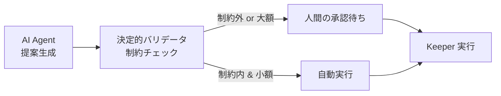

# Chapter 13: AI Agent

> LLM を運用判断に組み込む。ただし **AI に鍵を渡さない**。Human-in-the-loop と制約による安全設計。

!!! warning "この章は執筆中です（Phase 3）"
    本章は現在執筆中です。以下は確定済みのアウトラインです。

---

## この章の大原則

```text
AI は「提案」を生成する。
AI は署名鍵を持たない。
AI の提案は、事前に定義された制約を満たす場合にのみ実行される。
LLM はプロンプトインジェクションを受ける前提で設計する。
```

---

## この章で扱う内容

- LLM プロバイダを差し替え可能にする設計（`LLMProvider` Protocol）
- 構造化出力（JSON Schema / tool use）による提案の受け取り
- コンテキストの構築（APY 時系列、TVL、ガス価格、過去のリバランス履歴）
- **提案 → 検証 → 承認 → 実行**の4段パイプライン



- 提案の保存（`rebalance_proposals` テーブル、JSONB で理由を保持）
- **決定的バリデータ**が最終防衛線である理由（LLM の出力を信用しない）
- 通知（Slack / Discord / メール）と承認 UI
- コスト管理（トークン使用量の記録、上限設定）
- LLM が「もっともらしい嘘」を言う場合の検出（数値の再計算による照合）

## この章の Security 観点

- **プロンプトインジェクション**: 外部データ（APY の説明文など）に
  仕込まれた指示を LLM が実行してしまうリスク
- AI の提案を無検証で実行してはいけない理由
- 自動実行の閾値設計（金額 / 頻度 / APY差）
- 監査ログ（誰が / いつ / なぜ実行したか）
- LLM API キーの管理
- **AI が誤った提案をしても資産が失われない**構造の設計

---

## 章の構成（予定）

| # | セクション | 状態 |
|---|---|---|
| 1 | Goal | ⬜ |
| 2 | 完成イメージ | ⬜ |
| 3 | Architecture | ⬜ |
| 4 | Directory | ⬜ |
| 5 | 実装 | ⬜ |
| 6 | コード全文 | ⬜ |
| 7 | 実行方法 | ⬜ |
| 8 | デプロイ方法 | ⬜ |
| 9 | テスト方法 | ⬜ |
| 10 | Security | ⬜ |
| 11 | 設計レビュー | ⬜ |
| 12 | Git Commit | ⬜ |
| 13 | 演習問題 | ⬜ |
| 14 | 次章 | ⬜ |

---

- 前: [Chapter 12: Strategy Engine](./chapter12-strategy-engine.md)
- 次: [Chapter 14: x402](./chapter14-x402.md)
