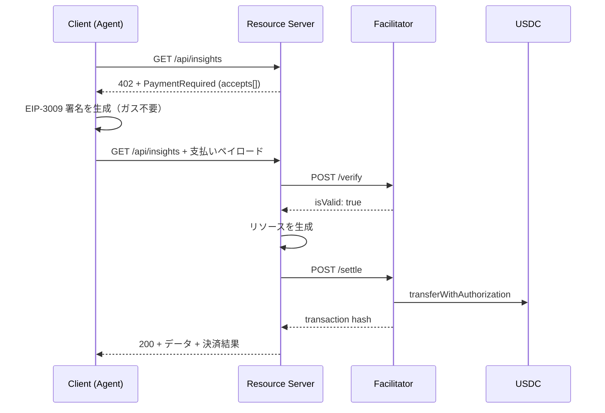

# Chapter 14: x402

> HTTP 402 を使ったマイクロペイメントで API を従量課金化する。EIP-3009 によるガスレス決済と、Agent 間決済。

!!! warning "この章は執筆中です（Phase 3）"
    本章は現在執筆中です。以下は確定済みのアウトラインです。

---

## この章で扱う内容

### プロトコルの理解

- HTTP `402 Payment Required` の復活という発想
- x402 の3コンポーネント: **Resource Server / Client / Facilitator**
- 支払いフロー

- **x402 v2 の仕様**
    - `PaymentRequired` / `PaymentPayload` / `SettlementResponse` / `VerifyResponse`
    - **CAIP-2 形式のネットワーク識別子**（`eip155:8453` = Base、`eip155:84532` = Base Sepolia）
    - `exact` スキーム（EIP-3009 `transferWithAuthorization`）
    - `amount` はアトミック単位の文字列
    - Facilitator の `/verify` `/settle` `/supported`
    - Discovery API と Bazaar
- **EIP-3009 と EIP-2612 の違い**（Chapter 03 の予告の回収）
- リプレイ防止（32 バイト nonce、`validAfter` / `validBefore`）

### 実装

- FastAPI ミドルウェアとして課金を組み込む
- 課金対象エンドポイントの設計（`/api/v1/insights/*` を有料化）
- **課金レイヤーを差し替え可能なインターフェースに隔離する**
- Chapter 13 の AI Agent が外部データを x402 で購入する（Client 側）
- Base Sepolia での動作確認

## この章の Security 観点

- **クライアント提供の支払い証明を検証なしで信用しない**
- Facilitator への依存（中央集権性）とセルフホストの選択肢
- 金額の**サーバー側検証**（クライアントの申告額を信用しない）
- リプレイ攻撃の監視
- オンチェーンのプライバシー漏洩（支払い履歴が公開される）
- レート制限（無料枠の乱用防止）
- 仕様変更への耐性（プロトコルが成熟途上であること）

---

## 章の構成（予定）

| # | セクション | 状態 |
|---|---|---|
| 1 | Goal | ⬜ |
| 2 | 完成イメージ | ⬜ |
| 3 | Architecture | ⬜ |
| 4 | Directory | ⬜ |
| 5 | 実装 | ⬜ |
| 6 | コード全文 | ⬜ |
| 7 | 実行方法 | ⬜ |
| 8 | デプロイ方法 | ⬜ |
| 9 | テスト方法 | ⬜ |
| 10 | Security | ⬜ |
| 11 | 設計レビュー | ⬜ |
| 12 | Git Commit | ⬜ |
| 13 | 演習問題 | ⬜ |
| 14 | 次章 | ⬜ |

---

- 前: [Chapter 13: AI Agent](./chapter13-ai-agent.md)
- 次: [Chapter 15: Production](./chapter15-production.md)
