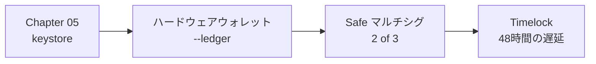

# Chapter 15: Production

> CI/CD を整え、権限を Safe + Timelock へ移し、Base Mainnet へ公開する。取り消せない操作と向き合う最終章。

!!! warning "この章は執筆中です（Phase 3）"
    本章は現在執筆中です。以下は確定済みのアウトラインです。

---

## この章で扱う内容

### CI/CD

- GitHub Actions の `paths` フィルタによる部分実行（Monorepo の CI 時間短縮）
- マージゲート（全テスト緑 + カバレッジ + ガススナップショット + 監査ツール）
- Slither / Aderyn による静的解析の統合
- frontend → Vercel、backend → Cloud Run の自動デプロイ
- **コントラクトのデプロイは自動化しない**（人間が dry-run を確認して実行）

### 権限の本番化

- `transferOwnership` による Safe への移行手順
- `AccessControl` のロールを Safe / Timelock / Keeper に割り当てる
- Timelock の遅延時間の設計（ユーザーが出金する時間を確保する）
- 緊急停止（Guardian）だけは遅延なしにする理由

### Mainnet デプロイ

- Mainnet 用の追加ガード（`CONFIRM_MAINNET=yes`、二人以上のレビュー）
- 段階的な公開（TVL 上限を設けて徐々に引き上げる）
- 初期デポジット（dead shares）の投入
- Verify とアドレスの公開
- **監査を受けるべき理由と、受けていないコードを公開する場合の開示義務**

### 運用

- 監視とアラート（Solvency の破れ、異常な出金、pause の実行）
- インシデント対応手順（Runbook）
- ガス価格の急騰時の挙動
- 依存プロトコル（Aave / Morpho / USDC）のインシデント監視

### 将来の拡張（方針のみ） {#future-work}

- Multichain（Arbitrum / Optimism）と CREATE2
- EigenLayer / Restaking
- Account Abstraction（ERC-4337）
- Intent ベース取引
- 形式検証（Certora / Halmos）— Chapter 04 の不変条件をそのまま仕様に使える

## この章の Security 観点

- 本番デプロイのチェックリスト（[Appendix C](../appendix/c-security-checklist.md)）
- 監査を受けていないコードに実資金を入れるリスクの開示
- バグバウンティの設置
- 中央集権的な要素の開示（Base のシーケンサ、USDC の凍結権限、Keeper、Timelock 管理者）
- 規制上の考慮（本書は法的助言ではない旨の明示）

---

## 章の構成（予定）

| # | セクション | 状態 |
|---|---|---|
| 1 | Goal | ⬜ |
| 2 | 完成イメージ | ⬜ |
| 3 | Architecture | ⬜ |
| 4 | Directory | ⬜ |
| 5 | 実装 | ⬜ |
| 6 | コード全文 | ⬜ |
| 7 | 実行方法 | ⬜ |
| 8 | デプロイ方法 | ⬜ |
| 9 | テスト方法 | ⬜ |
| 10 | Security | ⬜ |
| 11 | 設計レビュー | ⬜ |
| 12 | Git Commit | ⬜ |
| 13 | 演習問題 | ⬜ |
| 14 | 次章 | ⬜ |

---

- 前: [Chapter 14: x402](./chapter14-x402.md)
- 次: 本編の最後です。[Appendix](../appendix/a-glossary.md) と
  [将来の拡張](#future-work)へ進んでください。
